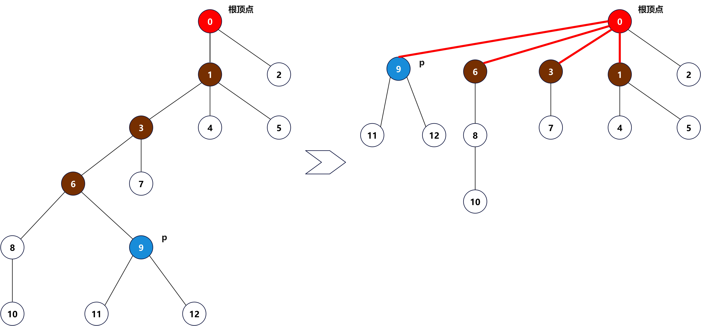

# 并查集

## 1.1 动态连通性

现在我们输入一列整数对，其中每个整数都表示一个某种类型的对象，一堆整数`p q`可以被理解为<font color='red'><strong>p和q是相连的</strong></font>，这里<font color='red'><strong>连接</strong></font>是一种等价关系，即：

1. 自反性：`p`和`p`是相连的；
2. 对称性：如果`p`和`q`是相连的，那么`q`和`p`也是相连的；
3. 传递性：如果`p`和`q`是相连的且`q`和`r`也是相连的，那么`p`和`r`也是相连的。

等价关系可以将对象分为多个等价类，在<font color='red'><strong>连接</strong></font>等价关系种，如果两个对象（整数）相连时，它们才属于同一个等价类。为了便于叙述，我们规定，将对象（整数）称之为顶点，将整数对称为连接，将等价类称为连通分量（简称分量）。现在，输入一个整数对`p q`我们要解决两个问题：

+ <font color='red'><strong>find</strong></font>：`p`和`q`是否连接；
+ <font color='red'><strong>union</strong></font>：`p`和`q`如果不连接，那么合并`p`和`q`所在的两个集合。

## 1.2 MyUnionFind API

为了解决动态连通性的问题，我们设计了`MyUnionFind`接口展示所需的基本操作，接口定义如下所示：

|public interface|**MyUnionFind**||
|--:|:--|:--|
|void|union(int p, int q)|如果 p 和 q 不相连，那么增加一条连接|
|int|find(int p)|p 所在分量的标识符|
|boolean|connected(int p, int q)|如果 p 和 q 在同一个分量中，返回 true|
|int|count()|连通分量的数量|

## 1.3 使用什么数据结构表示已知连接

实现`MyUnionFind`接口的所有类，首先都面临同一个问题：如何表示已知连接。`API`中已经说明顶点和分量都使用`int`表示，那么，我们可以用一个以顶点为索引的数组`id[]`作为基本数据结构来表示所有分量，并且使用分量中的某个顶点的名称作为分量的标识符，因此，每个分量中的每个顶点都可以代表该分量。一开始，我们有 $N$ 个分量，每个顶点都构成了一个只含自己的分量，故此，我们将`id[i]`的初始值定为 $i$ ，其中 $i$ 在 $0$ 至 $N-1$ 之间。对于，每个顶点 $i$，我们使用`find()`方法来寻找 $i$ 所在分量，并将分量信息保存至`id[i]`中。`connected()`方法的实现只用一条语句`find(p) ==find(q)`，它返回一个布尔值。除此之外，我们还需要一个`int count`属性，记录连通分量数量。

## 1.4 quick-find 算法

### 1.4.1 quick-find 算法思想和实现

为方便判断`p`和`q`是连通的，我们规定，当且仅当`id[p]==id[q]`时，`p`和`q`才是连通的。换句话说，在同一个连通分量中，所有顶点在`id[]`数组章的值必须相等，这也就意味着，方法`connected(p,q)`只需要判断`id[p]==id[q]`即可，这个比较简单，关键是`union(p,q)`的实现。

为了实现`union(p,q)`，首先我们需要检查`p`和`q`所在连通分量是否已经存在于同一个分量中，如果是，那么直接返回，否则，我们必须将两个集合中所有顶点所对应的`id[]`值变为同一个值。为此，我们不得不遍历整个数组，将所有和`id[p]`相等的值修改为`id[q]`或者反过来，将所有和`id[q]`相等的值修改为`id[p]`。

根据上面的描述，得出`MyQuickFindUnionFind`类代码，如下所示：

```java
public class MyQuickFindUnionFind implements MyUnionFind {
    private int[] id; // id[v]：顶点 v 连通分量的标识
    private int count; // 连通分量的数量

    public MyQuickFindUnionFind(int V) {
        if (V < 0)
            throw new IllegalArgumentException("number of vertices in a Graph must be non-negative");
        count = V;
        id = new int[V];
        for (int v = 0; v < V; v++)
            id[v] = v;
    }

    public MyQuickFindUnionFind(Scanner in) {
        if (in == null)
            throw new IllegalArgumentException("argument is null");
        try {
            int V = in.nextInt();
            if (V < 0)
                throw new IllegalArgumentException("number of vertices in a Graph must be non-negative");
            count = V;
            id = new int[V];
            for (int v = 0; v < V; v++)
                id[v] = v;
            while (in.hasNextInt()) {
                int p = in.nextInt();
                int q = in.nextInt();
                union(p, q);
            }
        } catch (NoSuchElementException e) {
            throw new IllegalArgumentException("invalid input format in Graph constructor", e);
        }
    }

    @Override
    public void union(int p, int q) {
        validateVertex(p);
        validateVertex(q);
        int pID = id[p];
        int qID = id[q];
        if (pID == qID)
            return;
        for (int v = 0; v < id.length; v++) {
            if (id[v] == pID)
                id[v] = qID;
        }
        count--;
    }

    @Override
    public int find(int p) {
        validateVertex(p);
        return id[p];
    }

    private void validateVertex(int p) {
        int n = id.length;
        if (p < 0 || p >= n) {
            throw new IllegalArgumentException("index " + p + " is not between 0 and " + (n - 1));
        }
    }

    @Override
    public boolean connected(int p, int q) {
        return find(p) == find(q);
    }

    @Override
    public int count() {
        return count;
    }
}
```

### 1.4.2 quick-find 算法分析

`find`操作速度是很快的，因为只需要访问`id[]`数组一次，时间复杂度为 $O(1)$。但是`quick-find`无法处理大型问题，因为`union`需要对每一对输入`p`和`q`，都需要扫描整个`id[]`数组。在`quick-find`算法中，每次`find()`调用只需要访问数组一次，而归并两个分量的`union()`操作访问数组的次数在 $N+3$ 到 $2N+1$ 之间。一对顶点`p`和`q`就需要 $O(N)$，那么对于动态连通性问题，时间复杂度就是 $O(N^2)$ 了。

## 1.4 quick-union 算法

### 1.4.1 quick-union 算法思想和实现

`quick-find`算法`union`速度很慢，我们需要重点提升`union`方法的速度，在`quick-find`中`id[v]`值为顶点连通分量的标识符，现在我们赋予`id[v]`完全不同的含义：同一个分量中另一个顶点的名称（也可能是自己，这样的顶点为根顶点），这种关系也被称为链接。在实现`find`时，我们从给定的顶点开始，由它链接得到另一个顶点，再由这个顶点得到第三个顶点，如此，继续跟随着链接，直到达到一个根顶点，即链接自己的顶点。当且仅当分别由顶点`p`和`q`链接到同一个根顶点时，说明它们存在于同一个连通分量。为了保证这个过程的有效性，我们需要`union(p,q)`来保证这一点。`union`方法的实现也不复杂：我们由`p`和`q`的链接分别找到它们的根顶点，然后只需将一个根顶点链接到另一个即可将一个分量重命名为另一个分量，因此这个算法叫做`quick-union`。

根据上面的描述，得出`MyQuickUnionUnionFind`类代码，如下所示：

```java
public class MyQuickUnionUnionFind implements MyUnionFind {
    private int[] parent; // parent[v]：顶点 v 的父顶点
    private int count; // 连通分量数量

    public MyQuickUnionUnionFind(int V) {
        if (V < 0)
            throw new IllegalArgumentException("number of vertices in a Graph must be non-negative");
        count = V;
        parent = new int[V];
        for (int v = 0; v < V; v++)
            parent[v] = v;
    }

    public MyQuickUnionUnionFind(Scanner in) {
        if (in == null)
            throw new IllegalArgumentException("argument is null");
        try {
            int V = in.nextInt();
            if (V < 0)
                throw new IllegalArgumentException("number of vertices in a Graph must be non-negative");
            count = V;
            parent = new int[V];
            for (int v = 0; v < V; v++)
                parent[v] = v;
            while (in.hasNextInt()) {
                int p = in.nextInt();
                int q = in.nextInt();
                union(p, q);
            }
        } catch (NoSuchElementException e) {
            throw new IllegalArgumentException("invalid input format in Graph constructor", e);
        }
    }

    @Override
    public void union(int p, int q) {
        int rootP = find(p);
        int rootQ = find(q);
        if (rootP == rootQ)
            return;
        else {
            parent[rootP] = rootQ;
            count--;
        }
    }

    @Override
    public int find(int p) {
        validateVertex(p);
        while (p != parent[p])
            p = parent[p];
        return p;
    }

    private void validateVertex(int p) {
        int n = parent.length;
        if (p < 0 || p >= n) {
            throw new IllegalArgumentException("index " + p + " is not between 0 and " + (n - 1));
        }
    }

    @Override
    public boolean connected(int p, int q) {
        return find(p) == find(q);
    }

    @Override
    public int count() {
        return count;
    }

}
```

### 1.4.2 quick-union 算法分析

`find`算法最快只需要访问数组`parent`一次，最差的情况也需要访问 $2N+1$（之所以为 $2N$，因为每次循环需要访问两次）。对于`quick-union`算法来说，`find()`方法访问数组的次数为 $1$ 加上给定顶点所对应的顶点的深度的两倍。`union()`和`connected()`访问数组的次数为两次`find()`操作（如果`union()`中给定的两个触点分别存在于不同的树中则还需要加 $1$ ）。虽然`quick-union`是在`union`操作上对`quick-find`的改进，但是不能保证所有情况下都比`quick-find`算法快。

### 1.4.3 加权 quick-union 算法

对于`quick-union`算法随意将一棵树连接到另一棵树上，我们通过添加一个数组和一些代码来记录树中的顶点数，达到总是将较小的树连接到较大的树上，这样的改动，可以大大改进算法的效率，将其称为加权`quick-union`算法。可以将`quick-union`和加权`quick-union`与二叉搜索树和平衡二叉搜索树对比，加权`quick-union`和平衡二叉搜索树一样，都是通过优化树的深度，将时间复杂度保证在对数级别。

对于 $N$ 个顶点，加权`quick-union`算法构造的森林中的任意节点的深度最多为 $lg_N$。所以，对于加权`quick-union`算法和 $N$ 个顶点，在最坏情况下`find()`、`connected()`和`union()`的成本的增长数量级为 $lg_N$ 。

对于动态连通性问题，加权`quick-union`算法是三种算法中唯一可以用于解决大型实际问题的算法。加权`quick-union`算法处理 $N$ 个触点和 $M$ 条连接时最多访问数组 $cMlg_N$ 次，其中 $c$ 为常数。这个结果和`quick-find`算法（以及某些情况下的`quick-union`算法）需要访问数组至少 $MN$ 次形成了鲜明的对比。因此，有了加权`quick-union`算法我们就能保证能够在合理的时间范围内解决实际中的大规模动态连通性问题。

根据上面的描述，得出`MyWeightedQuickUnionUnionFind`类代码，如下所示：

```java
public class MyWeightedQuickUnionUnionFind implements MyUnionFind {
    private int[] parent; // parent[v]：顶点 v 的父顶点
    private int[] size; // size[v]：以 v 为根顶点子树顶点的数量
    private int count; // 连通分量数量

    public MyWeightedQuickUnionUnionFind(int V) {
        if (V < 0)
            throw new IllegalArgumentException("number of vertices in a Graph must be non-negative");
        count = V;
        parent = new int[V];
        size = new int[V];
        for (int v = 0; v < V; v++) {
            parent[v] = v;
            size[v] = 1;
        }
    }

    public MyWeightedQuickUnionUnionFind(Scanner in) {
        if (in == null)
            throw new IllegalArgumentException("argument is null");
        try {
            int V = in.nextInt();
            if (V < 0)
                throw new IllegalArgumentException("number of vertices in a Graph must be non-negative");
            count = V;
            parent = new int[V];
            size = new int[V];
            for (int v = 0; v < V; v++) {
                parent[v] = v;
                size[v] = 1;
            }
            while (in.hasNextInt()) {
                int p = in.nextInt();
                int q = in.nextInt();
                union(p, q);
            }
        } catch (NoSuchElementException e) {
            throw new IllegalArgumentException("invalid input format in Graph constructor", e);
        }
    }

    @Override
    public void union(int p, int q) {
        int rootP = find(p);
        int rootQ = find(q);
        if (rootP == rootQ)
            return;
        else {
            if (size[rootP] < size[rootQ]) {
                parent[rootP] = rootQ;
                size[rootQ] += size[rootP];
            } else {
                parent[rootQ] = rootP;
                size[rootP] += size[rootQ];
            }
            count--;
        }
    }

    @Override
    public int find(int p) {
        validateVertex(p);
        while (p != parent[p])
            p = parent[p];
        return p;
    }

    private void validateVertex(int p) {
        int n = parent.length;
        if (p < 0 || p >= n) {
            throw new IllegalArgumentException("index " + p + " is not between 0 and " + (n - 1));
        }
    }

    @Override
    public boolean connected(int p, int q) {
        return find(p) == find(q);
    }

    @Override
    public int count() {
        return count;
    }

}
```

## 1.5 使用路径压缩的加权 quick-union 算法

为更进一步提升速率，在`find`操作上，要是所有的顶点都和根顶点链接就好了，这时，就有人会说`quick-find`不就是嘛？但是，我们又不希望修改大量链接做到这一点，所以，我们可以在检查顶点的同时，把顶点链接到跟顶点上，这样的方法，称为路径压缩。要实现路径压缩，只需要为`find`添加一个循环，将在路径上遇到的所有顶点直接链接到根结点，这样，我们得到的树几乎就是完全扁平化的树了。如下图所示，通过路径压缩，将找到顶点`p`的根顶点后，把查找路径上的 $9$ 、 $6$、 $3$ 、 $1$ 和 $0$ 都链接到根顶点上。



<table>
    <tr>
        <th rowspan="2">算法</th><th colspan="3">存在 N 个顶点时成本的增长数量级（最坏情况下）</th>
    </tr>
    <tr>
        <th>构造函数</th><th>union()</th><th>find()</th>
    </tr>
    <tr>
        <td>quick-find 算法</td><td>N</td><td>N</td><td>1</td>
    </tr>
    <tr>
        <td>quick-union 算法</td><td>N</td><td>树的高度</td><td>树的高度</td>
    </tr>
    <tr>
        <td>加权 quick-union 算法</td><td>N</td><td> lgN </td><td>lgN</td>
    </tr>
    <tr>
        <td>使用路径压缩的加权 quick-union 算法</td><td>N</td><td colspan="2">非常非常接近但仍没有达到 1 （均摊成本）</td>
    </tr>
    <tr>
        <td>理想情况</td><td>N</td><td>1</td><td>1</td>
    </tr>

</table>

根据上面的描述，得出`MyWeightedQuickUnionWithPathCompressionUnionFind`类代码，如下所示：

```java
public class MyWeightedQuickUnionWithPathCompressionUnionFind implements MyUnionFind {
    private int[] parent; // parent[v]：顶点 v 的父顶点
    private int[] size; // size[v]：以 v 为根顶点子树顶点的数量
    private int count; // 连通分量数量

    public MyWeightedQuickUnionWithPathCompressionUnionFind(int V) {
        if (V < 0)
            throw new IllegalArgumentException("number of vertices in a Graph must be non-negative");
        count = V;
        parent = new int[V];
        size = new int[V];
        for (int v = 0; v < V; v++) {
            parent[v] = v;
            size[v] = 1;
        }
    }

    public MyWeightedQuickUnionWithPathCompressionUnionFind(Scanner in) {
        if (in == null)
            throw new IllegalArgumentException("argument is null");
        try {
            int V = in.nextInt();
            if (V < 0)
                throw new IllegalArgumentException("number of vertices in a Graph must be non-negative");
            count = V;
            parent = new int[V];
            size = new int[V];
            for (int v = 0; v < V; v++) {
                parent[v] = v;
                size[v] = 1;
            }
            while (in.hasNextInt()) {
                int p = in.nextInt();
                int q = in.nextInt();
                union(p, q);
            }
        } catch (NoSuchElementException e) {
            throw new IllegalArgumentException("invalid input format in Graph constructor", e);
        }
    }

    @Override
    public void union(int p, int q) {
        int rootP = find(p);
        int rootQ = find(q);
        if (rootP == rootQ)
            return;
        else {
            if (size[rootP] < size[rootQ]) {
                parent[rootP] = rootQ;
                size[rootQ] += size[rootP];
            } else {
                parent[rootQ] = rootP;
                size[rootP] += size[rootQ];
            }
            count--;
        }
    }

    @Override
    public int find(int p) {
        validateVertex(p);
        int root = p;
        while (root != parent[root])
            root = parent[root];
        while (p != root) {
            int newP = parent[p];
            parent[p] = root;
            p = newP;
        }
        return root;
    }

    private void validateVertex(int p) {
        int n = parent.length;
        if (p < 0 || p >= n) {
            throw new IllegalArgumentException("index " + p + " is not between 0 and " + (n - 1));
        }
    }

    @Override
    public boolean connected(int p, int q) {
        return find(p) == find(q);
    }

    @Override
    public int count() {
        return count;
    }

}
```
