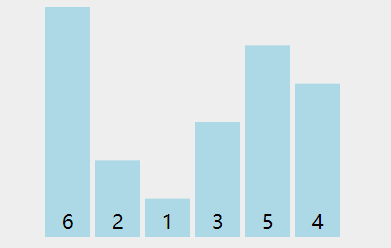

# 排序

## 2.1 概述

在不同领域，排序算法的实现各有千秋。总体来看，排序算法大致可分为十类：

+ 选泡插：选择排序、冒泡排序、插入排序；
+ 快归希堆：快速排序、归并排序、希尔排序、堆排序；
+ 桶计基：桶排序、计数排序、基数排序；

## 2.2 时间复杂度 $O(n^2)$ 排序算法

### 2.2.1 冒泡排序

冒泡排序是入门级的算法，其核心思想是每一轮比较就确认一个最大/最小的数，如果数组有 $n$ 个数，那么需要比较 $n$ 轮，第 $i$ 轮因为 $i-1$ 个数已经排序完成，所以需要比较的次数为 $n-i-1$ 。综上，得出代码如下所示：

```java
public static void bubbleSort(int[] arr) {
    for (int i = 0; i < arr.length - 1; i++) { // 比较的轮数
        for (int j = 0; j < arr.length - 1 - i; j++) { // 该轮需要比较的次数
            if (arr[j] > arr[j + 1]) {
                swap(arr, j, j + 1);
            }
        }
    }
}

// 交换元素
private static void swap(int[] arr, int i, int j) {
    arr[i] = arr[i] ^ arr[j];
    arr[j] = arr[j] ^ arr[i];
    arr[i] = arr[i] ^ arr[j];
}
```

冒泡排序动态图如下：



时间复杂度为 $o(n^2)$ ，空间复杂度为 $O(1)$ ，冒泡排序是稳定的。
