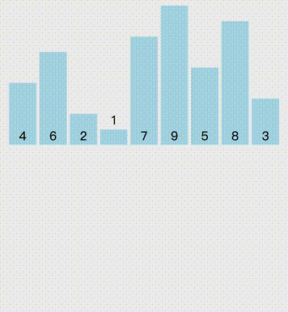

# 排序

## 2.1 概述

在不同领域，排序算法的实现各有千秋。总体来看，排序算法大致可分为十类：

+ 选泡插：选择排序、冒泡排序、插入排序；
+ 快归希堆：快速排序、归并排序、希尔排序、堆排序；
+ 桶计基：桶排序、计数排序、基数排序；

## 2.2 时间复杂度 $O(n^2)$ 排序算法

### 2.2.1 冒泡排序

冒泡排序是入门级的算法，其核心思想是每一轮比较就确认一个最大/最小的数，如果数组有 $n$ 个数，那么需要比较 $n$ 轮，第 $i$ 轮因为 $i-1$ 个数已经排序完成，所以需要比较的次数为 $n-i-1$ 。综上，得出代码如下所示：

```java
public static void bubbleSort(int[] arr) {
    for (int i = 0; i < arr.length - 1; i++) { // 比较的轮数
        for (int j = 0; j < arr.length - 1 - i; j++) { // 该轮需要比较的次数
            if (arr[j] > arr[j + 1]) {
                swap(arr, j, j + 1);
            }
        }
    }
}

// 交换元素
private static void swap(int[] arr, int i, int j) {
    if(i==j) return;
    arr[i] = arr[i] ^ arr[j];
    arr[j] = arr[j] ^ arr[i];
    arr[i] = arr[i] ^ arr[j];
}
```

冒泡排序动态图如下：


时间复杂度为 $o(n^2)$ ，空间复杂度为 $O(1)$ ，冒泡排序是稳定的。

### 2.2.2 选择排序

对于要排序的数组，设置一个 `minIdx` 记录最小数字下标。先假设第 1 个数字最小，此时 `minIdx = 0`，将  `arr[minIdx]` 与后续数字逐一比较，当遇到更小的数字时，使 `minIdx` 等于该数字下标，第 1 轮比较将找出此时数组中最小的数字。找到后将 `minIdx` 下标的数字与第 `1` 个数字交换，此时称一个数字已被排序。然后开始第`2`轮比较，令 `minIdx = 1`，重复上述过程。每一轮的比较将使得当前未排序数字中的最小者被排序，未排序数字总数减 1。第 `arr.length−1` 轮结束后排序完成。得出代码如下：

```java
public static void selectionSort(int[] arr) {
    if (arr.length < 2) // 0 或 1 个数组元素个数
        return;
    for (int i = 0; i < arr.length - 1; i++) { // 当前 N-1 个元素排好后，最后一个元素无需执行，故 i < arr.length - 1
        int minIdx = i;
        for (int j = i + 1; j < arr.length; j++) { // 找到本轮执行中最小的元素，将最小值下标赋值给 minIdx
            if (arr[j] < arr[minIdx])
                minIdx = j;
        }
        swap(arr, i, minIdx);
    }
    return;
}
```

选择排序动态图如下：


时间复杂度为 $o(n^2)$ ，空间复杂度为 $O(1)$ ，选择排序是不稳定的。

### 2.2.3 插入排序

对于待排序数组，从第 2 个元素开始 (称作插入对象元素) ，比较它与之前的元素 (称作比较对象元素) ，当插入对象元素小于比较对象元素时，继续往前比较，直到不小于 (≥) 比较对象，此时将插入对象元素插入到该次比较对象元素之后。重复这个插入过程直到最后一个元素作为插入对象元素完成插入操作。得出代码如下：

```java
// 插入排序
public static void insertSort(int[] arr) {
    if (arr.length < 2)
        return;
    // n - 1 轮次执行
    for (int i = 1; i < arr.length; i++) {
        // 通过二分查找得到插入位置
        int target = arr[i];
        int pos = binarySearch(arr, 0, i - 1, target);
        for (int j = i; j > pos; j--) { // 移动
            arr[j] = arr[j - 1];
        }
        arr[pos] = target; // 插入
    }
    return;
}


// 二分搜索
private static int binarySearch(int[] arr, int l, int r, int target) {
    while (l <= r) {
        int c = l + (r - l) / 2;
        if (arr[c] <= target)
            l = c + 1;
        else
            r = c - 1;
    }
    return l;
}

```

插入排序动态图如下：


时间复杂度为 $o(n^2)$ ，空间复杂度为 $O(1)$ ，插入排序是稳定的。

### 2.2.4 希尔排序

希尔排序是简单插入排序的改进，它基于以下事实。

+ 简单插入排序对排序程度较高的序列有较高的效率。假设初始序列已完全排序，则每一轮均只需比较一次，将得到 `O(n)` 的线性复杂度
+ 简单插入排序每次比较最多将数字移动一位，效率较低。

Donald Shell 针对这两个事实，提出如下方法。对原待排序列中相隔 gap 的数字执行简单插入排序，然后缩小 gap，对新的 gap 间隔的数字再次执行简单插入排序。以一种规则减少 gap 的大小，当 gap 为 1 时即简单插入排序，因此希尔排序也称作 增量递减排序。增量序列生成式为 $\frac{n}{2^k},k=1,2,3,...$ ，例如 n = 11，则增量序列为 {5,2,1} 。

```java
// 希尔排序：采用 Shell 增量 N / 2^k
public static void shellSort(int[] arr) {
    if (arr.length < 2)
        return;
    int n = arr.length;
    for (int gap = n / 2; gap > 0; gap /= 2) { // gap 初始为 n/2，缩小gap直到1
        for (int start = 0; start < gap; start++) { // 步长增量是gap，当前增量下需要对gap组序列进行简单插入排序
            for (int i = start + gap; i < n; i += gap) { // 此for及下一个for对当前增量序列执行简单插入排序
                int target = arr[i], j = i - gap;
                for (; j >= 0; j -= gap) {
                    if (target < arr[j])
                        arr[j + gap] = arr[j];
                    else
                        break;
                }
                arr[j + gap] = target;
            }
        }
    }
    return;
}
```

时间复杂度为 $O(n log ^n)-O(n^2)$ ，空间复杂度为 $O(1)$ ，插入排序是稳定的。

## 2.3 时间复杂度 $O(n log^n)$ 排序算法

### 2.3.1 归并排序

归并排序是分治思想的应用，即将原待排数组递归或迭代地分为左右两半，直到数组长度为 1，然后合并 (merge) 左右数组，在合并中完成排序。如下动图展示了 {4,6,2,1,7,9,5,8,3} 的归并排序过程（自顶向下非原地）。



递归的轨迹如下所示：


代码如下：

```java
// 归并排序，非原地
public static void mergeSort(int[] arr) {
    if (arr.length < 2)
        return;
    int[] tmpArr = new int[arr.length];
    mergeSort(arr, tmpArr, 0, arr.length - 1);
    return;
}

// mergeSort 递归方法
private static void mergeSort(int[] arr, int[] tmpArr, int l, int r) {
    if (l < r) {
        int c = l + (r - l) / 2;
        mergeSort(arr, tmpArr, l, c);
        mergeSort(arr, tmpArr, c + 1, r);
        merge(arr, tmpArr, l, c, r);
    }
}

// 非原地合并方法
private static void merge(int[] arr, int[] tmpArr, int l, int c, int r) {
    int lh = l, rh = c + 1, h = l; // lh: left head, rh: right head, h: tmpArr head
    while (lh <= c && rh <= r) {
        tmpArr[h++] = arr[lh] <= arr[rh] ? arr[lh++] : arr[rh++];
    }
    while (lh <= c)
        tmpArr[h++] = arr[lh++]; // 左半边还有剩余，加入 tmpArr 末尾
    while (rh <= r)
        tmpArr[h++] = arr[rh++]; // 右半边还有剩余，加入 tmpArr 末尾
    for (; l <= r; l++)
        arr[l] = tmpArr[l]; // 将 tmpArr 拷回 arr 中
}
```

时间复杂度为 $O(n log ^n)$ ，空间复杂度为 $O(n)$ ，归并排序是稳定的。

### 2.3.2 快速排序

与归并排序一样，快速排序也是一种利用分治思想的排序方法，确定主轴及分区是快速排序的核心操作。首先在数组中确定一个主轴元素 (例如以第一个元素为主轴元素)，然后遍历数组，将数组分为两部分，小于主轴的元素放在 (最终的) 主轴下标 p 的左侧， 大于等于主轴的放在右侧。当前主轴位置确定后，继续递归地对主轴左右两侧数组执行这个过程，每次递归都传入待排序数组 arr 和本次要处理的部分的左右界，只处理这个范围内的序列。当所有递归都到达基准情形时，排序完成。因为是原地交换，递归过程中 arr 总是在动态排序，递归过程无需返回，为尾递归形式。<br>

代码如下：

```java
// 单轴快排：首位为轴
public static void quickSort(int[] arr) {
    if (arr.length < 2)
        return;
    quickSort(arr, 0, arr.length - 1);
    return;
}

// 单轴快排递归方法：首位为轴
private static void quickSort(int[] arr, int l, int r) {
    if (l < r) { // 若left == right，表示此时 arr 只有一个元素，即为基准情形，完成递归
        int p = partition(arr, l, r); // 完成 p 排序
        quickSort(arr, l, p - 1);
        quickSort(arr, p + 1, r);
    }
}

// partition 方法
private static int partition(int[] arr, int l, int r) {
    int j = l + 1;
    for (int i = j; i <= r; i++) {
        if (arr[i] < arr[l]) {
            swap(arr, i, j); // 交换后的 arr[j] 为当前最后一个小于主轴元素的元素
            j++;
        }
    }
    swap(arr, l, j - 1); // 主轴元素归位
    return j - 1;
}
```

时间复杂度为 $O(n log ^n)$ ，空间复杂度为 $O(log ^ n)$ ，归并排序是不稳定的。

### 2.3.3 堆排序

堆排序算法建立在堆数据结构的基础上。

```java
// 堆排序
public static void heapSort(int[] arr) {
    if (arr.length < 2)
        return;
    heapify(arr, arr.length - 1); // 构建大顶堆
    for (int i = arr.length - 1; i > 0; i--) { // i > 0 即可，无需写成 i >= 0，当 N-1 个元素排序时，最后一个元素也已排序
        swap(arr, 0, i); // 交换堆顶和当前未排序部分最后一个元素
        siftDown(arr, 0, i - 1); // i - 1 是未排序部分最后一个元素下标，传入此参数确保下滤不会超过此范围
    }
    return;
}

// 堆化方法
private static void heapify(int[] arr, int r) {
    for (int hole = (r - 1) / 2; hole >= 0; hole--) { // (r - 1) / 2 为最后一个叶子节点的父节点下标
        siftDown(arr, hole, r);
    }
}

// 下滤方法
private static void siftDown(int[] arr, int hole, int r) {
    int target = arr[hole], child = hole * 2 + 1; // target 是要下滤的结点的值
    while (child <= r) { // child 最大为 r
        if (child < r && arr[child + 1] > arr[child])
            child++; // #1
        if (arr[child] > target) { // 若 child 大于 target
            arr[hole] = arr[child]; // 则 arr[child] 上移到下标 hole 处
            hole = child; // hole 更新为 child (下滤)
            child = hole * 2 + 1; // 更新 child ，也可以写成 child = child * 2 + 1
        } else
            break; // 若 arr[child] <= target ，说明下标 hole 处已经满足堆序，退出 while
    }
    arr[hole] = target; // 将 target 填 入hole 中
}
```

时间复杂度为 $O(n log ^n)$ ，空间复杂度为 $O(1)$ ，堆排序是不稳定的。
