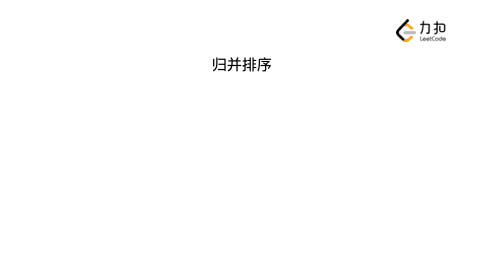
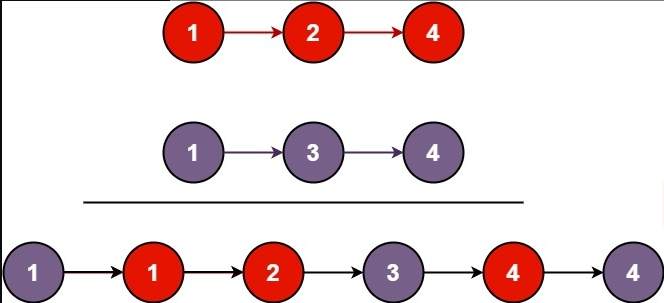

# 递归、分治

## 5.1 分而治之的算法设计思想

### 5.1.1 递归和分治

在编程语言中，递归（`Recursion`）是指函数自己调用自己的语法现象。递归是一种编程技巧，如果使用代码来体现，那么就是函数掉用自己。在调用的函数执行完毕，返回之后，程序会回到调用函数的地方继续执行下面的代码。调用的过程被称为<font color="red"><strong>递归</strong></font>，返回到调用的过程被称为<font color="red"><strong>回溯</strong></font>。

<font color="red"><strong>分治</strong></font>是一种算法设计思想，将一个大问题分解成多个小问题，一直分解，直到分成可解决的小问题。例如归并排序，它将大问题：`排序整个数组`，分解为小问题：`排序左半和右半`，直到分解为可解决的小问题：`只剩一个元素`。在绝大部分情况下，<font color="red"><strong>分治</strong></font>通过<font color="red"><strong>递归</strong></font>实现，即分治中子问题的求解通过递归的调用方式求解。

<font color="red"><strong>递归</strong></font>是基于<font color="red"><strong>自顶向下拆分问题</strong></font>，再<font color="red"><strong>自底向上逐层解决问题</strong></font>的思想设计得到。

### 5.1.2 递归函数设计思想：分而治之（减而治之）

分而治之（divide-and-conquer）的思想分为三步：

1. <font color="red"><strong>拆分</strong></font>：将原问题拆分成若干个子问题；
2. <font color="red"><strong>解决</strong></font>：解决这些子问题；
3. <font color="red"><strong>合并</strong></font>：合并子问题的解得到原问题的解；

分而治之的三步恰好与递归的程序的写法一致：

1. <font color="red"><strong>拆分</strong></font>：对当前的最大问题进行分析，写出相应代码，分解为子问题；
2. <font color="red"><strong>解决</strong></font>：通过递归调用解决子问题；
3. <font color="red"><strong>合并</strong></font>：在回溯的过程中，根据递归返回的结果，对子问题进行合并，最终得出最大问题的解。

所以，分治的思想一般使用递归的代码编写方式来实现。在分治中，刚开始我们处于顶层，然后<font color="red"><strong>自顶向下</strong></font>，将问题分解。在解决子问题后，将分解的问题<font color="red"><strong>自底向上</strong></font>合并。

分治思想的应用场景有很多，比较典型的场景有：归并排序、快速排序、树的问题（树中，可以将问题拆分成子树问题，当子树问题解决后，结合子树的解处理当前结点）、链表的问题等。

分治思想中有一个特例：减治思想（`Decrease-and-Conquer`），每一步将问题转换为规模更小的子问题。减治思想的典型应用有：二分查找、选择排序、插入排序、快速排序等。分治和减治思想的区别如下：

+ 分治思想：将一个问题拆分为若干个子问题，然后逐个求解，根据子问题得到的结果得到原问题的结果；
+ 减治思想：在拆分子问题的时候，只将问题转换成一个规模更小的子问题，因此子问题的结果就是上一层源

问题的结果，每一步只需要解决一个规模更小的子问题，相比较于分治思想，减治思想没有合并的过程。

### 5.1.3 自顶向下地解决问题

使用递归解决问题，最关键的是：从结果走向源头，然后再从源头走向结果，比如下面计算 $5!$ 过程，来解释递归如何自顶向下地解决问题：


在计算 $5!$ 的过程中，我们可以总结为两条路径：

1. 先自顶向下拆分问题，直到不能拆分可以解决为止；
2. 再自底向上逐层把底层的结果向上汇总，直到得到原问题的解。

因为需要记录拆分过程的每一个子问题，并且在求解每一个子问题以后，逐层向上汇报结果，实现这个目标使用了函数调用栈，所以递归整个过程，都需要栈来辅助操作。

## 5.2 如何使用递归解决问题

### 5.2.1 使用递归与循环实现求阶乘函数对比

现在，我们需要实现一个函数`factorial`，输 $n$ ，输出 $n$ 的阶乘，为了简化，我们不考虑负数以及输出发生整数溢出，换句话说，我们假设输入时合法的，并且计算机阶乘得到结果的整数在 $32$ 位整数范围之内。

#### 5.2.1.1 使用递归

使用递归计算阶乘代码如下：

```java
public int factorial(int n) {
    return n == 1 ? 1 : n * factorial(n - 1);
}
```

上面代码中，在递归调用方法`factorial`后，还做了一些事情：`factorial(n - 1)`返回后，我们将其返回的结果和`n`相乘，上面的代码和下面的代码等价：

```java
public int factorial(int n) {
    if (n == 1) {
        return 1;
    }
    // 获取递归调用的结果
    int res = factorial(n - 1);
    // 在这里还能够执行一次操作，实现「分治思想」里「合并」的逻辑
    return n * res;
}
```

这种能够在递归调用返回的时候做一些事情对应于分治思想中的第 $3$ 步合并的过程。在上一层递归调用结束以后，我们可以额外实现一些功能，这一点很重要，可以使用这一点为我们解决更多的问题。

#### 5.2.1.2 使用尾递归计算阶乘

相比较于上面递归的写法，有一种递归调用的模式称为：尾递归。尾递归是指一个函数里的`return`语句直接返回一个函数结果的情形，即最后一步调用的函数返回值被当前函数作为结果返回。

尾递归的特点是：`return`语句直接调用递归函数，而不做任何额外的操作，也就是说没有合并的过程。使用尾递归实现阶乘计算代码如下：

```java
/**
  * @param n
  * @param res 递归函数上一层的结果，由于求的是阶乘，一开始需要传入 1
  * @return
  */
public int factorial(int n, int res) {
    if (n == 1) {
        return res;
    }
    return factorial(n - 1, n * res);
}
```

因为在返回后没有做任何事，这样的过程就等价于自底向上递推地解决问题。

#### 5.2.1.3 使用循环

如果我们知道了一个问题最开始的结果，那么可以通过递推的方式一步一步求解，直到得到了我们想要问题的解，相对于递归而言，这样的思考是自底向上的，计算 $5!$ 可以使用循环实现，代码如下：

```java
public int factorial(int n) {
    int res = 1;
    for (int i = 2; i <= n; i++) {
        res *= i;
    }
    return res;
}
```

自底向上思考问题的方向直接从一个问题的源头开始，逐步求解，相较于自顶向下而言：

1. 少了一层一层拆分问题的步骤；
2. 不需要借助数据结构记录拆分过程中的每一个子问题。

这里我们遇见了两种解决问题的方式，`自顶向下的递归`与`自底向上的递推`。对于`自顶向下的递归`而言，是直接面对我们要解决的源问题，逐层拆分，直到不能拆分为止，再按照拆分的顺序的逆序逐层解决（逆序的实现依赖栈），直至源问题得到解决。`自底向上的递推`基于我们非常清楚一个问题最开始的解，并且也知道如何将问题从最开始的样子逐步演进到我们想要求解的问题，这样就可以递推得到我们目标问题的解，也就是说可以从小规模问题逐步`递推`得到目标问题的解。

### 5.2.2 如何写好递归

完成递归函数的编写可以总结为下面三个步骤：

1. <font color="red"><strong>写出递归终止条件（易忽略）</strong></font>：首先写出递归的终止条件，也就是先写出不能再拆分的子问题，如果没有写出终止条件，那么问题永远不会停止拆分，以至于递归栈满；
2. <font color="red"><strong>将原问题拆分成为规模更小的子问题（重点）</strong></font>：这一步是编写递归函数的关键，如何拆分子问题是我们使用递归的重点；
3. <font color="red"><strong>将子问题的结果进行合并（难点）</strong></font>：有一些逻辑需要在递归函数调用之后编写，使得我们求解原问题变得更加简单。

## 5.3 递归与归并和快速排序

### 5.3.1 归并排序

归并排序将数组不断拆分，直到拆到不能拆分为止（即数组只有 $1$ 个元素的时候）。由于 $1$ 个元素的数组肯定是有序数组，然后我们逐层向上，依次合并两个有序数组，通过这样的方式，实现了排序的需求。拆分和合并可以通过递归的方式实现其逻辑。



归并排序代码如下：

```java
public class Solution {

    public int[] sortArray(int[] nums) {
        int len = nums.length;
        int[] temp = new int[len];
        mergeSort(nums, 0, len - 1, temp);
        return nums;
    }

    /**
     * 递归函数语义：对数组 nums 的子区间 [left.. right] 进行归并排序
     *
     * @param nums
     * @param left
     * @param right
     * @param temp  用于合并两个有序数组的辅助数组，全局使用一份，避免多次创建和销毁
     */
    private void mergeSort(int[] nums, int left, int right, int[] temp) {
        // 1. 递归终止条件
        if (left == right) {
            return;
        }

        // 2. 拆分，对应「分而治之」算法的「分」
        int mid = (left + right) / 2;

        mergeSort(nums, left, mid, temp);
        mergeSort(nums, mid + 1, right, temp);

        // 3. 在递归函数调用完成以后还可以做点事情

        // 合并两个有序数组，对应「分而治之」的「合」
        mergeOfTwoSortedArray(nums, left, mid, right, temp);
    }


    /**
     * 合并两个有序数组：先把值复制到临时数组，再合并回去
     *
     * @param nums
     * @param left
     * @param mid   mid 是第一个有序数组的最后一个元素的下标，即：[left..mid] 有序，[mid + 1..right] 有序
     * @param right
     * @param temp  全局使用的临时数组
     */
    private void mergeOfTwoSortedArray(int[] nums, int left, int mid, int right, int[] temp) {
        for (int i = left; i <= right; i++) {
            temp[i] = nums[i];
        }

        int i = left;
        int j = mid + 1;

        int k = left;
        while (i <= mid && j <= right) {
            if (temp[i] <= temp[j]) {
                // 注意写成 < 就丢失了稳定性（相同元素原来靠前的排序以后依然靠前）
                nums[k] = temp[i];
                k++;
                i++;
            } else {
                nums[k] = temp[j];
                k++;
                j++;
            }
        }

        while (i <= mid) {
            nums[k] = temp[i];
            k++;
            i++;
        }
        while (j <= right) {
            nums[k] = temp[j];
            k++;
            j++;
        }
    }
}
```

### 5.3.2 快速排序

归并排序在拆分子问题环节是无脑地进行拆分，然后要求我们在和合的环节进行一些额外操作。而相对应的，快速排序在分的环节进行额外的操作，在合的过程中，可以很简洁。

快速排序的基本思想和步骤如下所述：

1. 从数组中取出一个数，称之为基数（`pivot`）；
2. 遍历数组，将比基数大的数字放在其右边，比基数小的数字放在其左边。遍历完成后，数组被分成了左右两个区域；
3. 将左右两个区域视为两个数组，重复前面两个步骤，直到排序完成；

快速排序步骤如下：


代码如下：

```java
import java.util.Random;

public class Solution {

    /**
     * 随机化是为了防止递归树偏斜的操作，此处不展开叙述
     */
    private static final Random RANDOM = new Random();

    public int[] sortArray(int[] nums) {
        int len = nums.length;
        quickSort(nums, 0, len - 1);
        return nums;
    }

    /**
     * 对数组的子区间 nums[left..right] 排序
     *
     * @param nums
     * @param left
     * @param right
     */
    private void quickSort(int[] nums, int left, int right) {
        // 1. 递归终止条件
        if (left >= right) {
            return;
        }

        int pIndex = partition(nums, left, right);

        // 2. 拆分，对应「分而治之」算法的「分」
        quickSort(nums, left, pIndex - 1);
        quickSort(nums, pIndex + 1, right);

        // 3. 递归完成以后没有「合」的操作，这是由「快速排序」partition 的逻辑决定的
    }


    /**
     * 将数组 nums[left..right] 分区，返回下标 pivot，
     * 且满足 [left + 1..lt) <= pivot，(gt, right] >= pivot
     *
     * @param nums
     * @param left
     * @param right
     * @return
     */
    private int partition(int[] nums, int left, int right) {
        int randomIndex = left + RANDOM.nextInt(right - left + 1);
        swap(nums, randomIndex, left);

        int pivot = nums[left];
        int lt = left + 1;
        int gt = right;

        while (true) {
            while (lt <= right && nums[lt] < pivot) {
                lt++;
            }

            while (gt > left && nums[gt] > pivot) {
                gt--;
            }

            if (lt >= gt) {
                break;
            }

            // 细节：相等的元素通过交换，等概率分到数组的两边
            swap(nums, lt, gt);
            lt++;
            gt--;
        }
        swap(nums, left, gt);
        return gt;
    }

    private void swap(int[] nums, int index1, int index2) {
        int temp = nums[index1];
        nums[index1] = nums[index2];
        nums[index2] = temp;
    }
}
```

上面的代码有优化部分：

1. 引入随机化选择切分元素`pivot`，以避免递归树倾斜；
2. 并且使用了双指针技巧，将与`pivot`相等的元素平均地分散到待排序区间的开头和末尾。

## 5.4 递归与链表

链表的定义是递归定义的：链表的某一个结点的`next`指针指向了一个链表。所以，链表的很多问题除了可以使用循环解决，也可以使用递归实现。

### 5.4.1 合并两个有序数组

将两个升序链表合并为一个新的升序链表并返回，新链表是通过拼接给定的两个链表的所有节点组成。

**示例1：**



```
输入：l1 = [1,2,4], l2 = [1,3,4]
输出：[1,1,2,3,4,4]
```

**示例2：**

```
输入：l1 = [], l2 = []
输出：[]
```

**示例3：**

```
输入：l1 = [], l2 = [0]
输出：[0]
```

提示：

+ 两个链表的节点数目范围是`[0, 50]`；
+ `-100 <= Node.val <= 100`；
+ `l1` 和 `l2` 均按 非递减顺序 排列；

#### 5.4.1.1 循环解决

```java
class ListNode {
      int val;
      ListNode next;
      ListNode(int x) { val = x; }
}

public class Solution {

    public ListNode mergeTwoLists(ListNode l1, ListNode l2) {
        ListNode dummyNode = new ListNode(-1);
        ListNode p1 = l1;
        ListNode p2 = l2;
        ListNode curNode = dummyNode;
        // 两者都不为空的时候，才有必要进行比较
        while (p1 != null && p2 != null) {
            if (p1.val < p2.val) {
                // 指针修改发生在这里
                curNode.next = p1;
                p1 = p1.next;
            } else {
                // 指针修改发生在这里
                curNode.next = p2;
                p2 = p2.next;
            }
            curNode = curNode.next;
        }
        // 跳出循环是因为 p1 == null 或者 p2 == null
        if (p1 == null) {
            curNode.next = p2;
        }
        if (p2 == null) {
            curNode.next = p1;
        }
        return dummyNode.next;
    }
}
```

#### 5.4.1.2 递归解决

```java
class ListNode {
      int val;
      ListNode next;
      ListNode(int x) { val = x; }
}

public class Solution {

    /**
     * 使用递归
     *
     * @param l1 有序链表
     * @param l2 有序链表
     * @return 有序链表
     */
    public ListNode mergeTwoLists(ListNode l1, ListNode l2) {
        // 先写递归终止的条件
        if (l1 == null) {
            return l2;
        }
        if (l2 == null) {
            return l1;
        }
        // 假设规模小的问题已经解决，如何建立和原始规模问题之间的关系
        if (l1.val < l2.val) {
            // l1 被选出，谁小谁在前面
            l1.next = mergeTwoLists(l1.next, l2);
            return l1;
        } else {
            // l2 被选出，谁小谁在前面
            l2.next = mergeTwoLists(l1, l2.next);
            return l2;
        }
    }
}
```

#### 5.4.1.3 对比

修改递归解决和循环解决，增加一些打印语句，代码如下：

```java
class ListNode {
      int val;
      ListNode next;
      ListNode(int x) { val = x; }
}

public class Solution {

    public ListNode mergeTwoLists(ListNode l1, ListNode l2) {
        ListNode dummyNode = new ListNode(-1);
        ListNode p1 = l1;
        ListNode p2 = l2;
        ListNode curNode = dummyNode;
        // 两者都不为空的时候，才有必要进行比较
        while (p1 != null && p2 != null) {
            if (p1.val < p2.val) {
                // 指针修改发生在这里
                curNode.next = p1;
                log(curNode, p1);
                p1 = p1.next;
            } else {
                // 指针修改发生在这里
                curNode.next = p2;
                log(curNode, p2);
                p2 = p2.next;
            }
            curNode = curNode.next;
        }
        // 跳出循环是因为 p1 == null 或者 p2 == null
        if (p1 == null) {
            curNode.next = p2;
            log(curNode, p2);
        }
        if (p2 == null) {
            curNode.next = p1;
            log(curNode, p1);
        }
        return dummyNode.next;
    }

    /**
     * 使用递归
     *
     * @param l1 有序链表
     * @param l2 有序链表
     * @return 有序链表
     */
    public ListNode mergeTwoListsByRecursion(ListNode l1, ListNode l2) {
        // 先写递归终止的条件
        if (l1 == null) {
            return l2;
        }
        if (l2 == null) {
            return l1;
        }
        // 假设规模小的问题已经解决，如何建立和原始规模问题之间的关系
        if (l1.val < l2.val) {
            // l1 被选出，谁小谁在前面
            // 这里声明 res 不是必需的，仅仅只是为了打印输出方便
            ListNode res = mergeTwoListsByRecursion(l1.next, l2);
            l1.next = res;
            log(l1, res);
            return l1;
        } else {
            // l2 被选出，谁小谁在前面
            ListNode res = mergeTwoListsByRecursion(l1, l2.next);
            l2.next = res;
            log(l2, res);
            return l2;
        }
    }

    private void log(ListNode currNode, ListNode nextNode) {
        System.out.println("将结点 " + currNode.val + " 指向结点 " + nextNode.val);
    }

    public static void main(String[] args) {
        Solution solution = new Solution();
        int[] nums1 = new int[]{1, 3, 5};
        int[] nums2 = new int[]{2, 4, 6};
        ListNode listNode1 = new ListNode(nums1);
        ListNode listNode2 = new ListNode(nums2);

        System.out.println("循环：");
        ListNode res1 = solution.mergeTwoLists(listNode1, listNode2);
        System.out.println("结果：" + res1);

        ListNode listNode3 = new ListNode(nums1);
        ListNode listNode4 = new ListNode(nums2);
        System.out.println("递归：");
        ListNode res2 = solution.mergeTwoListsByRecursion(listNode3, listNode4);
        System.out.println("结果：" +res2);
    }
}
```

程序输出：

```
循环：
将结点 -1 指向结点 1
将结点 1 指向结点 2
将结点 2 指向结点 3
将结点 3 指向结点 4
将结点 4 指向结点 5
将结点 5 指向结点 6
结果：1 -> 2 -> 3 -> 4 -> 5 -> 6 -> null
递归：
将结点 5 指向结点 6
将结点 4 指向结点 5
将结点 3 指向结点 4
将结点 2 指向结点 3
将结点 1 指向结点 2
结果：1 -> 2 -> 3 -> 4 -> 5 -> 6 -> null
```

我们看到`循环`方法合并两个链表的操作是从头到尾的，而递归方法合并两个链表的操作恰恰相反。这个例子恰恰说明了循环和递归这两种方法的思考路径是不一样的：

+ 循环：自底向上，从一个问题最基本的样子开始，一点一点解决问题，直到完成任务；
+ 递归：自顶向下，先对原问题进行拆分，直到不能拆分为止，再将子问题的结果一层一层返回，直到原问题得到解决。

### 5.4.2 反转链表

反转一个链表。

例如：

```
输入: 1->2->3->4->5->NULL
输出: 5->4->3->2->1->NULL
```

#### 5.4.2.1 循环解决

```java
class ListNode {
    int val;
    ListNode next;
    ListNode() {}
    ListNode(int val) { this.val = val; }
    ListNode(int val, ListNode next) { this.val = val; this.next = next; }
}

public class Solution {

    public ListNode reverseList(ListNode head) {
        // 特判
        if (head == null || head.next == null) {
            return head;
        }

        ListNode preNode = null;
        ListNode curNode = head;
        while (curNode != null) {
            ListNode nextNode = curNode.next;
            curNode.next = preNode;
            preNode = curNode;
            curNode = nextNode;
        }
        return preNode;
    }
}
```

#### 5.4.2.2 递归解决

```java
class Solution {
    public ListNode reverseList(ListNode head) {
        if (head == null || head.next == null) {
            return head;
        }
        ListNode newHead = reverseList(head.next);
        head.next.next = head;
        head.next = null;
        return newHead;
    }
}
```

## 5.5 递归与树

### 5.5.1 从先序与后序遍历序列构造二叉树

给定两个整数数组 `preorder` 和 `inorder` ，其中 `preorder` 是二叉树的先序遍历， `inorder` 是同一棵树的中序遍历，请构造二叉树并返回其根节点。

#### 5.5.1.1 递归

```java
class Solution {
    private Map<Integer, Integer> indexMap;

    public TreeNode myBuildTree(int[] preorder, int[] inorder, int preorder_left, int preorder_right, int inorder_left, int inorder_right) {
        if (preorder_left > preorder_right) {
            return null;
        }

        // 前序遍历中的第一个节点就是根节点
        int preorder_root = preorder_left;
        // 在中序遍历中定位根节点
        int inorder_root = indexMap.get(preorder[preorder_root]);
        
        // 先把根节点建立出来
        TreeNode root = new TreeNode(preorder[preorder_root]);
        // 得到左子树中的节点数目
        int size_left_subtree = inorder_root - inorder_left;
        // 递归地构造左子树，并连接到根节点
        // 先序遍历中「从 左边界+1 开始的 size_left_subtree」个元素就对应了中序遍历中「从 左边界 开始到 根节点定位-1」的元素
        root.left = myBuildTree(preorder, inorder, preorder_left + 1, preorder_left + size_left_subtree, inorder_left, inorder_root - 1);
        // 递归地构造右子树，并连接到根节点
        // 先序遍历中「从 左边界+1+左子树节点数目 开始到 右边界」的元素就对应了中序遍历中「从 根节点定位+1 到 右边界」的元素
        root.right = myBuildTree(preorder, inorder, preorder_left + size_left_subtree + 1, preorder_right, inorder_root + 1, inorder_right);
        return root;
    }

    public TreeNode buildTree(int[] preorder, int[] inorder) {
        int n = preorder.length;
        // 构造哈希映射，帮助我们快速定位根节点
        indexMap = new HashMap<Integer, Integer>();
        for (int i = 0; i < n; i++) {
            indexMap.put(inorder[i], i);
        }
        return myBuildTree(preorder, inorder, 0, n - 1, 0, n - 1);
    }
}
```

#### 5.5.1.2 迭代

```java
class Solution {
    public TreeNode buildTree(int[] preorder, int[] inorder) {
        if (preorder == null || preorder.length == 0) {
            return null;
        }
        TreeNode root = new TreeNode(preorder[0]);
        Deque<TreeNode> stack = new LinkedList<TreeNode>();
        stack.push(root);
        int inorderIndex = 0;
        for (int i = 1; i < preorder.length; i++) {
            int preorderVal = preorder[i];
            TreeNode node = stack.peek();
            if (node.val != inorder[inorderIndex]) {
                node.left = new TreeNode(preorderVal);
                stack.push(node.left);
            } else {
                while (!stack.isEmpty() && stack.peek().val == inorder[inorderIndex]) {
                    node = stack.pop();
                    inorderIndex++;
                }
                node.right = new TreeNode(preorderVal);
                stack.push(node.right);
            }
        }
        return root;
    }
}
```

## 5.6 递归时间复杂度计算

### 5.6.1 主定理

如果一个规模为 $n$ 的问题，可以拆解为 $a$ 个子问题，每个子问题的规模是 $\frac{n}{b}$ ，其中 $a\geq 1,b>1$ 。用 $f(n)$ 表示分解和合并的开销与 $n$ 的关系，那么原始问题的时间复杂度 $T(n)$ 可以表示成如下递归式：

$$T(n)=a\cdot T(\frac{n}{b})+f(n)$$

将此递推式得到关于 $n$ 的通项公式的时候，需要利用以下结论：

+ 如果 $f(n)<n^{log_b^a}$ ，那么 $T(n)=O(n^{log_b^a})$ ；
+ 如果 $f(n)=n^{log_b^a}$ ，那么 $T(n)=O(n^{log_b^a}\cdot log^n)$ ；
+ 如果 $f(n)>n^{log_b^a}$ ，那么 $T(n)=O(f(n))$ ；

比如，二分查找每一次将问题一分为二，但是只在其中一个子问题里继续求解，此时 $a=1$ ， $b=2$ 。只有拆分子问题，不用合并子问题，此时 $f(n)=1$ （常数次操作，与 $n$ 无关）。比较 $n^{log_b^a}=n^{log_2^1}=n^0=1$ ，套用主定理的第二种情况，此时 $T(n)=O(log^n)$ 。

比如，归并排序每一次将问题一分为二，然后递归在两个子问题里继续求解，此时 $a=2$ ， $b=2$ 。拆分子问题使用了 $O(1)$ ，合并子问题使用了 $f(n)=n$ ，此时 $f(n)=n$ 。比较 $n^{log_b^a}=n^{log_2^2}=n$ 套用主定理的第二种情况，此时 $T(n)=O(nlog^n)$ 。