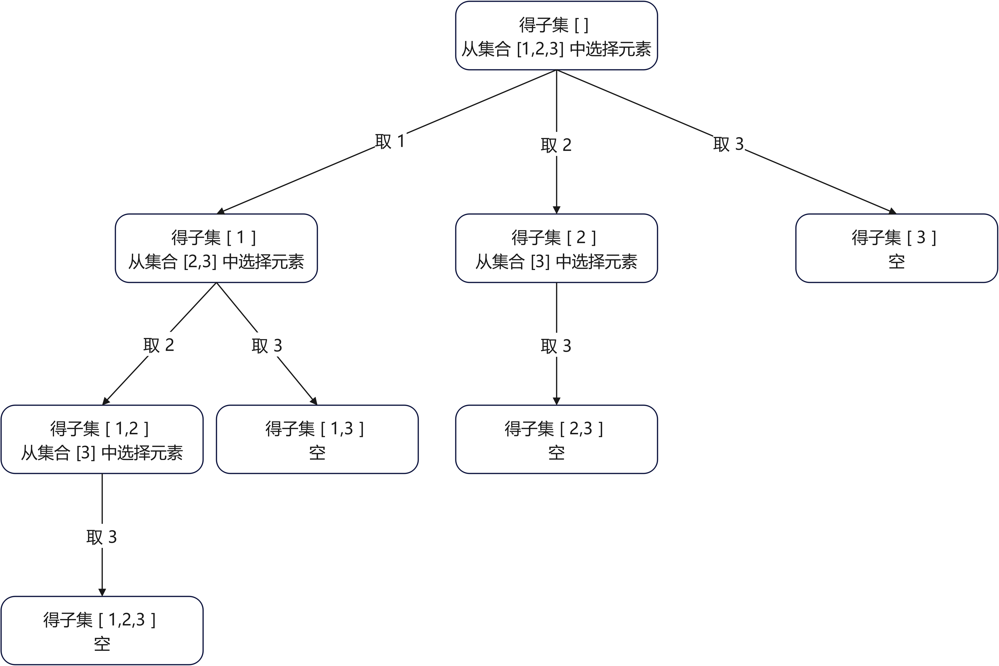
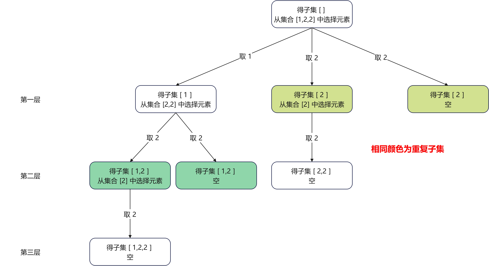
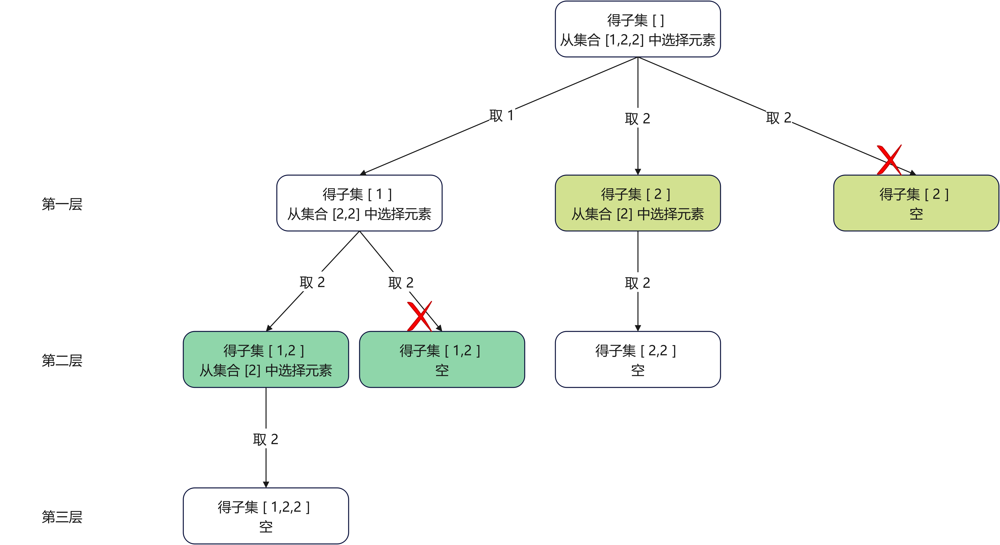
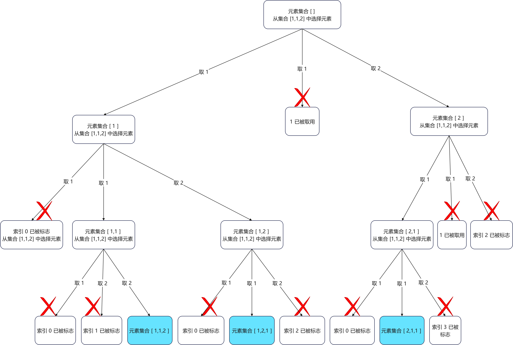

# 回溯

## 6.1 理论

回溯法也叫做回溯搜索法，可以看作一种搜索方法。在递归中，返回调用的过程叫做回溯，所以，回溯其实是递归中的一个操作，只要有递归就会有回溯。

回溯法解决的<font color="red"><strong>所有问题</strong></font>都可以抽象为树形结构，这是因为回溯法解决的都是在集合中递归查找子集，集合的大小就构成了树的宽度，递归的深度构成了树的深度。递归中，必然有终止条件，所以，抽象的树形结构必然是一棵高度有限的`N`叉树，结构如下图所示：


从上面的介绍看来，回溯其实是一种穷举法，它穷举所有的可能，然后根据给出的答案，选出我们的答案。如果想让回溯法高效一些，可以使用剪枝的操作，但仍然是穷举。

## 6.2 回溯法代码模板

在使用回溯法解决问题时，可以总结为下面三步：

1. 确认回溯函数返回值以及参数；
2. 回溯函数终止条件；
3. 回溯搜索的遍历过程。

### 6.2.1 确认回溯函数返回值和参数

在回溯方法中，最重要的就是写出回溯的递归函数，所以确认递归函数的返回值和参数就变得理所当然。虽然放在第一步，其实，这一步完全可以在整个递归函数写完后再根据函数中使用了哪些参数以及返回值动态给出。

### 6.2.2 终止条件

终止条件就是递归的终止条件，不过在回溯问题中，终止条件的伪代码如下：

```java
if(终止条件){
    存放结果;
    return; // 根据实际情况，是否有返回值
}
```

### 6.2.3 回溯搜索的遍历过程

这一步中，包含了递归写法的拆分问题和合并问题两步，我们先看回溯的模板代码，代码如下：

```java
for (选择：本层集合中元素（树中节点孩子的数量就是集合的大小）) {
    处理节点;
    backtracking(路径，选择列表); // 递归
    回溯，撤销处理结果
}
```

`for`循环中对应于递归中拆分问题，将问题根据集合拆分。回溯撤销结果对应递归合并操作，在递归函数调用之后，我们需要一些操作把状态回溯到递归函数调用之前，即递归函数调用前后的状态需要一致，这也是回溯的由来，在递归函数之后，需要确保状态回溯恢复到和调用前一致。

### 6.2.4 总结

经过上面的分析，总结回溯算法模板如下：

```java
void backtracking(参数) {
    if (终止条件) {
        存放结果;
        return;
    }

    for (选择：本层集合中元素（树中节点孩子的数量就是集合的大小）) {
        处理节点;
        backtracking(路径，选择列表); // 递归
        回溯，撤销处理结果
    }
}
```

## 6.3 组合问题

### 6.3.1 基本组合问题

[77.组合](https://leetcode.cn/problems/combinations/)

给定两个整数 $n$ 和 $k$ ，返回范围 $[1, n]$ 中所有可能的 $k$ 个数的组合。你可以按**任何顺序**返回答案。

示例 $1$ ：

输入：$n = 4$ ， $k = 2$

输出：

```java
[
  [2,4],
  [3,4],
  [2,3],
  [1,2],
  [1,3],
  [1,4],
]
```

示例 2：

输入：$n = 1$ ， $k = 1$

输出：

```java
[[1]]
```

提示：

+ $1 \leq n \leq 20$
+ $1 \leq k \leq n$

现在我们使用回溯来解决这个组合的问题。

#### 6.3.1.1 使用回溯解决组合问题

**第一步：确认递归终止条件**：

首先我们来看如何确认递归终止条件，从题意中，需要有 $k$ 个数组成一个组合，那么，首先我们需要一个数据结构来保存 $k$ 个数作为一个可能的组合，这里选择数组`Integer[] elements = new Integer[k]`。除此之外，还需要一个数据结构保存所有组合结果，定义保存所有结果数据结构：`List<List<Integer>> ans = new LinkedList<>();`。那么根据题意和定义的数据结构，我们可以得到递归终止条件：

```java
if (k == elements.length) {
    ans.add(Arrays.asList(Arrays.copyOf(elements, elements.length))); // 存放结果
    return;
}
```

其中代码中 $k$ （需要参数给出）是当前`elements`（需要参数给出）数组中有效的位数，`ans`  （需要参数给出）是存储结果的列表。

**第二步：回溯搜索的遍历过程**：

回溯中，我们需要确认模板中`for`循环中的遍历集合，假设当前处理的节点为 $num$ （需要定义参数给出），那么，`for`循环中代码为`for(int i=num; i<=n; i++)`，其中 $n$ 是题目中描述的 $n$ （需要参数给出），给定的数据范围。

处理节点代码很简单，就是将当前遍历数据填入`elements`中，代码为：`elements[k++]=i`。

之后调用递归函数，进行递归操作，这里先不给出代码，因为还有参数和返回值没有给出，这里不好确认。

调用完递归函数后，需要回溯操作，这里回溯操作只需回溯`k`即可，我们知道，在调用递归函数之前，我们运行了代码`k++`，所以回溯只需要运行代码`k--`即可。

**第三步：确认回溯函数返回值以及参数**：

根据前两步，我们完全可以确认递归函数的返回值为`void`，其中涉及到的参数有：`Integer[] elements`（保存当前组合中的元素）、`int num`（当前遍历的数字）、`int n`（题目中给定遍历范围： $[1,n]$ ）、`int k`（当前数组`elements`中有效的位数）、`List<List<Integer>> ans`（保存所有组合结果数据结构）。

**第四步：给出代码**：

结合前三步，我们给出问题的解决代码：

```java
class Solution {
        public List<List<Integer>> combine(int n, int k) {
        List<List<Integer>> ans = new LinkedList<>();
        Integer[] elements = new Integer[k];

        backtrack(elements, 1, n, 0, ans);

        return ans;

    }

    private void backtrack(Integer[] elements, int num, int n, int k, List<List<Integer>> ans) {
        // 递归终止条件
        if (k == elements.length) {
            ans.add(Arrays.asList(Arrays.copyOf(elements, elements.length))); // 存放结果
            return;
        }

        for (int i = num; i <= n; i++) {
            elements[k++] = i;
            backtrack(elements, i + 1, n, k, ans);
            k--; // 回溯，撤销处理结果
        }

    }
}
```

#### 6.3.1.2 回溯过程可视化

前面说过，所有的回溯问题都可以使用`N叉树`可视化整个操作过程，那么基本组合问题使用`N叉树`可视化过程如下，以 $n=5$ 和 $k=2$ 为例。


#### 6.3.1.3 回溯优化：剪枝

我们先来看一下 $n=4$ 和 $k=4$ 的`N`叉树可视化过程，如下图所示：


如图中，红叉部分为剪枝部分。分析图，可以知道，所谓的剪枝就是在循环时减少不必要的遍历以达到优化的目标，应用剪枝代码如下：

```java
class Solution {
    public List<List<Integer>> combine(int n, int k) {
        List<List<Integer>> ans = new LinkedList<>();
        Integer[] elements = new Integer[k];

        backtrack(elements, 1, n, 0, ans);

        return ans;

    }

    private void backtrack(Integer[] elements, int num, int n, int k, List<List<Integer>> ans) {
        // 递归终止条件
        if (k == elements.length) {
            ans.add(Arrays.asList(Arrays.copyOf(elements, elements.length))); // 存放结果
            return;
        }

        for (int i = num; i <= n - (elements.length - k) + 1; i++) {
            elements[k++] = i;
            backtrack(elements, i + 1, n, k, ans);
            k--; // 回溯，撤销处理结果
        }

    }
}
```

### 6.3.2 可重复使用组合总和

[39.组合总和](https://leetcode.cn/problems/combination-sum/description/)

给你一个无重复元素的整数数组`candidates`和一个目标整数`target`，找出`candidates`中可以使数字和为目标数`target`的所有不同组合，并以列表形式返回。你可以按任意顺序返回这些组合。

`candidates`中的 同一个数字可以无限制重复被选取 。如果至少一个数字的被选数量不同，则两种组合是不同的。

对于给定的输入，保证和为`target`的不同组合数少于$150$个。

示例 $1$ ：

输入：$candidates = [2,3,6,7], target = 7$
输出：$[[2,2,3],[7]]$
解释：$2$ 和 $3$ 可以形成一组候选，$2 + 2 + 3 = 7$ 。注意 $2$ 可以使用多次。 $7$ 也是一个候选， $7 = 7$ 。仅有这两种组合。

示例 $2$ ：

输入: $candidates = [2,3,5], target = 8$

输出: $[[2,2,2,2],[2,3,3],[3,5]]$

示例 $3$ ：

输入: candidates = [2], target = 1
输出: []

提示：

+ $1 <= candidates.length <= 30$
+ $2 <= candidates[i] <= 40$
+ $candidates$ 的所有元素 互不相同， $1 <= target <= 40$

#### 6.3.2.1 使用回溯解决组合总和问题

题目中，注意两点，一个是无重复元素，一个是无限制重复地选取，所以，导致我们，一个不用考虑去重，另一个需要重复取用。

**第一步：确认递归终止条件**：

我们确认递归终止条件，根据题意，和为`target`（参数给出），所以可以视作每确认一个元素`element`，那么目标就减去`element`，即`target-element`，最终`target==0`，就是我们寻找的递归终止条件。

还有一件事，就是收集结果，这里我们使用一个列表`Deque<Integer> elements=new LinkedList<>()`（参数给出）暂存单次的结果，使用`List<List<Integer>> ans=new LinkedList<>()`（参数给出）保存所有结果。

最终，递归终止条件代码如下：

```java
if(target==0){
    ans.add(new LinkedList(elements));
    return;
}
```

**第二步：回溯搜索的遍历过程**：

确认回溯搜索的遍历过程，我们需要确认模板中`for`循环遍历的集合元素，假设开始处理的节点为`start`（参数给出），那么`for`循环中代码为：`for(int i=start;i<candidates.length;i++)`。其中我们可以进行剪枝，这里可以根据`candidates[i]<=target`进行剪枝，前提是：<font color="red"><strong>需要排序</strong></font>，不要忘了排序，自己就是忘了排序导致解答错误。

结合以上所述，给出回溯搜索遍历代码：

```java
for (int i = start; i < candidates.length && candidates[i] <= target; i++) {
    elements.push(candidates[i]);
    backtrack(candidates, i, target - candidates[i], elements, ans);
    elements.pop();
}
```

**第三步：确认回溯函数返回值以及参数**：

根据前两步，我们可以确认递归函数的返回值为`void`，其中涉及到的函数参数有：`int[] candidates`（候选数组）、`int start`（开始遍历索引）、`int target`目标值，`Deque<Integer> elements`存储单次结果，`List<List<Integer>> ans`（结果变量）。

**第四步：给出代码**：

```java
class Solution {
    public List<List<Integer>> combinationSum(int[] candidates, int target) {
        Arrays.sort(candidates); // 别忘了排序
        List<List<Integer>> ans = new LinkedList<>();
        Deque<Integer> elements = new LinkedList<>();

        backtrack(candidates, 0, target, elements, ans);

        return ans;

    }

    private void backtrack(int[] candidates, int start, int target, Deque<Integer> elements, List<List<Integer>> ans) {
        // 递归终止条件
        if (target == 0) {
            ans.add(new LinkedList(elements));
            return;
        }

        for (int i = start; i < candidates.length && candidates[i] <= target; i++) {
            elements.push(candidates[i]);
            backtrack(candidates, i, target - candidates[i], elements, ans);
            elements.pop();
        }
    }
}
```

#### 6.3.2.2 回溯可视化

以下是 $candidates = [2,3,5], target = 8$ 的 `N` 叉树可视化过程：


### 6.3.3 去重组合总和问题

[40.组合总和 II](https://leetcode.cn/problems/combination-sum-ii/description/)

给定一个候选人编号的集`candidates`和一个目标数`target`，找出`candidates`中所有可以使数字和为`target`的组合。`candidates`中的每个数字在每个组合中只能使用一次。

注意：解集不能包含重复的组合。

示例 1:

输入: `candidates = [10,1,2,7,6,1,5], target = 8`,
输出:

```java
[
[1,1,6],
[1,2,5],
[1,7],
[2,6]
]
```

示例 2:

输入: `candidates = [2,5,2,1,2], target = 5`,
输出:

```java
[
[1,2,2],
[5]
]
```

提示:

+ `1 <= candidates.length <= 100`；
+ `1 <= candidates[i] <= 50`；
+ `1 <= target <= 30`；

#### 6.3.3.1 使用回溯解决解集不可重复组合总和问题

题目中需要我们求出所有和为`target`的组合，每个数只能使用一次，因为给定集合`candidates`的元素是可以重复的，使用一般的回溯方法会获取重复解，所以需要额外的去重操作，为去重可以有两种方法：

+ **方法一**：在递归终止条件处使用集合+列表去重；
+ **方法二**：将相同的数放在一起处理；

针对第一种方法比较简单，代码如下：

```java
class Solution {
    public List<List<Integer>> combinationSum2(int[] candidates, int target) {
        Arrays.sort(candidates);
        List<List<Integer>> ans = new LinkedList<>();
        Deque<Integer> elements = new LinkedList<>();
        Set<List<Integer>> elementsSet = new HashSet<>();
        backtrack(candidates, 0, target, elements, elementsSet, ans);
        return ans;
    }

    private void backtrack(int[] candidates, int startIndex, int target, Deque<Integer> elements,
            Set<List<Integer>> elementsSet, List<List<Integer>> ans) {
        // 终止条件
        if (target == 0) {
            List<Integer> l = new LinkedList(elements);
            l.sort(null); // 自然排序
            if (!elementsSet.contains(l)) { // 判重
                elementsSet.add(l);
                ans.add(l);
            }
        }
        for (int i = startIndex; i < candidates.length && candidates[i] <= target; i++) {
            elements.push(candidates[i]);
            backtrack(candidates, i + 1, target - candidates[i], elements, elementsSet, ans);
            elements.pop();
        }
    }
}
```

很不幸，上面代码复杂度过高，很容易超时。

我们来看方法二：将相同的数放在一起。假设数`x`出现了`y`次，那么在递归时一次性处理它们，即分别调用选择`0,1,...,y`次`x`的递归函数，这样我们就不会得到重复的组合了。比如，对于当前的第`start`个数，它的值为`candidatesFrequency.get(start)[0]`，出现的次数为`candidatesFrequency.get(start)[1]`，那么我们可以调用`backtrack(start+1, target-i*candidatesFrequency.get(start)[0])`，其中`i`的取值为`0,1,...,candidatesFrequency.get(start)[1]`。完整的代码如下：

```java
class Solution {
    public List<List<Integer>> combinationSum2(int[] candidates, int target) {
        List<List<Integer>> ans = new LinkedList<>();
        Deque<Integer[]> elements = new LinkedList<>();

        List<int[]> candidatesFrequency = new ArrayList<>();
        Arrays.sort(candidates);
        for (int candidate : candidates) {
            int size = candidatesFrequency.size();
            if (candidatesFrequency.isEmpty() || candidatesFrequency.get(size - 1)[0] != candidate) {
                candidatesFrequency.add(new int[] { candidate, 1 });
            } else {
                candidatesFrequency.get(size - 1)[1]++;
            }
        }

        backtrack(0, target, elements, candidatesFrequency, ans);

        return ans;
    }

    private void backtrack(int start, int target, Deque<Integer[]> elements,
            List<int[]> candidatesFrequency,
            List<List<Integer>> ans) {
        // 终止条件
        if (target == 0) {
            List<Integer> l = new LinkedList<>();
            for (Integer[] element : elements) {
                for (int i = 0; i < element[1]; i++) {
                    l.add(element[0]);
                }
            }
            ans.add(l);
            return;
        }
        if (start == candidatesFrequency.size()
                || candidatesFrequency.get(start)[0] > target) // 剪枝
            return;

        int most = Math.min(candidatesFrequency.get(start)[1], target / candidatesFrequency.get(start)[0]);
        for (int i = 0; i <= most; i++) {
            elements.push(new Integer[] { candidatesFrequency.get(start)[0], i });
            backtrack(start + 1, target - i * candidatesFrequency.get(start)[0], elements, candidatesFrequency, ans);
            elements.pop();
        }
    }
}
```

#### 6.3.3.2 回溯可视化

以下是`candidates=[2,5,2,1,2],target=5`的`N`叉树可视化过程。


### 6.3.4 记忆化回溯搜索组合总和

[377.组合总和 IV](https://leetcode.cn/problems/combination-sum-iv/description/)

给你一个由不同整数组成的数组`nums`，和一个目标整数`target`。请你从`nums`中找出并返回总和为`target`的元素组合的个数。

题目数据保证答案符合$32$位整数范围。

示例`1`：

输入：`nums = [1,2,3], target = 4`
输出：`7`
解释：
所有可能的组合为：

```java
(1, 1, 1, 1)
(1, 1, 2)
(1, 2, 1)
(1, 3)
(2, 1, 1)
(2, 2)
(3, 1)
```

请注意，顺序不同的序列被视作不同的组合。

示例 `2`：

输入：`nums = [9], target = 3`
输出：`0`

提示：

+ `1 <= nums.length <= 200`；
+ `1 <= nums[i] <= 1000`，`nums`中的所有元素 互不相同；
+ `1 <= target <= 1000`；

#### 6.3.4.1 使用回溯解决组合问题

该问题可以使用一般递归回溯解决，代码如下：

```java
class Solution {
    private int ans = 0;

    public int combinationSum4(int[] nums, int target) {
        // 排序方便剪枝
        Arrays.sort(nums);

        backtrack(0, nums, target);

        return ans;
    }

    private void backtrack(int start, int[] nums, int target) {
        // 递归终止函数
        if (target == 0) {
            ans++;
            return;
        }
        for (int i = start; i < nums.length && nums[i] <= target; i++) {
            backtrack(start, nums, target - nums[i]);
        }
    }
}
```

上面代码很容易写出来，不过可惜的是，时间复杂度过高，提交会超时。为此，需要对上面方法进行改进。之所以会超时，因为回溯是暴力的解法需要遍历并且联系斐波拉契数列的递归写法，会有很多重复计算。比如，数组`nums=[1,2,3],target=5`，我们从顶自下已经达到底部，已经收集了`[1,1,1,1]`，接下来的`backtrack(0,nums,1)`会得到`[1,1,1,1,1]`，那么下次收集到了结果`[1,1,2]`和`[2,2]`，需要重新计算`backtrack(0,nums,1)`，用来得到结果：`[1,1,2,1]`和`[2,2,1]`。所以，其实`backtrack(0,nums,1)`运行了三次，但是如果我们用哈希表记录了`backtrack(0,nums,1)`后，那么只需要运行一次，后面直接获取结果即可。为此，得到代码如下：

```java
class Solution {
    private int ans;

    public int combinationSum4(int[] nums, int target) {
        // 排序方便剪枝
        Arrays.sort(nums);

        Map<Integer, Integer> map = new HashMap<>();

        backtrack(0, nums, target, map);

        return ans;
    }

    private void backtrack(int startIndex, int[] nums, int target, Map<Integer, Integer> map) {
        // 递归终止函数
        if (0 == target) {
            ans++;
            return;
        }
        for (int i = startIndex; i < nums.length && nums[i] <= target; i++) {
            int targetNext = target - nums[i];
            if (map.containsKey(targetNext)) {
                ans += map.get(targetNext);
            } else {
                int c = ans;
                backtrack(startIndex, nums, targetNext, map);
                map.put(targetNext, ans - c);
            }
        }
    }
}
```

#### 6.3.4.2 回溯可视化

以下是`candidates=[2,1,3],target=5`的`N`叉树可视化过程。


## 6.4 切割问题

[131.分割回文串](https://leetcode.cn/problems/palindrome-partitioning/description/)

给你一个字符串`s`，请你将`s`分割成一些子串，使每个子串都是回文串。返回`s`所有可能的分割方案。

示例 1：

输入：`s = "aab"`
输出：`[["a","a","b"],["aa","b"]]`

示例 2：

输入：`s = "a"`
输出：`[["a"]]`

提示：

+ `1 <= s.length <= 16`；
+ `s`仅由小写英文字母组成；

### 6.4.1 使用回溯解决切割回文串问题

从感觉上看，该题是可以使用回溯来解决的，关键是确认递归的三个要素：

+ 递归终止条件;
+ 如何拆分问题；
+ 如何回溯问题；

递归终止条件比较简单，这里我们引入一个参数`int start`（递归开始索引），当`start==sLength`时（`int sLength=s.length()`是字符串的长度），那么说明字符串遍历完成，递归需要终止，递归终止条件代码如下：

```java
// 递归终止条件
if (start == sLength) {
    LinkedList<String> l = new LinkedList<>(elements);
    Collections.reverse(l);
    ans.add(l);
    return;
}
```

代码中`Deque<String> elements = new LinkedList<>();`变量是存储单个结果的数据结构，`List<List<String>> ans = new LinkedList<>();`是结果变量。

如何拆分问题呢？对比组合问题，组合问题是将给定集合的元素一个一个加入`elements`中，而该问题是需要将一个一个回文串元素加入`elements`中。所以，递归中，问题就变成了从`start`开始拿到回文子串，然后将其加入`elements`中。假设回文子串为`s.substring(start,startNext)`，那么下一次就从`startNext`开始寻找最短子串。

回溯操作比较简单，只需要将`elements`最近加入的结果删除即可，然后将`startNext`加一，之所以需要加一，是因为需要寻找从`start`开始新的回文子串。

结合上面描述，得到如下代码;

```java
class Solution {
    private Map<String, Boolean> map = new HashMap<>();

    public List<List<String>> partition(String s) {
        List<List<String>> ans = new LinkedList<>();
        Deque<String> elements = new LinkedList<>();

        backtrack(0, s.length(), s, elements, ans);

        return ans;
    }

    private void backtrack(int start, int sLength, String s, Deque<String> elements, List<List<String>> ans) {
        // 递归终止条件
        if (start == sLength) {
            LinkedList<String> l = new LinkedList<>(elements);
            Collections.reverse(l);
            ans.add(l);
            return;
        }
        int startNext = start + 1;
        while (startNext <= sLength) {
            boolean palindrome = false;
            // 从 start 开始找到最短回文子串
            while (startNext <= sLength && !(palindrome = isPalindrome(s.substring(start, startNext)))) {
                startNext++;
            }
            if (palindrome) {
                elements.push(s.substring(start, startNext));
                backtrack(startNext, sLength, s, elements, ans);
                // 回溯
                elements.pop();
                startNext++;
            }

        }
    }

    private boolean isPalindrome(String s) {
        if (map.containsKey(s))
            return map.get(s);
        else {
            int sRight = s.length() - 1;
            int sLeft = 0;
            while (sLeft < sRight && s.charAt(sLeft) == s.charAt(sRight)) {
                sLeft++;
                sRight--;
            }
            boolean result = sLeft >= sRight;
            map.put(s, result);
            return result;
        }
    }
}
```

### 6.4.2 回溯可视化

给定条件`s="aabaa"`，分割回文串问题回溯`N`叉树可视化如下图所示：


## 6.5 子集问题

子集问题和组合问题最大的不同在于，组合问题的解在`N`叉树的叶子节点，而子集问题是找出树的所有节点。在这节，我们将会学习一个基本的子集问题，之后学习对子集去重问题，最后学习提取满足给定条件的子集问题。

### 6.5.1 基本子集问题

[78.子集](https://leetcode.cn/problems/subsets/)

给你一个整数数组`nums`，数组中的元素互不相同。返回该数组所有可能的子集（幂集）。解集不能包含重复的子集。你可以按任意顺序返回解集。

示例 1：

输入：`nums = [1,2,3]`
输出：`[[],[1],[2],[1,2],[3],[1,3],[2,3],[1,2,3]]`

示例 2：

输入：`nums = [0]`
输出：`[[],[0]]`

提示：

+ `1 <= nums.length <= 10`；
+ `-10 <= nums[i] <= 10`；
+ `nums`中的所有元素互不相同；

#### 6.5.1.1 使用回溯解决基本子集问题

**解法一**：使用组合解法，添加叶子节点

这道题目其实是 [40.组合求和II](https://leetcode.cn/problems/combination-sum-ii/description/) 的一种特殊情况，不过，在这里不像 [40.组合求和II](https://leetcode.cn/problems/combination-sum-ii/description/) 是求出满足目标值的组合，而是求出全部组合。并且，在 [40.组合求和II](https://leetcode.cn/problems/combination-sum-ii/description/) 中递归函数：`backtrack(start+1, target-i*candidatesFrequency.get(start)[0])`，`i`的取值为`0,1,...,x`，放在该题，`i`的取值只能为`0,1`。

代码如下：

```java
class Solution {
    public List<List<Integer>> subsets(int[] nums) {
        List<List<Integer>> ans = new LinkedList<>();
        Deque<Integer> elements = new LinkedList<>();

        backtrack(0, nums, elements, ans);

        return ans;
    }

    private void backtrack(int start, int[] nums, Deque<Integer> elements, List<List<Integer>> ans) {
        // 递归终止条件
        if (start == nums.length) {
            ans.add(new LinkedList<>(elements));
            return;
        }

        // 不收集 nums[start]
        backtrack(start + 1, nums, elements, ans);
        // 收集 nums[start]
        elements.push(nums[start]);
        backtrack(start + 1, nums, elements, ans);
        elements.pop();
    }
}
```

**解法二**：使用子集解法，添加节点

我们先看代码，如下：

```java
class Solution {
    public List<List<Integer>> subsets(int[] nums) {
        List<List<Integer>> ans = new LinkedList<>();
        Deque<Integer> elements = new LinkedList<>();

        backtrack(nums, 0, elements, ans);

        return ans;
    }

    private void backtrack(int[] nums, int start, Deque<Integer> elements, List<List<Integer>> ans) {
        ans.add(new LinkedList<>(elements));
        for (int i = start; i < nums.length; i++) {
            elements.push(nums[i]);
            backtrack(nums, i + 1, elements, ans);
            elements.pop();
        }
    }
}
```

如代码，在`private void backtrack(int[] nums, int start, Deque<Integer> elements, List<List<Integer>> ans)`函数第一行，就将结果`elements`加入`ans`中，即直接将节点`elements`作为结果加入`ans`中，不像组合中的代码，是先判断是否是叶子节点，再把叶子节点`elements`加入`ans`中。

#### 6.5.1.2 回溯可视化

给定条件`nums=[1,2,3]`，基本子集问题回溯`N`叉树可视化如下图所示：



### 6.5.2 解集去重子集问题

[90.子集II](https://leetcode.cn/problems/subsets-ii/description/)

给你一个整数数组`nums`，其中可能包含重复元素，请你返回该数组所有可能的 子集（幂集）。

解集不能包含重复的子集。返回的解集中，子集可以按任意顺序排列。

示例 1：

输入：`nums = [1,2,2]`
输出：`[[],[1],[1,2],[1,2,2],[2],[2,2]]`

示例 2：

输入：`nums = [0]`
输出：`[[],[0]]`

提示：

+ `1 <= nums.length <= 10`
+ `-10 <= nums[i] <= 10`

#### 6.5.2.1 使用回溯解决去重子集问题

**解法一**：使用组合解法，添加叶子节点

这道题和 [40.组合求和II](https://leetcode.cn/problems/combination-sum-ii/description/) 一样，可以使用同一个递归函数求解。[40.组合求和II](https://leetcode.cn/problems/combination-sum-ii/description/) 递归函数：`backtrack(start+1, target-i*candidatesFrequency.get(start)[0])`，`i`的取值为`0,1,...,x`，放在该题，`i`的取值也是`0,1,...,x`。代码如下所示：

```java
class Solution {
    public List<List<Integer>> subsetsWithDup(int[] nums) {
        List<List<Integer>> ans = new LinkedList<>();
        List<Integer> elements = new ArrayList<>();
        List<int[]> nonRepeatCount = new ArrayList<>(nums.length);

        // 将相同数据合在一起
        Arrays.sort(nums);
        for (int num : nums) {
            int size = nonRepeatCount.size();
            if (size == 0 || nonRepeatCount.get(size - 1)[0] != num) {
                nonRepeatCount.add(new int[] { num, 1 });
            } else {
                nonRepeatCount.get(size - 1)[1]++;
            }
        }

        backtrack(0, nonRepeatCount, elements, ans);

        return ans;
    }

    private void backtrack(int start, List<int[]> nonRepeatCount, List<Integer> elements, List<List<Integer>> ans) {
        if (start == nonRepeatCount.size()) {
            ans.add(new LinkedList<>(elements));
            return;
        }
        backtrack(start + 1, nonRepeatCount, elements, ans);
        for (int i = 1; i <= nonRepeatCount.get(start)[1]; i++) {
            elements.add(nonRepeatCount.get(start)[0]);
            backtrack(start + 1, nonRepeatCount, elements, ans);
        }
        for (int i = 1; i <= nonRepeatCount.get(start)[1]; i++) {
            elements.remove(elements.size() - 1);
        }
    }
}
```

**解法二**：使用子集解法，添加节点

其实本题和基本子集问题一样，关键在于如何去重。比如测试数据为：`nums=[1,2,2]`，那么按照基本子集问题得出下面的`N`叉树可视化图。



那么，如何去重呢？从上图中不难看出，`N`叉树中同一根结点的同一层节点不能使用相同的元素，比如图中第一层和第二层中，两个`2`不能在同一根节点的子树中存在，否则就会产生重复的子集，所以问题的关键是如何避免同一根节点中取相同的数据。这个问题很简单，只需要先排序，在回溯搜索模板中`for`循环下面判断一下当前数值是不是和上一个数值相同，如果相同那么`continue`，否则正常回溯。代码如下：

```java
class Solution {
    public List<List<Integer>> subsetsWithDup(int[] nums) {
        Arrays.sort(nums);

        List<List<Integer>> ans = new LinkedList<>();
        List<Integer> elements = new ArrayList<>();

        backtrack(0, nums, elements, ans);

        return ans;
    }

    private void backtrack(int start, int[] nums, List<Integer> elements, List<List<Integer>> ans) {
        ans.add(new LinkedList<>(elements));
        int lastNumber = 0;
        if (start < nums.length)
            lastNumber = nums[start] - 1;
        else
            return;
        for (int i = start; i < nums.length; i++) {
            if (lastNumber == nums[i])
                continue;
            else {
                lastNumber = nums[i];
                elements.add(nums[i]);
                backtrack(i + 1, nums, elements, ans);
                elements.remove(elements.size() - 1);
            }
        }
    }
}
```

#### 6.5.2.2 回溯可视化

给定条件`nums=[1,2,2]`，去重子集问题回溯N叉树可视化如下图所示：



### 6.5.3 递增子序列

[491.非递减子序列](https://leetcode.cn/problems/non-decreasing-subsequences/)

给你一个整数数组`nums`，找出并返回所有该数组中不同的递增子序列，递增子序列中至少有两个元素。你可以按任意顺序返回答案。

数组中可能含有重复元素，如出现两个整数相等，也可以视作递增序列的一种特殊情况。

示例`1`：

输入：`nums = [4,6,7,7]`
输出：`[[4,6],[4,6,7],[4,6,7,7],[4,7],[4,7,7],[6,7],[6,7,7],[7,7]]`

示例 2：

输入：`nums = [4,4,3,2,1]`
输出：`[[4,4]]`

提示：

+ `1 <= nums.length <= 15`
+ `-100 <= nums[i] <= 100`

#### 6.5.3.1 使用回溯解决去重子集问题

**解法一**：使用组合解法，添加叶子节点

结合基本子集问题，我们可以得到以下代码获取结果：

```java
class Solution {
    public List<List<Integer>> subsets(int[] nums) {
        List<List<Integer>> ans = new LinkedList<>();
        List<Integer> elements = new LinkedList<>();

        backtrack(0, nums, elements, ans);

        return ans;
    }

    private void backtrack(int current, int[] nums, List<Integer> elements, List<List<Integer>> ans) {
        // 递归终止条件
        if (current == nums.length && isValid() && notMarked()) {
            ans.add(new LinkedList<>(elements));
            return;
        }

        // 不选择 nums[start]
        backtrack(current + 1, nums, elements, ans);
        // 选择 nums[start]
        elements.add(nums[current]);
        backtrack(current + 1, nums, elements, ans);
        elements.remove(elements.size()-1);
    }
}
```

但是如果我们这样简单地枚举，对于每个子序列都需要做一次 $O(n)$ 的合法性检查`isValid()`和哈希判重`notMarked()`，其中因为子序列的空间复杂度为 $O(2^n)$ ，即我们需要 $O(2^n)$ 的空间存储子序列的哈希值。为此，我们需要对选择和不选择做一些限定：

+ 给选择做限定：只有当当前的元素大于等于上一个元素的时候，才可以保证子序列非递减；
+ 给不选择做限定：只有当当前的元素不等于上一个元素的时候，才考虑不选择当前元素，直接递归后面的元素。

比如：`nums=[4,6,7,7,7]`，那么做了选择限定，可以确保所有得到的子序列都递增，这个很好理解。而如果不做不选择限定的话，结果会有重复，比如：`[4,6,7,7],[4,6,7],[4,7,7],[4,7],[6,7,7],[6,7],[7,7]`会因为`[7,7,7]`的存在而重复。现在我们做出不选择限定，假设`elements`中已有`[4,6,7,7,7]`，根据程序，会一直回溯到`elements=[4,6]，lastElement=6，current=2，nums[current]=7`状态，此时`nums[2]==nums[3]==7`，那么我们不选择`nums[current=2]`，选择递归`nums[current+1=3]`，最终得到`[4,6,7,7]`。得到`[4,6,7,7]`后，回溯到`elements=[4,6]，lastElement=6，current=3，nums[current]=7，nums[current+1]=7`状态，此时`nums[3]==nums[4]==7`，那么我们不选择`nums[current=3]`，选择递归`nums[current+1=4]`，最终得到`[4,6,7]`，对于`[7,7]`，我们总是抛弃前者而选择后者。

如果有两个相同的元素，那么根据选择和不选择，有如下四种情况：

+ 前者被选择，后者被选择（因为选择限定选择）
+ 前者被选择，后者不被选择（因为不选择限定而抛弃）
+ 前者不被选择，后者被选择（因为不选择限定选择）
+ 前者不被选择，后者不被选择（因为选择限定选择）

其中，第二种情况和第三种情况是完全等价的，我们这样限制之后，根据`nums=[4,6,7,7,7]`的案例，我们舍弃了第二种，保留了第三种，达到了去重的目的。

```java
class Solution {
    List<Integer> elements = new ArrayList<Integer>();
    List<List<Integer>> ans = new ArrayList<List<Integer>>();

    public List<List<Integer>> findSubsequences(int[] nums) {
        backtrack(0, Integer.MIN_VALUE, nums);
        return ans;
    }

    public void backtrack(int current, int lastElement, int[] nums) {
        if (current == nums.length) {
            if (elements.size() >= 2) {
                ans.add(new ArrayList<Integer>(elements));
            }
            return;
        }
        if (nums[current] >= lastElement) {
            elements.add(nums[current]);
            backtrack(current + 1, nums[current], nums);
            elements.remove(elements.size() - 1);
        }
        if (nums[current] != lastElement)
            backtrack(current + 1, lastElement, nums);
    }
}
```

**解法二**：使用子集解法，添加节点

本题中和去重子集问题差不多，不过比去重子问题复杂的是需要额外的操作保证结果有效，有两种方法保证结果有效：

+ 收集结果时，判断结果有效；
+ 加入元素时，保证加入的元素有效；

第一种复杂度高一点，这里使用第二种，代码如下：

```java
class Solution {
    public List<List<Integer>> findSubsequences(int[] nums) {
        List<List<Integer>> ans = new LinkedList<>();
        List<Integer> elements = new ArrayList<>();

        backtrack(0, nums, elements, ans);

        return ans;
    }

    private void backtrack(int start, int[] nums, List<Integer> elements, List<List<Integer>> ans) {
        // 符合条件加入结果列表中
        if (elements.size() >= 2)
            ans.add(new LinkedList<>(elements));

        Set<Integer> marked = new HashSet<>();
        for (int i = start; i < nums.length; i++) {
            if ((elements.isEmpty() || nums[i] >= elements.get(elements.size() - 1)) && !marked.contains(nums[i])) {
                elements.add(nums[i]);
                marked.add(nums[i]);
                backtrack(i + 1, nums, elements, ans);
                elements.remove(elements.size() - 1);
            }
        }
    }
}
```

#### 6.5.3.2 回溯可视化

给定条件`nums=[4,7,6,5,7]`，递增子序列问题回溯`N`叉树可视化如下图所示：


## 6.6 排列问题

排列问题和组合问题不同，排列中位置不同视为不同，比如`[1,2]`和`[2,1]`是同一个组合却是不同的排列。

### 6.6.1 基本排列问题

[46.全排列](https://leetcode.cn/problems/permutations/description/)

给定一个不含重复数字的数组`nums`，返回其所有可能的全排列。你可以按任意顺序返回答案。

示例 1：

输入：`nums = [1,2,3]`
输出：`[[1,2,3],[1,3,2],[2,1,3],[2,3,1],[3,1,2],[3,2,1]]`

示例 2：

输入：`nums = [0,1]`
输出：`[[0,1],[1,0]]`

示例 3：

输入：`nums = [1]`
输出：`[[1]]`

提示：

+ `1 <= nums.length <= 6`
+ `-10 <= nums[i] <= 10`
+ `nums 中的所有整数 互不相同`

#### 6.6.1.1 使用回溯解决基本排列问题

排列问题因为位置的不同，所以在回溯搜索`for`循环中，调用递归函数开始索引不再是遍历当前的索引`i`，必须从`0`开始，但是如果这样的话，已经访问过的索引会再次访问，导致重复的结果，所以还需要一个数据结构（`marked`数组）标记已经使用过的索引。

代码如下所示：

```java
class Solution {
    public List<List<Integer>> permute(int[] nums) {
        List<List<Integer>> ans = new LinkedList<>();
        List<Integer> elements = new ArrayList<>(nums.length);
        boolean[] marked = new boolean[nums.length];

        // 回溯
        backtrack(nums, marked, elements, ans);

        return ans;

    }

    private void backtrack(int[] nums, boolean[] marked, List<Integer> elements, List<List<Integer>> ans) {
        // 递归终止条件
        if (elements.size() == nums.length) {
            ans.add(new LinkedList(elements));
            return;
        }

        for (int i = 0; i < nums.length; i++) {
            if (!marked[i]) {
                elements.add(nums[i]);
                marked[i] = true;
                backtrack(nums, marked, elements, ans);
                elements.remove(elements.size() - 1);
                marked[i] = false;
            }
        }
    }
}
```

#### 6.6.1.2 回溯可视化

给定条件`nums=[1,2,3]`，基本排列问题回溯`N`叉树可视化如下图所示：


### 6.6.2 解集去重排列问题

[47.全排列II](https://leetcode.cn/problems/permutations-ii/)

给定一个可包含重复数字的序列`nums`，按任意顺序返回所有不重复的全排列。

示例 1：

输入：`nums = [1,1,2]`
输出：

```java
[[1,1,2],
 [1,2,1],
 [2,1,1]]
```

示例 2：

输入：`nums = [1,2,3]`
输出：`[[1,2,3],[1,3,2],[2,1,3],[2,3,1],[3,1,2],[3,2,1]]`

提示：

+ `1 <= nums.length <= 8`
+ `-10 <= nums[i] <= 10`

#### 6.6.2.1 使用回溯解决去重排列问题

该问题和基本排列问题不同的有两点：

1. 包含重复元素；
2. 返回不包含重复的全排列；

问题不难，去重方法和组合问题一样：同一层不能取相同的元素。再结合基本组合问题回溯写法，代码如下所示：

```java
class Solution {
    public List<List<Integer>> permuteUnique(int[] nums) {
        Arrays.sort(nums);
        List<List<Integer>> ans = new LinkedList<>();
        List<Integer> elements = new ArrayList<>(nums.length);
        boolean[] marked = new boolean[nums.length];

        backtrack(nums, marked, elements, ans);

        return ans;
    }

    private void backtrack(int[] nums, boolean[] marked, List<Integer> elements, List<List<Integer>> ans) {
        // 递归终止条件
        if (elements.size() == nums.length) {
            ans.add(new ArrayList<>(elements));
            return;
        }
        Integer preNum = Integer.MIN_VALUE;
        for (int i = 0; i < nums.length; i++) {
            if (!marked[i] && nums[i] != preNum) {
                preNum = nums[i];
                marked[i] = true;
                elements.add(nums[i]);
                backtrack(nums, marked, elements, ans);
                elements.remove(elements.size() - 1);
                marked[i] = false;
            }
        }
    }
}
```

#### 6.6.2.2 回溯可视化

给定条件：`nums=[1,1,2]`，得出如下去重全排列问题`N`叉树可视化图：



## 6.7 棋盘问题

### 6.7.1 N 皇后问题

按照国际象棋的规则，皇后可以攻击与之处在同一行或同一列或同一斜线上的棋子。

$n$ 皇后问题研究的是如何将 $n$ 个皇后放置在 $n×n$ 的棋盘上，并且使皇后彼此之间不能相互攻击。

给你一个整数 $n$ ，返回所有不同的 $n$ 皇后问题的解决方案。

每一种解法包含一个不同的 $n$ 皇后问题的棋子放置方案，该方案中`Q`和`.`分别代表了皇后和空位。

示例 1：

输入：`n = 4`
输出：`[[".Q..","...Q","Q...","..Q."],["..Q.","Q...","...Q",".Q.."]]`


解释：如上图所示， $4$ 皇后问题存在两个不同的解法。

示例 2：

输入：`n = 1`
输出：`[["Q"]]`

提示：

+ `1 <= n <= 9`

#### 6.7.1.1 使用回溯解决 N 皇后问题

使用回溯解决的问题，有两个固定的变量：存放全部的结果变量`ans`以及存放单个结果变量`elements`，还有关键是要思考以下 $4$ 个问题：

1. 递归终止条件；
2. 如何循环递归推动问题；
3. 如何回溯到上一个状态；
4. 如何剪枝；

根据 $N$ 皇后问题中给出上面四个问题的答案：

1. 递归终止的条件是：`elements.size()==n`，将全部的皇后安置在棋盘上就解决了问题；
2. 根据已放置的皇后，遍历当前皇后可以放置的位置，决定完当前皇后位置后，递归放置下一个皇后；
3. 将状态变量重置为不放置当前皇后状态；
4. 考虑优化，减少不必要的递归，可以采用根据当前位置获取当前皇后下一个可能的位置，这样每次递归都是有效讨论；

根据上面的讨论，得出以下代码：

```java
class Solution {
    public List<List<String>> solveNQueens(int n) {
        List<int[]> elements = new ArrayList<>(n);
        List<List<String>> ans = new LinkedList<>();

        backtrack(n, elements, ans);

        return ans;
    }

    private void backtrack(int n, List<int[]> elements, List<List<String>> ans) {
        if (elements.size() == n) {
            List<String> e = new ArrayList<>(n);
            for (int i = 0; i < n; i++) {
                char[] element = new char[n];
                Arrays.fill(element, '.');
                element[elements.get(i)[1]] = 'Q';
                e.add(new String(element));
            }
            ans.add(e);
            return;
        }
        int y = 0;
        while (y < n) {
            int[] pos = getValidPos(elements, y, n);
            if (pos == null) {
                return;
            } else {
                y = pos[1] + 1;
                elements.add(pos);
                backtrack(n, elements, ans);
                elements.remove(elements.size() - 1);
            }
        }

    }

    private int[] getValidPos(List<int[]> elements, int startY, int n) {
        int x = elements.size(), y = -1;
        for (int i = startY; i < n; i++) {
            int m = 0;
            for (int[] element : elements) {
                if (i == element[1] || Math.abs(x - element[0]) == Math.abs(i - element[1]))
                    break;
                else
                    m++;
            }
            if (m == elements.size()) {
                y = i;
                break;
            }
        }
        if (y == -1) {
            return null;
        }
        return new int[] { x, y };
    }
}
```

### 6.7.2 解数独问题

[37.解数独](https://leetcode.cn/problems/sudoku-solver/description/)

编写一个程序，通过填充空格来解决数独问题。数独的解法需遵循如下规则：

数字`1-9`在每一行只能出现一次。
数字`1-9`在每一列只能出现一次。
数字`1-9`在每一个以粗实线分隔的 $3x3$ 宫内只能出现一次。（请参考示例图）

数独部分空格内已填入了数字，空白格用 '.' 表示。

示例 1：


输入：`board = [["5","3",".",".","7",".",".",".","."],["6",".",".","1","9","5",".",".","."],[".","9","8",".",".",".",".","6","."],["8",".",".",".","6",".",".",".","3"],["4",".",".","8",".","3",".",".","1"],["7",".",".",".","2",".",".",".","6"],[".","6",".",".",".",".","2","8","."],[".",".",".","4","1","9",".",".","5"],[".",".",".",".","8",".",".","7","9"]]`

输出：`[["5","3","4","6","7","8","9","1","2"],["6","7","2","1","9","5","3","4","8"],["1","9","8","3","4","2","5","6","7"],["8","5","9","7","6","1","4","2","3"],["4","2","6","8","5","3","7","9","1"],["7","1","3","9","2","4","8","5","6"],["9","6","1","5","3","7","2","8","4"],["2","8","7","4","1","9","6","3","5"],["3","4","5","2","8","6","1","7","9"]]`

解释：输入的数独如上图所示，唯一有效的解决方案如下所示：


提示：

+ `board.length == 9`
+ `board[i].length == 9`
+ `board[i][j] 是一位数字或者'.'`
+ `题目数据保证输入数独仅有一个解`

#### 6.7.2.1 使用回溯解决数独问题

根据问题描述，可以使用回溯解决，那么还是围绕四个问题：

1. 递归终止条件；
2. 如何循环递归推动问题；
3. 如何回溯到上一个状态；
4. 如何剪枝；

**1、递归终止条件**：

本题中，递归终止条件比较简单，就是将所有的空白填补完成即可，在实现中，可以通过先遍历一遍`board`，统计有多少个空白，然后剩余空白个数为零时，就解决了问题。

**2、如何循环递归推动问题**：

本题中，单次递归就是将当前空白填上`1~9`中一个数字，然后递归填上下一个空白。

**3、如何回溯到上一个状态**：

回到上一个状态，很明显必须将递归开始之前填写空白回到空白状态，但是这样很明显不够的。因为不是任何数据都可以满足条件采取，还必须满足数独问题的三个约束条件，这三个约束条件可以使用三个数组来辅助标记状态，所以，回溯到上一个状态，还必须考虑如何将三个约束条件数组回溯。

**4、如何剪枝**：

剪枝的考虑比较简单，就是我们仅让合法的当前元素取值递归，过滤掉所有不合法当前元素取值以达到避免不必要的递归发生。

根据上面的讨论，得出以下代码：

```java
class Solution {
    private boolean hasSolved = false;

    public void solveSudoku(char[][] board) {
        boolean[][] horizontalMarked = new boolean[board.length][board[0].length];
        boolean[][] verticalMarked = new boolean[board.length][board[0].length];
        boolean[][] boxMarked = new boolean[board.length][board[0].length];

        List<int[]> blanks = new ArrayList<>(board.length * board[0].length);

        for (int x = 0; x < board.length; x++) {
            for (int y = 0; y < board[0].length; y++) {
                if ('.' == board[x][y]) {
                    blanks.add(new int[] { x, y });
                } else {
                    int markedY = board[x][y] - '1';
                    horizontalMarked[x][markedY] = true;
                    verticalMarked[y][markedY] = true;
                    boxMarked[x / 3 * 3 + y / 3][markedY] = true;
                }
            }
        }

        backtrack(0, blanks, horizontalMarked, verticalMarked, boxMarked, board);
    }

    private void backtrack(int start, List<int[]> blanks, boolean[][] horizontalMarked, boolean[][] verticalMarked,
            boolean[][] boxMarked, char[][] board) {
        // 递归终止条件
        if (start == blanks.size()) {
            hasSolved = true;
            return;
        }

        int x = blanks.get(start)[0], y = blanks.get(start)[1];
        for (int i = 0; i < 9 && !hasSolved; i++) { // 取 0 到 8 对应 1 到 9
            if (!horizontalMarked[x][i] && !verticalMarked[y][i] && !boxMarked[x / 3 * 3 + y / 3][i]) {
                horizontalMarked[x][i] = true;
                verticalMarked[y][i] = true;
                boxMarked[x / 3 * 3 + y / 3][i] = true;
                board[x][y] = (char) (i + '1');
                backtrack(start + 1, blanks, horizontalMarked, verticalMarked, boxMarked, board);
                horizontalMarked[x][i] = false;
                verticalMarked[y][i] = false;
                boxMarked[x / 3 * 3 + y / 3][i] = false;
            }
        }
    }
}
```
