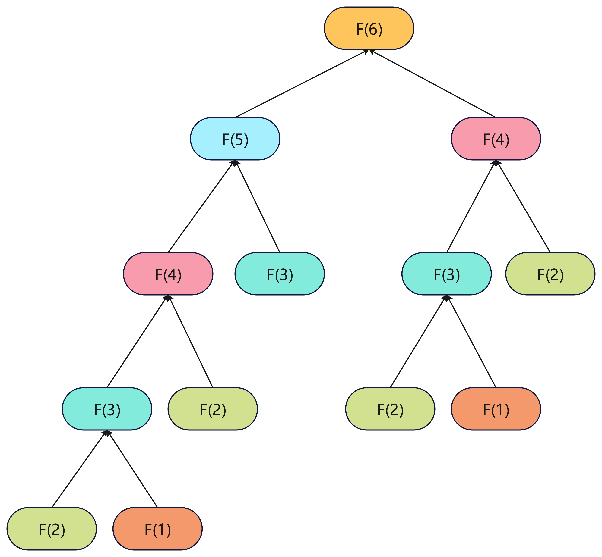
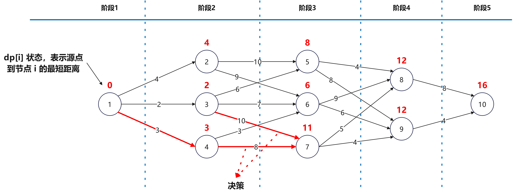

# 动态规划

## 7.1 理论

### 7.1.1 何为动态规划

动态规划（`Dynamic Programming`，简称`dp`）：把原问题拆分成若干子问题，每个子问题的解一定是全局最优解，然后自底向上先求解最小的子问题，把结果存储在表格中，然后向上求解较大子问题需要使用较小子问题解时，可以直接从表格中查询较小子问题的解，以避免重复计算，从而提高效率。

根据动态规划的定义，我们可以总结出可以使用动态规划的问题必须具有以下四个特性：

1. <font color="red"><strong>最优子结构</strong></font>：在自下而上递推的过程中，求得的每个子问题的最优解一定是全局最优解，既然分解的子问题是最优解，那么依赖子问题的原问题的解也是全局最优解。换句话说，从最底层开始得到的解就是全局最优解，那么依次向上，得到的解也是全局最优解，最终得到原问题的解肯定还是全局最优解；
2. <font color="red"><strong>多阶段决策</strong></font>：何为多阶段决策呢？在一些问题中，我们会把问题分解成若干个相互联系的阶段，在每一个阶段都要做出决策，在整个求解过程中依次做出的决策就是一个决策序列。每一阶段中，做出的决策都不是随意的，可能于前一阶段或者后一阶段有关。动态规划中，把原问题逐渐划分，分为若干个子问题，求解每一个子问题都可以看作是一个阶段，每一个阶段的解都与前面的阶段有关；
3. <font color="red"><strong>子问题重叠</strong></font>：前面提及，每一个阶段的解都与前面的阶段有关，换句话说，每一个阶段的解都需要用到前面阶段的解，这些阶段在向上逐步递推求解新阶段的解时，需要重复使用。如下图所示，求解斐波那契数列（ $F(n)=F(n - 1)+F(n - 2)$ ）的 $F(6)$ 时，求解每个 $F(x),x=1,2,3,4,5,6$ 就是一个阶段，每个阶段都与前面 $F(x-1)$ 和 $F(x-2)$ 已求解阶段有关。所以，每个阶段的解并不是只使用一次，在求解过程中会重复使用多次。
3. <font color="red"><strong>无后效性</strong></font>：斐波那契数列由一个很大的特点，求解 $F(n)$ ，它的值永远都只与 $F(n)$ 前面的阶段 $F(n-1)$ 和 $F(n-2)$ 的值有关，而不会与$F(n)$ 后面的阶段 $F(n+1)$ 有关。动态规划也一样，求解当前阶段的解只与前面阶段的值有关而与之后阶段无关。如果一个问题具有后效性，那么则需要将其转换为逆向问题，然后才能使用动态规划求解。

在使用动态规划时，先将原问题分解为不同的<font color="red"><strong>阶段</strong></font>，每个阶段的解就是问题的<font color="red"><strong>状态</strong></font>，由前面阶段的解得出当前阶段的解就是状态之间的转移，对状态转移的选择得出最优解就是动态规划中的<font color="red"><strong>决策</strong></font>，所以<font color="red"><strong>阶段</strong></font>、<font color="red"><strong>状态</strong></font>和<font color="red"><strong>决策</strong></font>是动态规划的三要素。

### 7.1.2 动态规划设计方法

动态规划处理的是多阶段决策问题，由初始状态开始，通过求解下一状态的解，然后决策出状态转移的路径，一步一步逼近原问题。在这个过程中，可以分为以下的步骤：

1. <font color="red"><strong>状态表示</strong></font>：将问题分解的各个状态时所处的情况使用不同状态和状态变量表示出来。
2. <font color="red"><strong>阶段划分</strong></font>：将问题按照时间特征或者空间特征或者其它特征将问题划分为不同阶段。
3. <font color="red"><strong>状态转移</strong></font>：状态转移是指根据前面阶段的状态，按照一定的决策确定本阶段的状态。根据决策和状态之间的关系，我们可以写出状态转移方程。
4. <font color="red"><strong>终止条件</strong></font>：状态转移方程是一个递归式，递归式需要确认递归终止条件。
5. <font color="red"><strong>求解目标</strong></font>：确定问题的求解目标，根据状态转移方程一步一步自底向上递推得到求解目标。

求解动态规划问题时，如何确定状态以及确认状态转移方程最为重要。

为进一步理解动态规划求解问题步骤，如下图所示，我们以单源最短路径为例。

1. <font color="red"><strong>状态表示</strong></font>：状态是每个顶点距离源点的最短距离`dp[i]`。
2. <font color="red"><strong>阶段划分</strong></font>：根据拓扑序列，将问题划分为五个不同的阶段。
3. <font color="red"><strong>状态转移</strong></font>：考察当前节点的逆邻接点，将所有逆邻接点的最短距离与连接当前节点边权之和的最小值得到 $dp[i]$ ，写出状态转移方程， $dp[i]=min(dp[j]+w[j][i]),<j, i>∈E$ 。
4. <font color="red"><strong>终止条件</strong></font>：若当前节点为源点`1`，则令 $dp[1]=0$ 。
5. <font color="red"><strong>求解目标</strong></font>：由 $dp[1]$ 开始，从底向上依次解答得到`dp[i]`。



### 7.1.3 动态规划基本问题

#### 7.1.3.1 斐波拉契数列

[509.斐波那契数](https://leetcode.cn/problems/fibonacci-number/description/)

斐波那契数（通常用 $F(n)$ 表示）形成的序列称为 斐波那契数列。该数列由 $0$ 和 $1$ 开始，后面的每一项数字都是前面两项数字的和。也就是：

$F(0) = 0，F(1) = 1$

$F(n) = F(n - 1) + F(n - 2),n > 1$

给定 $n$ ，请计算 $F(n)$ 。

示例 $1$ ：

输入： $n = 2$

输出： $1$

解释： $F(2) = F(1) + F(0) = 1 + 0 = 1$

示例 $2$ ：

输入： $n = 3$

输出： $2$

解释： $F(3) = F(2) + F(1) = 1 + 1 = 2$

示例 3：

输入： $n = 4$

输出： $3$

解释： $F(4) = F(3) + F(2) = 2 + 1 = 3$

提示：

+ $0 <= n <= 30$

##### 7.1.3.1.1 记忆化搜索

根据题目的描述，我们可以很快判断出：

1. 该问题可以使用递归来求解；
2. 递归过程中存在大量的重复子问题；
3. 采用递归记忆化搜索存储子问题解避免重复计算（回溯剪枝）；

根据上面讨论，得到下面递归记忆化搜索代码：

```java
class Solution {
    public int fib(int n) {
        if (n <= 1)
            return n;
        int[] memorandum = new int[n + 1];
        memorandum[0] = 0;
        memorandum[1] = 1;
        return fibRecursion(memorandum, n);
    }

    private int fibRecursion(int[] memorandum, int n) {
        // 递归终止条件
        if (n > 1) {
            if (memorandum[n] == 0) {
                memorandum[n] = fibRecursion(memorandum, n - 1) + fibRecursion(memorandum, n - 2);
            }
        }
        return memorandum[n];
    }
}
```

##### 7.1.3.1.2 自底向上动态规划

递归先是自顶向下分解问题，然后自底向上合并问题，其实我们完全可以使用递推的方法直接从底开始，这就是动态规划，代码如下：

```java
class Solution {
    public int fib(int n) {
        if (n < 2)
            return n;
        int pre = 1, prePre = 0, cur = 1;
        for (int i = 2; i <= n; i++) {
            cur = pre + prePre;
            prePre = pre;
            pre = cur;
        }
        return cur;
    }
}
```

#### 7.1.3.2 三角形最小路径和

[120.三角形最小路径和](https://leetcode.cn/problems/triangle/description/)

给定一个三角形`triangle`，找出自顶向下的最小路径和。每一步只能移动到下一行中相邻的结点上。相邻的结点在这里指的是下标与上一层结点下标相同或者等于上一层结点**下标+1**的两个结点。也就是说，如果正位于当前行的下标**i**，那么下一步可以移动到下一行的下标**i**或**i+1**。

示例 $1$ ：

输入： $triangle = [[2],[3,4],[6,5,7],[4,1,8,3]]$

输出：$11$

解释：如下面简图所示：

&nbsp;&nbsp;&nbsp;2</br>
&nbsp;&nbsp;3&nbsp;4</br>
&nbsp;6&nbsp;5&nbsp;7</br>
4&nbsp;1&nbsp;8&nbsp;3</br>

自顶向下的最小路径和为 $11$ （即， $2 + 3 + 5 + 1 = 11$ ）。

示例 $2$ ：

输入：$triangle = [[-10]]$

输出： $-10$

提示：

+ $1 <= triangle.length <= 200$
+ $triangle[0].length == 1$
+ $triangle[i].length == triangle[i - 1].length + 1$
+ $-104 <= triangle[i][j] <= 104$

##### 7.1.3.2.1 记忆化搜索

根据题目的描述，我们可以很快判断出：

1. 该问题可以使用递归来求解；
2. 递归过程中存在大量的重复子问题；
3. 采用递归记忆化搜索存储子问题解避免重复计算（回溯剪枝）；

既然需要剪枝，需要选择一个数据结构存储结果，根据题意，可以使用和输入一样的数据结构`List<List<Integer>> shortestPath`。根据递归的写法，得到如下的代码：

```java
class Solution {

    public int minimumTotal(List<List<Integer>> triangle) {
        List<List<Integer>> shortestPath = new ArrayList<>();
        // shortestPath 全部置 null
        for (int i = 0; i < triangle.size(); i++) {
            List<Integer> l = new ArrayList<>();
            for (int j = 0; j < triangle.get(i).size(); j++)
                l.add(null);
            shortestPath.add(l);
        }
        int ans = Integer.MAX_VALUE;
        for (int i = 0; i < triangle.size(); i++) {
            int v = minimumTotalRecursion(triangle.size() - 1, i, triangle, shortestPath);
            if (ans > v) {
                ans = v;
            }
        }
        return ans;
    }

    private int minimumTotalRecursion(int x, int y, List<List<Integer>> triangle, List<List<Integer>> shortestPath) {
        // 递归终止条件
        if (x == 0 && y == 0) {
            return triangle.get(0).get(0);
        } else {
            if (shortestPath.get(x).get(y) == null) {
                if (y == 0) {
                    shortestPath.get(x).set(y,
                            minimumTotalRecursion(x - 1, 0, triangle, shortestPath) + triangle.get(x).get(y));
                } else if (y == triangle.get(x).size() - 1) {
                    shortestPath.get(x).set(y,
                            minimumTotalRecursion(x - 1, y - 1, triangle, shortestPath) + triangle.get(x).get(y));
                } else {
                    int xx = minimumTotalRecursion(x - 1, y - 1, triangle, shortestPath);
                    int yy = minimumTotalRecursion(x - 1, y, triangle, shortestPath);
                    shortestPath.get(x).set(y, Math.min(xx, yy) + triangle.get(x).get(y));
                }
            }
            return shortestPath.get(x).get(y);
        }
    }
}
```

递归自顶向下分解问题，从`triangle.get(triangle.size()-1)`开始分解，待分解到`triangle.get(0)`可以直接得到结果，然后使用`shortestPath`记录结果避免重复计算。

##### 7.1.3.2.2 自底向上动态规划

为确认状态转移方程，我们定义存储每个结点的最短路径数据结构`int[][] s = new int[triangle.size()][triangle.size()]`，`triangle`的值用`t`表示，那么得到如下的状态转移方程：

$$s(x,y) = \begin{cases}
s(x-1,0)+t(x,0), & y=0 \\
min \big(s(x-1,y),s(x-1,y-1)\big)+t(x,y), & 0<y<x \\
s(x-1,y-1)+t(x,y),& y=x \\
\end{cases}$$

递推的初始条件是： $s(0,0)=t(0,0)$

如果我们使用`s`，那么空间复杂度就是 $O(n^2)$ ，在每一次计算 $s(x,y)$ ，仅与 $s(x-1,y)$ 和 $s(x-1,y-1)$ 有关，如果我们用一个变量 $pre=s(x-1,y-1)$ ，那么可以仅使用一维数组 `int[] s=new int[triangle.size()]`来完成计算。

得出以下动态规划代码：

```java
class Solution {
    public int minimumTotal(List<List<Integer>> triangle) {
        int l = triangle.size();
        int[] s = new int[l];
        s[0] = triangle.get(0).get(0);
        int pre = s[0];
        for (int x = 1; x < l; x++) {
            for (int y = 0; y <= x; y++) {
                if (y == 0) {
                    pre = s[y];
                    s[y] = s[y] + triangle.get(x).get(y);
                } else if (y == x) {
                    s[y] = pre + triangle.get(x).get(y);
                } else {
                    int r = Math.min(pre, s[y]) + triangle.get(x).get(y);
                    pre = s[y];
                    s[y] = r;
                }
            }
        }
        pre = s[0];
        for (int i = 1; i < l; i++) {
            if (pre > s[i])
                pre = s[i];
        }
        return pre;
    }
}
```

## 7.2 背包问题

### 7.2.1 01 背包

现在有 $n$ 件物品，第 $i(i<n)$ 件物品的重量和价值分别为 $w_i$ 和 $v_i$ 。现在，有一个容量为 $W$ 的背包，求解背包所能装的物品最大价值是多少。因为每个物品要么不放入（0），要么放入（1），因此也称为 01 背包问题。

#### 7.2.1.1 状态转移方程

这里有两个维度（重量和价值），所以需要使用一个二维数组 $c(i,j)$ 来表示每个状态，其中 $i$ 是第 $i$ 个阶段，也就是往背包中处理第 $i$ 件物品， $j$ 表示处理第 $i$ 件物品时背包剩余容量， $c(i,j)$ 表示背包容量 $j$ 处理第 $i$ 件物品后总价值。那么第 $i$ 件物品时只有两种处理状态：

+ 放入背包：将 $i-1$ 状态向 $i$ 状态转移，第 $i$ 件物品放入背包中，导致前 $i-1$ 个阶段可用容量变成了 $j-w_i$ ，那么问题转换为将前 $i-1$ 件物品放入容量为 $j-w_i$ 背包获得最大价值。最后，第 $i$ 阶段获取的最大价值为： $c(i-1,j-w_i)+v_i$；
+ 不放入背包：背包的价值不变化，问题依然是将前 $i-1$ 件物品放入容量为 $j$ 的背包中获得的最大价值，最大价值为 $c[i-1][j]$ ；

考虑如何处理第 $i$ 件物品，需要分两种情况讨论，如果剩余容量小于第 $i$ 件物品重量 $w_i$ ，那么肯定不能放入物品 $i$ 。如果剩余容量大于等于第 $i$ 件物品重量 $w_i$ ， 那么需要比较放入和不放入两种情况，取其较大者。得出状态转移方程为：

$$c(i,j) = \begin{cases}
c(i-1,j), & j<w_i \\
max\big(c(i-1,j),c(i-1,j-w_i)+v_i\big), & j\geq w_i \\
\end{cases}$$

#### 7.2.1.2 求解代码

```java
public class Main {
    /**
     * 拿到最大价值数
     */
    public int solution(int[] w, int[] v, int W) {
        // 为统一计算，第 0 行和第 0 列需要全部置为 0
        int[][] c = new int[w.length + 1][W + 1];
        for (int i = 1; i <= w.length; i++) {
            for (int j = 1; j <= W; j++) {
                if (j < w[i - 1]) {
                    c[i][j] = c[i - 1][j];
                } else {
                    c[i][j] = Math.max(c[i - 1][j], c[i - 1][j - w[i - 1]] + v[i - 1]);
                }
            }
        }

        return c[w.length][W];

    }

    /**
     * 返回背包中存放的物品
     */
    public List<Integer> solutionStuff(int[] w, int[] v, int W) {
        // 为统一计算，第 0 行和第 0 列需要全部置为 0
        int[][] c = new int[w.length + 1][W + 1];
        for (int i = 1; i <= w.length; i++) {
            for (int j = 1; j <= W; j++) {
                if (j < w[i - 1]) {
                    c[i][j] = c[i - 1][j];
                } else {
                    c[i][j] = Math.max(c[i - 1][j], c[i - 1][j - w[i - 1]] + v[i - 1]);
                }
            }
        }
        List<Integer> x = new ArrayList<>(w.length);
        int j = W;
        for (int i = w.length; i > 0; i--) {
            if (c[i][j] > c[i - 1][j]) {
                x.add(i);
                j -= w[i - 1];
            }
        }
        return x;
    }
}
```

#### 7.2.1.3 详细图解

测试数据为： $w=[2, 5, 4, 2, 3],v=[6, 3, 5, 4, 6],W=10$ ，那么根据求解步骤得出以下详细步骤图解。


#### 7.2.1.4 代码优化

根据上面的详细图解，我们先来看 $i=4$ 时，整个计算流程，如下所示：

> i=4,j=1   => c(4,1)=c(3,1)=0；</br>
i=4,j=2   => c(4,2)=max(c(3,2),c(3,0)+4)=6；</br>
i=4,j=3   => c(4,3)=max(c(3,3),c(3,1)+4)=6；</br>
i=4,j=4   => c(4,4)=max(c(3,4),c(3,2)+4)=10；</br>
i=4,j=5   => c(4,5)=max(c(3,5),c(3,3)+4)=10；</br>
i=4,j=6   => c(4,6)=max(c(3,6),c(3,4)+4)=11；</br>
i=4,j=7   => c(4,7)=max(c(3,7),c(3,5)+4)=11；</br>
i=4,j=8   => c(4,8)=max(c(3,8),c(3,6)+4)=15；</br>
i=4,j=9   => c(4,9)=max(c(3,9),c(3,7)+4)=15；</br>
i=4,j=10 => c(4,10)=max(c(3,10),c(3,8)+4)=15；

计算 $c(4,j)$ 时，需要用到的值是 $c(3,j)$ 和 $v[4]=4$ （这里写的是 $4$ 但其实使用的是 $v[3]$ ，因为数组下标从 $0$ 开始 ）。也就是说，如果不需要给出详细的解，只需要一个最大值时，完全可以不存储 $O(n^2)$ 的数，只需要 $O(n)$ 即可。所以，重新定义状态和状态转移方程：

+ 状态： $dp(j)$ 表示将物品放入容量为 $j$ 的背包获得的价值。
+ 状态转移方程： $dp(j)=max(dp[j],dp(j-w_i)+v_i)$。

观察状态转移方程， $dp(j)$ 跟前面的 $dp(j-w_i)$ 有关，如果从 $j=0$ 开始，那么计算 $dp(j)$ 时，会因为 $dp(j-w_i)$ 已经计算过，不是原来的值而是更新过的值，会导致计算错误。所以，这里不采用正推（ $j=0$ 开始 ），而使用倒推 （ $j=W$ 开始）。

修改代码如下所示：

```java
public class Main {
    /**
     * 拿到最大价值数
     */
    public int solution(int[] w, int[] v, int W) {
        int[] dp = new int[W + 1];
        for (int i = 0; i < w.length; i++) {
            for (int j = W; j >= w[i]; j--) {
                dp[j]=Math.max(dp[j], dp[j-w[i]]+v[i]);
            }
        }
        return dp[W];
    }
}
```

### 7.2.2 完全背包

现在有 $n$ 件物品，第 $i(i<n)$ 件物品的重量和价值分别为 $w_i$ 和 $v_i$ 。现在，有一个容量为 $W$ 的背包，求解背包所能装的物品最大价值是多少。现在每个物品可以重复使用，是完全背包问题。

我们使用 $dp(j)$ 表示将物品放入容量为 $j$ 的背包中可以获取的最大价值，那么，因为可以重复使用，所以处理第 $i$ 阶段时，放入第 $i$ 件物品，相当于从第 $i$ 阶段向第 $i$ 阶段转移，得到状态转移方程如下所述： $dp(j)=max(dp(j),dp(j-w_i)+v_i)$ 。

### 7.2.2.1 存钱罐

现在我们有一个存钱罐，打碎后可能会发现钱不够的情况。那么，我们可以称一下钱罐的重量，然后根据每个面值硬币的重量以及存钱罐的重量，估算存钱罐的最小金额，如果最小金额不存在，返回 $-1$ 。

比如，空存钱罐的重量为 $10$ ，装满硬币存钱罐的重量为 $110$ ，存钱罐内有 $2$ 种硬币，一种面值为 $1$ ，重量为 $1$，另一种面值为 $30$ ，重量为 $50$ ，那么最小金额为 $60$ 。

+ 状态表示： $do(j)$ 表示重量为 $j$ 的存钱罐内的最小金额。
+ 状态转移方程： $dp(j)=min(dp(j),dp(j-w_i)+v_i)$ 。

代码如下所示：

```java
public class Main {
    public int solution(int[] w, int[] v, int piggyBankW, int fullPittyBankW) {
        int W = fullPittyBankW - piggyBankW;

        int[] dp = new int[W + 1];
        Arrays.fill(dp, Integer.MAX_VALUE);
        dp[0] = 0;
        for (int i = 0; i < w.length; i++) {
            for (int j = w[i]; j <= W; j++) {
                dp[j] = Math.min(dp[j], dp[j - w[i]] + v[i]);
            }
        }
        if (dp[W] == Integer.MAX_VALUE) {
            return -1;
        } else
            return dp[W];
    }
}
```

### 7.2.3 多重背包

现在有 $n$ 种物品，第 $i(i<n)$ 种物品的重量和价值分别为 $w_i$ 和 $v_i$ ,每种物品的数量 $c_i$ （ $c_i\geq1$ ）。现在，有一个容量为 $W$ 的背包，求解背包所能装的物品最大价值是多少。因为每种物品可以获取的数量有限，称为多重背包。

#### 7.2.3.1 暴力拆分

所谓暴力拆分就是将 $c_i$ 件第 $i$ 种物品看作 $c_i$ 种物品，那么可以将问题转换为 01 背包问题，遵循 01 背包问题解法，得到如下代码：

```java
public class Main {
    public int solution(int[] w, int[] v, int[] c, int W) {
        int[] dp = new int[W + 1];
        for (int i = 0; i < w.length; i++) {
            for (int m = 0; m < c[i]; m++) {
                for (int j = W; j >= w[i]; j--) {
                    dp[j] = Math.max(dp[j], dp[j - w[i]] + v[i]);
                }
            }
        }
        return dp[W];
    }

    public static void main(String[] args) {
        Main m = new Main();
        System.out.println(
                m.solution(new int[] { 2, 5, 4, 2, 3 }, new int[] { 6, 3, 5, 4, 6 }, new int[] { 3, 1, 1, 1, 1 }, 10));
    }

}
```

上面代码中，只需要增加一层循环即可，每一层循环时间复杂度为 $W$ ，共有 $\sum {c_i}$ 层，所以时间复杂度为 $W\times \sum {c_i}$ 。空间复杂度为 $W$ 。

#### 7.2.3.2 二进制优化

当 $c[i]\times w[i]>=W$ 时，可以将这种物品看作不限数量放入背包种，按照完全背包的方法求解；否则可以采用二进制的方法拆分，将 $c[i]$ 个物品重新打包称若干种新物品。怎么拆分呢？现在有一个数 $p$ 满足：$2^0+2^1+2^2+\dots+2^p\leq c[i]$ 和 $2^0+2^1+2^2+\dots+2^p+2^{p+1} > c[i]$ ，在满足上述条件的 $p$ 中，增加一个数 $R_i$ ，满足 $2^0+2^1+2^2+\dots+2^p+R_i = c[i]$ 。比如 $c[i]=2^0+2^1+2^2+(9-2^0+2^1+2^2)=9$ ，相当于把 $9$ 个物品重新打包成 $4$ 个物品，第一个物品只有一个物品，重量为 $w[i]$ ，价值为 $v[i]$ ；第二个物品有两个物品，重量为 $2*w[i]$ ，价值为 $2*v[i]$ ；第三个物品有4个物品，重量为 $4*w[i]$ ，价值为 $4*v[i]$ ；第四个物品有两个物品，重量为 $2*w[i]$ ，价值为 $2*v[i]$ 。这样将 $c[i]$ 拆分成 $p+2$ 个物品，重新将问题转换为完全背包和 01 背包问题。代码如下：

```java
public class KnapsackProblem {
    public int knapsack(int[] w, int[] v, int[] c, int W) {
        int[] dp = new int[W + 1];
        for (int i = 0; i < w.length; i++) {
            if (c[i] * w[i] >= W) {
                // 完全背包
                for (int j = w[i]; j <= W; j++) {
                    dp[j] = Math.max(dp[j], dp[j - w[i]] + v[i]);
                }
            } else {
                for (int k = 1; c[i] > 0; k <<= 1) { // 二进制拆分
                    int x = Math.min(k, c[i]);
                    for (int j = W; j >= w[i] * x; j--) {
                        dp[j] = Math.max(dp[j], dp[j - w[i] * x] + x * v[i]);
                    }
                    c[i] -= x;
                }
            }
        }

        return dp[W];
    }

    public static void main(String[] args) {
        KnapsackProblem m = new KnapsackProblem();
        System.out.println(
                m.knapsack(new int[] { 2, 5, 4, 2, 3 }, new int[] { 6, 3, 5, 4, 6 }, new int[] { 1, 1, 1, 1, 1 }, 10));
    }
}
```

### 7.2.4 分组背包

给定 $n$ 组物品，第 $i$ 组有 $c_i$ 种物品，第 $i$ 组的第 $j$ 种物品有重量 $w_{i,j}$ 和价值 $v_{i,j}$ ，背包容量为 $W$ ，在不超过背包容量的基础下每组最多选择一个物品，求解如何放置物品使背包种物品的价值之和最大。

#### 7.2.4.1 状态转移方程

因为每组最多选择一个物品，那么可以将每组都看作一个整体，那么就将问题转为了 01 背包问题。根据 01 背包问题，在处理第 $i$ 组物品时，前 $i-1$ 组物品已经处理完毕，只需要考虑从 $i-1$ 阶段向 $i$ 阶段转移。

我们使用 $c(i,j)$ 表示将前 $i$ 组放入容量为 $j$ 的背包中可以获得的最大价值， $w_{i,k}$ 表示放入第 $i$ 组放入第 $k$ 个物品， $v_{i,k}$ 表示放入第 $i$ 组第 $k$ 个物品获取的价值。那么对于第 $i$ 组物品的处理状态如下：

+ 第一种状态：若不放入第 $i$ 组物品，则放入背包的价值不增加，问题转换为：将前 $i-1$ 组物品放入容量为 $j$ 的背包中可以获得最大的价值，最大的价值为 $c(i-1,j)$ 。
+ 若放入第 $i$ 组物品 $k$ 个，则相当于从第 $i-1$ 阶段向第 $i$ 阶段转移，问题转换为：将前 $i-1$ 组物品放入容量为 $j-w_{i,k}$ 的背包中可以获取的最大价值，此时获得的最大价值是 $c(i-1,j-w_{i,k})+v_{i,k}$。

我们知道，如果背包的容量不足，那么不可以放入，那么是第一种状态；如果背包容量充足，那么需要比较放入和不放入第 $i$ 组物品哪种情况可以获取更大的价值。总结上面，得到分组背包状态转移方程如下;

$$c(i,j) = \begin{cases}
c(i-1,j), & j<w_{i,k} \\
max_{1 \leq k \leq c_i} \big \{c(i-1,j),c(i-1,j-w_{i,k})+v_{i,k}\big\}, & j\geq w_{i,k} \\
\end{cases}$$

#### 7.2.4.2 求解代码

```java
public class KnapsackProblem {
    public int groupingKnapsack(List<List<Integer>> w, List<List<Integer>> v, int W) {
        int[] dp = new int[W + 1];
        for (int i = 0; i < w.size(); i++) {
            for (int j = W; j >= 0; j--) {
                for (int k = 0; k < w.get(i).size(); k++) { // 枚举组内各个物品
                    if (j>=w.get(i).get(k)) {
                        dp[j]=Math.max(dp[j], dp[j-w.get(i).get(k)]+v.get(i).get(k));
                    }
                }
            }
        }
        return dp[W];
    }
}
```
