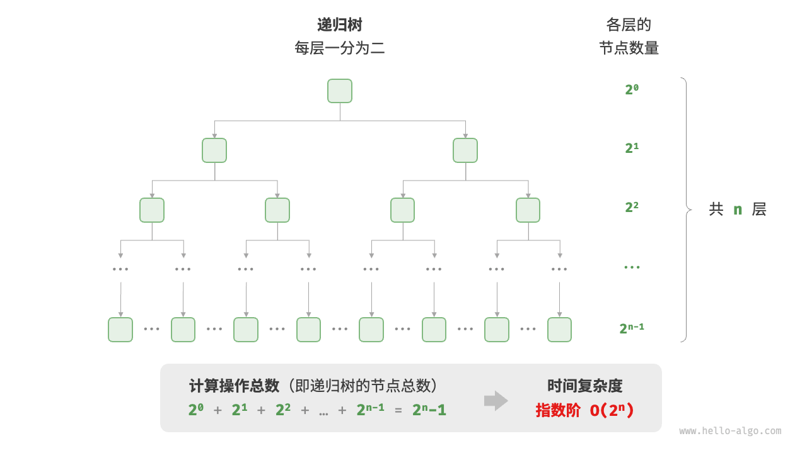
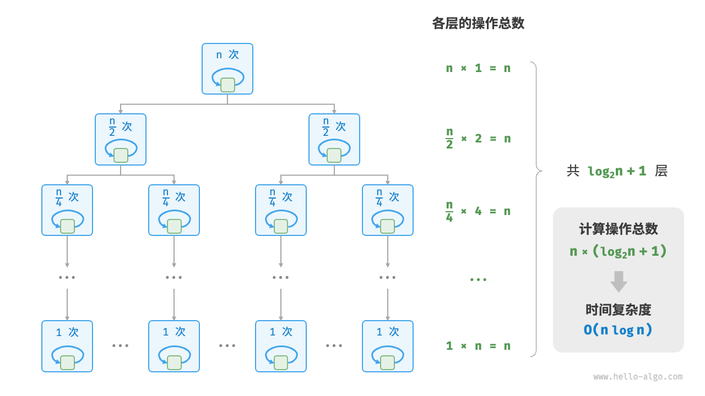

# 第1章 复杂度分析

## 1.1 时间复杂度

程序运行时间可以直观且准确地反映算法的效率。如果我们想准确预估一段代码的运行时间，应该如何操作呢？尽管有许多复杂的因素影响着我们对程序的运行时间的理解，但是原则上，我们仍然可能构造出一个数学模型来描述任意程序的运行时间。一个程序运行的时间主要和两点有关：

1. 执行每条语句的耗时；
2. 执行每条语句的频率；

前者取决于计算机、`Java`编译器和操作系统，后者取决于程序本身和输入。如果对于程序的所有部分我们都知道了这些性质，可以将它们相乘并将程序中所有指令的成本相加得到总运行时间。

例如在以下代码中，输入数据大小为 $n$ ：

```java
// 在某运行平台下
void algorithm(int n) {
    int a = 2;  // 赋值 1 ns
    a = a + 1;  // 加法 1 ns
    a = a * 2;  // 乘法 10 ns
    // 循环 n 次
    for (int i = 0; i < n; i++) {  // 1 ns ，每轮都要执行 i++
        System.out.println(0);     // 打印 5 ns
    }
}
```

根据以上方法，可以得到算法的运行时间为 $6n+12$ ns：

$$1+1+10+(1+5)*n=6n+12$$

但实际上，统计算法的运行时间既不合理也不现实。首先，我们不希望将预估时间和运行平台绑定，因为算法需要在各种不同的平台上运行。其次，我们很难获知每种操作的运行时间，这给预估过程带来了极大的难度。

### 1.1.1 统计时间增长趋势

时间复杂度分析统计的不是算法运行时间，而是算法运行时间随着数据量变大时的增长趋势。

“时间增长趋势”这个概念比较抽象，我们通过一个例子来加以理解。假设输入数据大小为 $n$，，给定三个算法`A`、`B`和`C`：

```java
// 算法 A 的时间复杂度：常数阶
void algorithm_A(int n) {
    System.out.println(0);
}
// 算法 B 的时间复杂度：线性阶
void algorithm_B(int n) {
    for (int i = 0; i < n; i++) {
        System.out.println(0);
    }
}
// 算法 C 的时间复杂度：常数阶
void algorithm_C(int n) {
    for (int i = 0; i < 1000000; i++) {
        System.out.println(0);
    }
}
```

下图展示了以上三个算法函数的时间复杂度。

+ 算法`A`只有 $1$ 个打印操作，算法运行时间不随着 $n$ 增大而增长。我们称此算法的时间复杂度为“常数阶”。
+ 算法`B`中的打印操作需要循环 $n$ 次，算法运行时间随着 $n$ 增大呈线性增长。此算法的时间复杂度被称为“线性阶”。
+ 算法`C`中的打印操作需要循环 $1000000$ 次，虽然运行时间很长，但它与输入数据大小 $n$ 无关。因此`C`的时间复杂度和`A`相同，仍为“常数阶”。


和直接计算程序运行时间相比，时间复杂度有以下优点：

+ 时间复杂度能够有效评估算法效率。例如，算法`B`的运行时间呈线性增长，在 $n>1$ 时，比算法 A 更慢，在 $n>1000000$ 时比算法`C`更慢。事实上，只要输入数据大小 $n$ 足够大，复杂度为“常数阶”的算法一定优于“线性阶”的算法，这正是时间增长趋势的含义。
+ 时间复杂度的推算方法更简便。显然，运行平台和计算操作类型都与算法运行时间的增长趋势无关。因此在时间复杂度分析中，我们可以简单地将所有计算操作的执行时间视为相同的“单位时间”，从而将“计算操作运行时间统计”简化为“计算操作数量统计”，这样一来估算难度就大大降低了。
+ 时间复杂度也存在一定的局限性。例如，尽管算法`A`和`C`的时间复杂度相同，但实际运行时间差别很大。同样，尽管算法`B`的时间复杂度比`C`高，但在输入数据大小 $n$ 较小时，算法`B`明显优于算法`C`。在这些情况下，我们很难仅凭时间复杂度判断算法效率的高低。当然，尽管存在上述问题，复杂度分析仍然是评判算法效率最有效且常用的方法。

### 1.1.2 函数渐近上界

许多程序的运行时间都只取决于其中的一小部分指令。比如下面函数：

```java
void algorithm(int n) {
    int a = 1;  // +1
    a = a + 1;  // +1
    a = a * 2;  // +1
    // 循环 n 次
    for (int i = 0; i < n; i++) { // +1（每轮都执行 i ++）
        System.out.println(0);    // +1
    }
}
```

设算法的操作数量是一个关于输入数据大小 $n$ 的函数，记为 $T(n)$ ，则以上函数的操作数量为：$$T(n)=3+2n$$

$T(n)$ 是一次函数，说明其运行时间的增长趋势是线性的，因此它的时间复杂度是线性阶。我们将线性阶的时间复杂度记为 $O(n)$，这个数学符号称为大 $O$ 记号（big-$O$ notation），表示函数 $T(n)$ 的渐近上界（asymptotic upper bound）。

比如下面一些典型的近似：

|函数|近似|增长的数量级|
|:-:|:-:|:-:|
| $\frac{N^3}{6}-\frac{N^2}{2}+\frac{N}{3}$ | $\sim\frac{N^3}{3}$ | $N^3$ |
| $\frac{N^2}{2}-\frac{N}{2}$ | $\sim\frac{N^2}{2}$ | $N^2$ |
| $\lg N+1$ | $\sim\lg N$ | $\lg N$ |
| $3$ | $\sim3$ | $1$ |

### 1.1.3 常见类型

设输入数据大小为 $n$，常见的时间复杂度类型如下图所示（按照从低到高的顺序排列）。$$O(1)<O(\log n)<O(n)<O(n\log n)<O(n^2)<O(2^n)<O(n!)\\常数阶<对数阶<线性阶<线性对数阶<平方阶<指数阶<阶乘阶$$


#### 1.1.3.1 常数阶 $O(1)$

常数阶的操作数量与输入数据大小 $n$ 无关，即不随着 $n$ 的变化而变化。

在以下函数中，尽管操作数量`size`可能很大，但由于其与输入数据大小 $n$ 无关，因此时间复杂度仍为 $O(1)$ ：

```java
/* 常数阶 */
int constant(int n) {
    int count = 0;
    int size = 100000;
    for (int i = 0; i < size; i++)
        count++;
    return count;
}
```

#### 1.1.3.2 线性阶 $O(n)$

线性阶的操作数量相对于输入数据大小 $n$ 以线性级别增长。线性阶通常出现在单层循环中：

```java
/* 线性阶 */
int linear(int n) {
    int count = 0;
    for (int i = 0; i < n; i++)
        count++;
    return count;
}
```

#### 1.1.3.3 平方阶 $O(n^2)$

平方阶的操作数量相对于输入数据大小 $n$ 以平方级别增长。平方阶通常出现在嵌套循环中，外层循环和内层循环的时间复杂度都为 $O(n)$，因此总体的时间复杂度为 $O(n^2)$ ：

```java
/* 平方阶 */
int quadratic(int n) {
    int count = 0;
    // 循环次数与数据大小 n 成平方关系
    for (int i = 0; i < n; i++) {
        for (int j = 0; j < n; j++) {
            count++;
        }
    }
    return count;
}
```

#### 1.1.3.4 指数阶 $O(2^n)$

生物学的“细胞分裂”是指数阶增长的典型例子：初始状态为 $1$ 个细胞，分裂一轮后变为 $2$ 个，分裂两轮后变为 $4$ 个，以此类推，分裂 $n$ 轮后有 $2^n$ 个细胞。

下图和以下代码模拟了细胞分裂的过程，时间复杂度为 $O(2^n)$ ：

```java
/* 指数阶（循环实现） */
int exponential(int n) {
    int count = 0, base = 1;
    // 细胞每轮一分为二，形成数列 1, 2, 4, 8, ..., 2^(n-1)
    for (int i = 0; i < n; i++) {
        for (int j = 0; j < base; j++) {
            count++;
        }
        base *= 2;
    }
    // count = 1 + 2 + 4 + 8 + .. + 2^(n-1) = 2^n - 1
    return count;
}
```



#### 1.1.3.5 对数阶 $O(\log n)$

与指数阶相反，对数阶反映了“每轮缩减到一半”的情况。设输入数据大小为 $n$ ，由于每轮缩减到一半，因此循环次数是 $\log_2n$ ，即 $2^n$ 的反函数。

```java
/* 对数阶（循环实现） */
int logarithmic(int n) {
    int count = 0;
    while (n > 1) {
        n = n / 2;
        count++;
    }
    return count;
}
```


#### 1.1.3.6 对数阶 $O(n\log n)$

线性对数阶常出现于嵌套循环中，两层循环的时间复杂度分别为 $O(\log n)$ 和 $O(n)$ 。相关代码如下：

```java
/* 线性对数阶 */
int linearLogRecur(int n) {
    if (n <= 1)
        return 1;
    int count = linearLogRecur(n / 2) + linearLogRecur(n / 2);
    for (int i = 0; i < n; i++) {
        count++;
    }
    return count;
}
```

线性对数阶的生成方式。二叉树的每一层的操作总数都为 $n$ ，树共有 $\log_2n+1$ 层，因此时间复杂度为 $O(n\log n)$ 。



#### 1.1.3.7 对数阶 $O(n!)$

阶乘阶对应数学上的“全排列”问题。给定 $n$ 个互不重复的元素，求其所有可能的排列方案，方案数量为： $$n!=n\times(n-1)\times(n-2)\times...\times 2\times 1$$

阶乘通常使用递归实现。如下图和以下代码所示，第一层分裂出 $n$ 个，第二层分裂出 $n-1$ 个，以此类推，直至第 $n$ 层时停止分裂：

```java
/* 阶乘阶（递归实现） */
int factorialRecur(int n) {
    if (n == 0)
        return 1;
    int count = 0;
    // 从 1 个分裂出 n 个
    for (int i = 0; i < n; i++) {
        count += factorialRecur(n - 1);
    }
    return count;
}
```


### 1.1.4 最差、最佳、平均时间复杂度

算法的时间效率往往不是固定的，而是与输入数据的分布有关。假设输入一个长度为 $n$ 的数组`nums`，其中`nums`由从 $1$ 至 $n$ 的数字组成，每个数字只出现一次，但元素顺序是随机打乱的，任务目标是返回元素 $1$ 的索引。由此，我们可以得出以下结论：

+ 当`nums=[?,?,...,1]`，即当末尾元素是 $1$ 时，需要完整遍历数组，**达到最差时间复杂度** $O(n)$；
+ 当`nums=[?,?,...,1]`，即当首个元素为 $1$ 时，无论数组多长都不需要继续遍历，**达到最佳时间复杂度** $\Omega(1)$

值得说明的是，我们在实际中很少使用最佳时间复杂度，因为通常只有在很小概率下才能达到，可能会带来一定的误导性。**而最差时间复杂度更为实用，因为它给出了一个效率安全值**，让我们可以放心地使用算法。

从上述示例可以看出，最差时间复杂度和最佳时间复杂度只出现于“特殊的数据分布”，这些情况的出现概率可能很小，并不能真实地反映算法运行效率。相比之下，**平均时间复杂度可以体现算法在随机输入数据下的运行效率**，用 $\Theta$ 记号来表示。

对于部分算法，我们可以简单地推算出随机数据分布下的平均情况。比如上述示例，由于输入数组是被打乱的，因此元素 $1$ 出现在任意索引的概率都是相等的，那么算法的平均循环次数就是数组长度的一半 $\frac{n}{2}$ ，平均时间复杂度为 $\Theta (\frac{n}{2})=\Theta (n)$ 。

但对于较为复杂的算法，计算平均时间复杂度往往比较困难，因为很难分析出在数据分布下的整体数学期望。在这种情况下，我们通常使用最差时间复杂度作为算法效率的评判标准。
