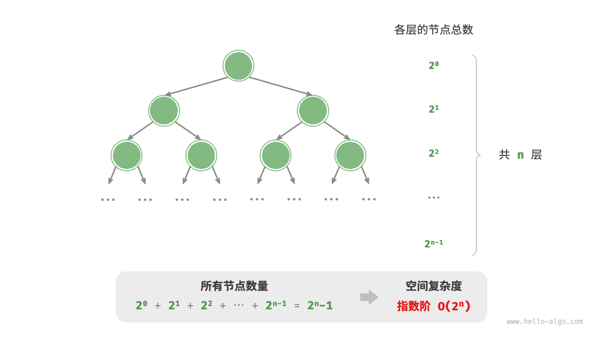

# 第1章 复杂度分析

## 1.2 空间复杂度

空间复杂度（`space complexity`）用于衡量算法占用内存空间随着数据量变大时的增长趋势。这个概念与时间复杂度非常类似，只需将“运行时间”替换为“占用内存空间”。

### 1.2.1 算法相关空间

算法在运行过程中使用的内存空间主要包括以下几种。

+ 输入空间：用于存储算法的输入数据。
+ 暂存空间：用于存储算法在运行过程中的变量、对象、函数上下文等数据。
+ 输出空间：用于存储算法的输出数据。

一般情况下，空间复杂度的统计范围是“暂存空间”加上“输出空间”。

暂存空间可以进一步划分为三个部分。

* 暂存数据：用于保存算法运行过程中的各种常量、变量、对象等。
* 栈帧空间：用于保存调用函数的上下文数据。系统在每次调用函数时都会在栈顶部创建一个栈帧，函数返回后，栈帧空间会被释放。
* 指令空间：用于保存编译后的程序指令，在实际统计中通常忽略不计。

在分析一段程序的空间复杂度时，我们通常统计暂存数据、栈帧空间和输出数据三部分，如下图所示：


相关代码如下：

```java
/* 类 */
class Node {
    int val;
    Node next;
    Node(int x) { val = x; }
}

/* 函数 */
int function() {
    // 执行某些操作...
    return 0;
}

int algorithm(int n) {        // 输入数据
    final int a = 0;          // 暂存数据（常量）
    int b = 0;                // 暂存数据（变量）
    Node node = new Node(0);  // 暂存数据（对象）
    int c = function();       // 栈帧空间（调用函数）
    return a + b + c;         // 输出数据
}
```

### 1.2.2 推算方法

空间复杂度的推算方法与时间复杂度大致相同，只需将统计对象从“操作数量”转为“使用空间大小”。

而与时间复杂度不同的是，我们通常只关注最差空间复杂度。这是因为内存空间是一项硬性要求，我们必须确保在所有输入数据下都有足够的内存空间预留。

观察以下代码，最差空间复杂度中的“最差”有两层含义。

1. **以最差输入数据为准**：当 $n \leq 10$ 时，空间复杂度为 $O(1)$ ；但当 $n > 10$ 时，初始化的数组`nums`占用 $O(n)$ 空间，因此最差空间复杂度为 $O(n)$ 。
2. **以算法运行中的峰值内存为准**：例如，程序在执行最后一行之前，占用 $O(1)$ 空间；当初始化数组`nums`时，程序占用 $O(n)$ 空间，因此最差空间复杂度为 $O(n)$ 。

```java
void algorithm(int n) {
    int a = 0;                   // O(1)
    int[] b = new int[10000];    // O(1)
    if (n > 10)
        int[] nums = new int[n]; // O(n)
}
```

**在递归函数中，需要注意统计栈帧空间**。观察以下代码：

```java
int function() {
    // 执行某些操作
    return 0;
}
/* 循环的空间复杂度为 O(1) */
void loop(int n) {
    for (int i = 0; i < n; i++) {
        function();
    }
}
/* 递归的空间复杂度为 O(n) */
void recur(int n) {
    if (n == 1) return;
    return recur(n - 1);
}
```

函数`loop()`和`recur()`的时间复杂度都为 $O(n)$ ，但空间复杂度不同。

1. 函数`loop()`在循环中调用了 $n$ 次`function()`，每轮中的`function()`都返回并释放了栈帧空间，因此空间复杂度仍为 $O(1)$ 。
2. 递归函数`recur()`在运行过程中会同时存在 $n$ 个未返回的`recur()`，从而占用 $O(n)$ 的栈帧空间。

### 1.2.3 常见类型

设输入数据大小为 $n$ ，下图展示了常见的空间复杂度类型（从低到高排列）。$$O(1)<O(\log n)<O(n)<O(n^2)<O(2^n)\\常数阶<对数阶<线性阶<平方阶<指数阶$$


#### 1.2.3.1 常数阶 $O(1)$

常数阶常见于数量与输入数据大小 $n$ 无关的常量、变量、对象。需要注意的是，在循环中初始化变量或调用函数而占用的内存，在进入下一循环后就会被释放，因此不会累积占用空间，空间复杂度仍为 $O(1)$ ：

```java
/* 函数 */
int function() {
    // 执行某些操作
    return 0;
}

/* 常数阶 */
void constant(int n) {
    // 常量、变量、对象占用 O(1) 空间
    final int a = 0;
    int b = 0;
    int[] nums = new int[10000];
    ListNode node = new ListNode(0);
    // 循环中的变量占用 O(1) 空间
    for (int i = 0; i < n; i++) {
        int c = 0;
    }
    // 循环中的函数占用 O(1) 空间
    for (int i = 0; i < n; i++) {
        function();
    }
}
```

#### 1.2.3.2 线性阶 $O(n)$

线性阶常见于元素数量与 $n$ 成正比的数组、链表、栈、队列等：

```java
/* 线性阶 */
void linear(int n) {
    // 长度为 n 的数组占用 O(n) 空间
    int[] nums = new int[n];
    // 长度为 n 的列表占用 O(n) 空间
    List<ListNode> nodes = new ArrayList<>();
    for (int i = 0; i < n; i++) {
        nodes.add(new ListNode(i));
    }
    // 长度为 n 的哈希表占用 O(n) 空间
    Map<Integer, String> map = new HashMap<>();
    for (int i = 0; i < n; i++) {
        map.put(i, String.valueOf(i));
    }
}
```

如下代码所示，此函数的递归深度为 $n$ ，即同时存在 $n$ 个未返回的`linear_recur()`函数，使用 $O(n)$ 大小的栈帧空间：

```java
/* 线性阶（递归实现） */
void linearRecur(int n) {
    System.out.println("递归 n = " + n);
    if (n == 1)
        return;
    linearRecur(n - 1);
}
```

#### 1.2.3.3 平方阶 $O(n^2)$

平方阶常见于矩阵和图，元素数量与 $n$ 成平方关系：

```java
/* 平方阶 */
void quadratic(int n) {
    // 矩阵占用 O(n^2) 空间
    int[][] numMatrix = new int[n][n];
    // 二维列表占用 O(n^2) 空间
    List<List<Integer>> numList = new ArrayList<>();
    for (int i = 0; i < n; i++) {
        List<Integer> tmp = new ArrayList<>();
        for (int j = 0; j < n; j++) {
            tmp.add(0);
        }
        numList.add(tmp);
    }
}
```

#### 1.2.3.4 指数阶 $O(2^n)$

指数阶常见于二叉树。如下图所示，层数为 $n$ 的“满二叉树”的节点数量为 $2^n-1$ ，占用 $2^n$ 空间：

```java
/* 指数阶（建立满二叉树） */
TreeNode buildTree(int n) {
    if (n == 0)
        return null;
    TreeNode root = new TreeNode(0);
    root.left = buildTree(n - 1);
    root.right = buildTree(n - 1);
    return root;
}
```



#### 1.2.3.5 对数阶 $O(\log n)$

对数阶常见于分治算法。例如归并排序，输入长度为 $n$ 的数组，每轮递归将数组从中点处划分为两半，形成高度为 $\log n$ 的递归树，使用 $O(\log n)$ 栈帧空间。

再例如将数字转化为字符串，输入一个正整数 $n$ ，它的位数为 $\lfloor \log_{10}n \rfloor +1$ ，即对应字符串长度为 $\lfloor \log_{10}n \rfloor +1$ ，因此空间复杂度为 $O(\log_{10}n+1)=O(\log n)$ 。

### 1.2.4 权衡时间与空间

理想情况下，我们希望算法的时间复杂度和空间复杂度都能达到最优。然而在实际情况中，同时优化时间复杂度和空间复杂度通常非常困难。

**降低时间复杂度通常需要以提升空间复杂度为代价，反之亦然**。我们将牺牲内存空间来提升算法运行速度的思路称为“以空间换时间”；反之，则称为“以时间换空间”。

选择哪种思路取决于我们更看重哪个方面。在大多数情况下，时间比空间更宝贵，因此“以空间换时间”通常是更常用的策略。当然，在数据量很大的情况下，控制空间复杂度也非常重要。