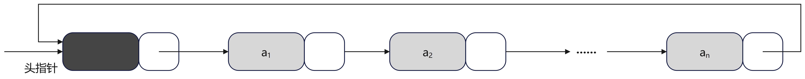
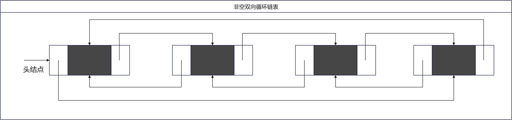

# 第3章 线性表

## 3.4 特殊的链表：单循环链表、双循环链表和跳表

`3.3`节中实现的链表是单向链表，有去无回，只能向前看，却不能向后转。假如现在我们想回到起点，有的人会想，地球都是圆的，为什么链表不能是循环的呢（循环链表，cycle chain，circular linked list）？这样一直往前，总会再回到起点。还有的会想，就像公路，有单向的，也会有双向的（双向链表，double linked list）。

### 3.4.1 单循环链表

#### 3.4.1.1 定义

在单链表的基础上，实现循环链表，无需增加存储量，仅仅需要对链表的链接方式稍作改变，即可实现循环链表。

如下单链表实现的循环链表示意图：



### 3.4.2 双循环链表

在双向链表中，每个结点不仅有指向前驱结点的指针，还有后继结点的指针，具体定义如下：

```java
    static class DulNode<E> {
        private E item;
        private DulNode<E> prior; // 直接前驱指针
        private DulNode<E> next; // 直接后继指针

        DulNode(E item) {
            this(item, null, null);
        }

        DulNode(E item, DulNode<E> prior, DulNode<E> next) {
            this.item = item;
            this.prior = prior;
            this.next = next;
        }

        /**
         * @return the item
         */
        public E getItem() {
            return item;
        }

        /**
         * @param item the item to set
         */
        public void setItem(E item) {
            this.item = item;
        }

        /**
         * @return the prior
         */
        public DulNode<E> getPrior() {
            return prior;
        }

        /**
         * @param prior the prior to set
         */
        public void setPrior(DulNode<E> prior) {
            this.prior = prior;
        }

        /**
         * @return the next
         */
        public DulNode<E> getNext() {
            return next;
        }

        /**
         * @param next the next to set
         */
        public void setNext(DulNode<E> next) {
            this.next = next;
        }
    }
```

带头结点的空双向循环链表如下所示，头结点的前驱和后继结点指针都指向了自己：


带头结点的非双向循环链表如下所示：

