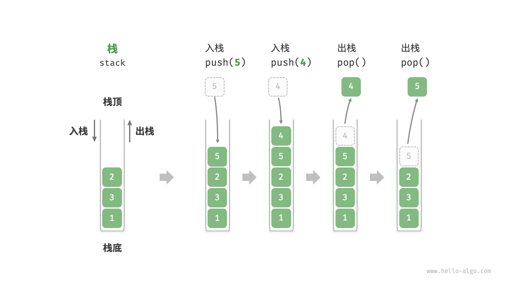

# 第4章 队列和栈

## 4.1 栈的定义

栈（`stack`）是一种遵循后进先出逻辑（`LIFO`）的线性数据结构。

我们可以将栈类比为桌面上的一摞盘子，如果想取出底部的盘子，则需要先将上面的盘子依次移走。我们将盘子替换为各种类型的元素（如整数、字符、对象等），就得到了栈这种数据结构。

如下图所示，把堆叠元素的顶部称为“栈顶”，底部称为“栈底”。将把元素添加到栈顶的操作叫作“入栈”，删除栈顶元素的操作叫作“出栈”。



### 4.1.1 栈的接口定义

```java
public interface MyStack<E> extends Iterable<E> {

    /**
     * 判断栈是否为空
     * 
     * @return 如果为空，返回<tt>true</tt>，否则返回<tt>false</tt>
     */
    boolean isEmpty();

    /**
     * 返回栈存储元素个数
     * 
     * @return 栈中元素数量
     */
    int size();

    /**
     * 元素入栈
     * 
     * @param item the item to add
     */
    void push(E element);

    /**
     * 元素出栈
     * 
     * @return 出栈的元素
     * @throws java.util.NoSuchElementException 如果栈为空
     */
    E pop();

    /**
     * 查看栈顶元素
     * 
     * @return 栈顶元素
     * @throws java.util.NoSuchElementException 如果栈为空
     */
    E peek();

    /**
     * 清除所有元素
     */
    void clear();
}
```

### 4.1.2 栈的常用操作

栈的常用操作如下表所示，常见的有`push()`、`pop()`、`peek()` 。

<table>
<thead>
<tr>
<th>方法</th>
<th>描述</th>
<th>时间复杂度</th>
</tr>
</thead>
<tbody>
<tr>
<td><code>push()</code></td>
<td>元素入栈（添加至栈顶）</td>
<td><span ><mjx-container  jax="CHTML" style="font-size: 122.9%; position: relative;"><mjx-math  aria-hidden="true"><mjx-mi class="mjx-i"><mjx-c class="mjx-c1D442 TEX-I"></mjx-c></mjx-mi><mjx-mo ><mjx-c class="mjx-c28"></mjx-c></mjx-mo><mjx-mn ><mjx-c ></mjx-c></mjx-mn><mjx-mo ><mjx-c class="mjx-c29"></mjx-c></mjx-mo></mjx-math><mjx-assistive-mml unselectable="on" display="inline"><mjx-container  jax="CHTML" style="font-size: 122.9%; position: relative;"><mjx-math  aria-hidden="true"><mjx-mi class="mjx-i"><mjx-c class="mjx-c1D442 TEX-I"></mjx-c></mjx-mi><mjx-mo ><mjx-c class="mjx-c28"></mjx-c></mjx-mo><mjx-mn ><mjx-c ></mjx-c></mjx-mn><mjx-mo ><mjx-c class="mjx-c29"></mjx-c></mjx-mo></mjx-math><mjx-assistive-mml unselectable="on" display="inline"><math xmlns="http://www.w3.org/1998/Math/MathML"><mi>O</mi><mo stretchy="false">(</mo><mn>1</mn><mo stretchy="false">)</mo></math></mjx-assistive-mml></mjx-container></mjx-assistive-mml></mjx-container></span></td>
</tr>
<tr>
<td><code>pop()</code></td>
<td>栈顶元素出栈</td>
<td><span ><mjx-container  jax="CHTML" style="font-size: 122.9%; position: relative;"><mjx-math  aria-hidden="true"><mjx-mi class="mjx-i"><mjx-c class="mjx-c1D442 TEX-I"></mjx-c></mjx-mi><mjx-mo ><mjx-c class="mjx-c28"></mjx-c></mjx-mo><mjx-mn ><mjx-c ></mjx-c></mjx-mn><mjx-mo ><mjx-c class="mjx-c29"></mjx-c></mjx-mo></mjx-math><mjx-assistive-mml unselectable="on" display="inline"><mjx-container  jax="CHTML" style="font-size: 122.9%; position: relative;"><mjx-math  aria-hidden="true"><mjx-mi class="mjx-i"><mjx-c class="mjx-c1D442 TEX-I"></mjx-c></mjx-mi><mjx-mo ><mjx-c class="mjx-c28"></mjx-c></mjx-mo><mjx-mn ><mjx-c ></mjx-c></mjx-mn><mjx-mo ><mjx-c class="mjx-c29"></mjx-c></mjx-mo></mjx-math><mjx-assistive-mml unselectable="on" display="inline"><math xmlns="http://www.w3.org/1998/Math/MathML"><mi>O</mi><mo stretchy="false">(</mo><mn>1</mn><mo stretchy="false">)</mo></math></mjx-assistive-mml></mjx-container></mjx-assistive-mml></mjx-container></span></td>
</tr>
<tr>
<td><code>peek()</code></td>
<td>访问栈顶元素</td>
<td><span ><mjx-container  jax="CHTML" style="font-size: 122.9%; position: relative;"><mjx-math  aria-hidden="true"><mjx-mi class="mjx-i"><mjx-c class="mjx-c1D442 TEX-I"></mjx-c></mjx-mi><mjx-mo ><mjx-c class="mjx-c28"></mjx-c></mjx-mo><mjx-mn ><mjx-c ></mjx-c></mjx-mn><mjx-mo ><mjx-c class="mjx-c29"></mjx-c></mjx-mo></mjx-math><mjx-assistive-mml unselectable="on" display="inline"><mjx-container  jax="CHTML" style="font-size: 122.9%; position: relative;"><mjx-math  aria-hidden="true"><mjx-mi class="mjx-i"><mjx-c class="mjx-c1D442 TEX-I"></mjx-c></mjx-mi><mjx-mo ><mjx-c class="mjx-c28"></mjx-c></mjx-mo><mjx-mn ><mjx-c ></mjx-c></mjx-mn><mjx-mo ><mjx-c class="mjx-c29"></mjx-c></mjx-mo></mjx-math><mjx-assistive-mml unselectable="on" display="inline"><math xmlns="http://www.w3.org/1998/Math/MathML"><mi>O</mi><mo stretchy="false">(</mo><mn>1</mn><mo stretchy="false">)</mo></math></mjx-assistive-mml></mjx-container></mjx-assistive-mml></mjx-container></span></td>
</tr>
</tbody>
</table>
