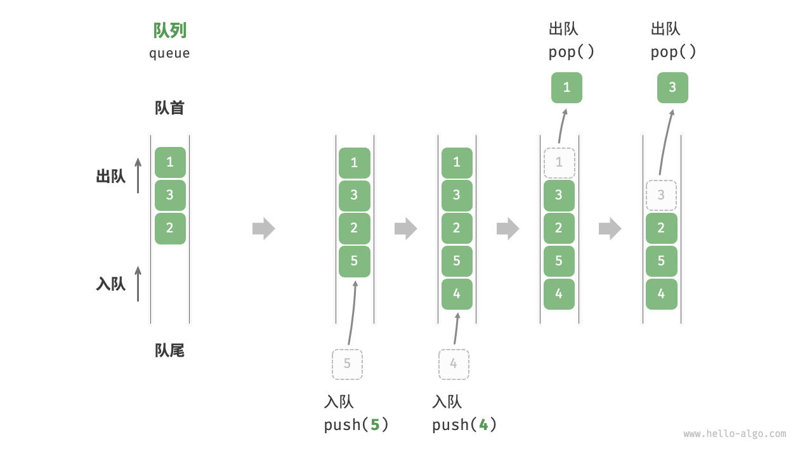

# 第4章 队列和栈

## 4.3 队列的定义

队列是一种先进先出（`First In First Out`）的线性表，简称`FIFO`。顾名思义，模仿生活中排队的场景，即新来的人不断加入到队尾，而位于队首的人逐个离开。

队列中，将队列头部称为“队首”，尾部称为“队尾”，将把元素加入队尾的操作称为“入队”，删除队首元素的操作称为“出队”，类似排队，队列中，只允许队首出队，队尾入队。



### 4.3.1 队列常见的操作

<table>
<thead>
<tr>
<th>方法名</th>
<th>描述</th>
<th>时间复杂度</th>
</tr>
</thead>
<tbody>
<tr>
<td><code>push()</code></td>
<td>元素入队，即将元素添加至队尾</td>
<td><span ><mjx-container  jax="CHTML" style="font-size: 122.9%; position: relative;"><mjx-math  aria-hidden="true"><mjx-mi ><mjx-c ></mjx-c></mjx-mi><mjx-mo ><mjx-c ></mjx-c></mjx-mo><mjx-mn ><mjx-c ></mjx-c></mjx-mn><mjx-mo ><mjx-c ></mjx-c></mjx-mo></mjx-math><mjx-assistive-mml unselectable="on" display="inline"><mjx-container  jax="CHTML" style="font-size: 122.9%; position: relative;"><mjx-math  aria-hidden="true"><mjx-mi ><mjx-c ></mjx-c></mjx-mi><mjx-mo ><mjx-c ></mjx-c></mjx-mo><mjx-mn ><mjx-c ></mjx-c></mjx-mn><mjx-mo ><mjx-c ></mjx-c></mjx-mo></mjx-math><mjx-assistive-mml unselectable="on" display="inline"><math xmlns="http://www.w3.org/1998/Math/MathML"><mi>O</mi><mo stretchy="false">(</mo><mn>1</mn><mo stretchy="false">)</mo></math></mjx-assistive-mml></mjx-container></mjx-assistive-mml></mjx-container></span></td>
</tr>
<tr>
<td><code>pop()</code></td>
<td>队首元素出队</td>
<td><span ><mjx-container  jax="CHTML" style="font-size: 122.9%; position: relative;"><mjx-math  aria-hidden="true"><mjx-mi ><mjx-c ></mjx-c></mjx-mi><mjx-mo ><mjx-c ></mjx-c></mjx-mo><mjx-mn ><mjx-c ></mjx-c></mjx-mn><mjx-mo ><mjx-c ></mjx-c></mjx-mo></mjx-math><mjx-assistive-mml unselectable="on" display="inline"><mjx-container  jax="CHTML" style="font-size: 122.9%; position: relative;"><mjx-math  aria-hidden="true"><mjx-mi ><mjx-c ></mjx-c></mjx-mi><mjx-mo ><mjx-c ></mjx-c></mjx-mo><mjx-mn ><mjx-c ></mjx-c></mjx-mn><mjx-mo ><mjx-c ></mjx-c></mjx-mo></mjx-math><mjx-assistive-mml unselectable="on" display="inline"><math xmlns="http://www.w3.org/1998/Math/MathML"><mi>O</mi><mo stretchy="false">(</mo><mn>1</mn><mo stretchy="false">)</mo></math></mjx-assistive-mml></mjx-container></mjx-assistive-mml></mjx-container></span></td>
</tr>
<tr>
<td><code>peek()</code></td>
<td>访问队首元素</td>
<td><span ><mjx-container  jax="CHTML" style="font-size: 122.9%; position: relative;"><mjx-math  aria-hidden="true"><mjx-mi ><mjx-c ></mjx-c></mjx-mi><mjx-mo ><mjx-c ></mjx-c></mjx-mo><mjx-mn ><mjx-c ></mjx-c></mjx-mn><mjx-mo ><mjx-c ></mjx-c></mjx-mo></mjx-math><mjx-assistive-mml unselectable="on" display="inline"><mjx-container  jax="CHTML" style="font-size: 122.9%; position: relative;"><mjx-math  aria-hidden="true"><mjx-mi ><mjx-c ></mjx-c></mjx-mi><mjx-mo ><mjx-c ></mjx-c></mjx-mo><mjx-mn ><mjx-c ></mjx-c></mjx-mn><mjx-mo ><mjx-c ></mjx-c></mjx-mo></mjx-math><mjx-assistive-mml unselectable="on" display="inline"><math xmlns="http://www.w3.org/1998/Math/MathML"><mi>O</mi><mo stretchy="false">(</mo><mn>1</mn><mo stretchy="false">)</mo></math></mjx-assistive-mml></mjx-container></mjx-assistive-mml></mjx-container></span></td>
</tr>
</tbody>
</table>

### 4.3.2 队列的接口定义

```java
public interface MyQueue<E> extends Iterable<E> {

    /**
     * 判断队列是否为空
     * 
     * @return 如果为空，返回<tt>true</tt>，否则返回<tt>false</tt>
     */
    boolean isEmpty();

    /**
     * 返回队列中存储元素个数
     * 
     * @return 队列中元素数量
     */
    int size();

    /**
     * 元素入队列
     * 
     * @param item the item to add
     */
    void enqueue(E element);

    /**
     * 元素出队
     * 
     * @return 出队的元素
     * @throws java.util.NoSuchElementException 如果队列为空
     */
    E dequeue();

    /**
     * 查看队首元素
     * 
     * @return 队首元素
     * @throws java.util.NoSuchElementException 如果队列为空
     */
    E peek();

    /**
     * 清除所有元素
     */
    void clear();
}
```
