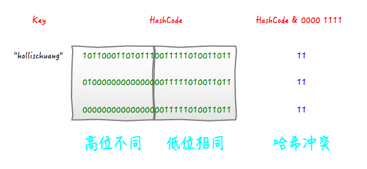

# 第5章 哈希表和集合

## 5.1 哈希表

哈希表（`hash table`），又称散列表，也称映射。它通过建立键`key`与值`value`之间的映射，将值存储在一个数组中，以实现高效的元素查询。具体而言，我们向哈希表中输入一个键`key`，则可以在 $O(1)$ 时间内获取值在数组中的索引，以得到对应的值`value`。


在哈希表中，最关键一点就是如何通过一个已知的键在 $O(1)$ 时间复杂度内找到对应的值。为实现这个目标，使用到了**散列技术**。**散列技术**既是一种存储方法，也是一种查找方法，使用散列技术需要两个步骤：

1. 将键通过哈希函数（`Java`中是`hashCode`）转换为整型数据的哈希值，再将哈希值转换为数组的索引。这种，将键转化为数组索引的函数称为**散列函数**；
2. 在实际应用中，两个不同的键通过同一个散列函数可能得出同一个数组索引，这种现象叫做发生冲突，这时就需要**冲突处理**；

在第一步中，我们设计的散列函数需要尽可能减少冲突，但是即使再优秀的散列函数也不可能避免冲突的发生，所以冲突处理也非常重要。

### 5.1.1 散列函数的构造方法

设计一个哈希表，面对的第一个问题就是散列函数的计算，这个过程会将键转化为数组的索引。如果我们有一个能够保存 $M$ 个键值对的数组，那么我们就需要一个能够将任意键转化为该数组范围内的索引（$[0,\ M-1]$范围内的整数）的散列函数。我们要找的散列函数应该易于计算并且能够均匀分布所有的键，即对于任意键，$0$ 到 $M-1$ 之间的每个整数都有相等的可能性与之对应（而与键无关）。

散列函数和键的类型有关。严格地说，对于每种类型的键都我们都需要一个与之对应的散列函数。常用的构造方法如下：

+ **直接定址法**：如果键是一个数，比如社会保险号，我们就可以直接使用这个数或者取关键字的某个线性函数值；
+ **数字分析法**：如果键含有多个部分，比如邮件地址，我们需要用某种方法将这些部分结合起来，结合的手段有很多，比如将某些数据反转、左移、右移等，总的目的就是提供一个散列函数，能够合理地将关键字分配到散列表的各位置。
+ **分段叠加法**：关键字从左到右分割成位数相等的几部分（注意最后一部分位数不够时可以短些），然后将这几部分叠加求和，并按散列表表长，取后几位作为散列地址。比如我们的关键字是 $9876543210$，散列表表长为三位，我们将它分为四组，$987|654|321|0$，然后将它们叠加求和 $987+654+321+0=1962$，再求后 $3$ 位得到散列地址为 $962$ 。
+ **平方取中法**：如果关键字各个部分分布都不均匀的话，可以先求出它的平方值，然后按照需求取中间的几位作为哈希地址。假设关键字是 $1234$，那么它的平方就是 $1522756$，再抽取中间的 $3$ 位就是 $227$，用做散列地址。再比如关键字是 $4321$，那么它的平方就是 $18671041$，抽取中间的 $3$ 位就可以是 $671$，也可以是 $710$，用做散列地址。平方取中法比较适合于不知道关键字的分布，而位数又不是很大的情况。
+ **随机数法**：选择一个随机数，取关键字的随机函数值为它的散列地址。也就是 $f(key)=random(key)$。这里 `random` 是随机函数。
+ **除留余数法**：此方法为最常用的构造散列函数方法。对于散列表长为 $m$ 的散列函数公式为：$f(key)=key\ mod\ p\ \ \ \ p\leq m$。模。很显然，本方法的关键就在于选择合适的 $p$，$p$ 如果选得不好，就可能会容易产生冲突。

看到这里，可能就会疑问了？你这里计算，键都是整数，那万一我的键是字符串、浮点数、或者自定义数据类型呢，这时该如何处理呢？

对于许多常见类型的键，我们可以利用`Java`提供的`hashCode`默认实现将键转换为一个 $32$ 位整数值。比如下面的`String`和`Double`类型：

```java
    /**
     * Returns a hash code for this string. The hash code for a
     * {@code String} object is computed as
     * <blockquote><pre>
     * s[0]*31^(n-1) + s[1]*31^(n-2) + ... + s[n-1]
     * </pre></blockquote>
     * using {@code int} arithmetic, where {@code s[i]} is the
     * <i>i</i>th character of the string, {@code n} is the length of
     * the string, and {@code ^} indicates exponentiation.
     * (The hash value of the empty string is zero.)
     *
     * @return  a hash code value for this object.
     */
    public int hashCode() {
        int h = hash;
        if (h == 0 && value.length > 0) {
            char val[] = value;

            for (int i = 0; i < value.length; i++) {
                h = 31 * h + val[i];
            }
            hash = h;
        }
        return h;
    }


    /**
     * Returns a hash code for a {@code double} value; compatible with
     * {@code Double.hashCode()}.
     *
     * @param value the value to hash
     * @return a hash code value for a {@code double} value.
     * @since 1.8
     */
    public static int hashCode(double value) {
        long bits = doubleToLongBits(value);
        return (int)(bits ^ (bits >>> 32));
    }
```

但是我们需要的是数组的索引而不是一个 $32$ 位的整数，我们在实现中会将默认的`hashCode()`方法和除留余数法结合起来产生一个 $0$ 到 $M-1$ 的整数，方法如下：

```java
private int hash(Key x) {
    return (x.hashCode() & 0x7fffffff) % M;
}
```

这段代码会将符号位屏蔽（将一个 $32$ 位整数变为一个 $31$ 位非负整数），然后用除留余数法计算它除以 $M$ 的余数。在使用这样的代码时我们一般会将数组的大小 $M$ 取为素数以充分利用原散列值的所有位。

在设计散列函数时，如果使用除留余数法，我们需要注意一个问题，那就是 $16$ 位高位不同，但是 $16$ 位低位相同是很容易得到同一个索引值的，即高位和低位对结果的影响权重不是一样，违反索引相等可能性，怎么理解呢，比如现在哈希表长度位 $16$，那么，如下：



可以看到，后面的两个 `hashcode` 经过位运算之后得到的值也是 $11$。对于此问题，需要为`hashCode`加上扰动，比如，`Java 8`中`HashMap`中`hash`方法：

```java
    /**
     * Computes key.hashCode() and spreads (XORs) higher bits of hash
     * to lower.  Because the table uses power-of-two masking, sets of
     * hashes that vary only in bits above the current mask will
     * always collide. (Among known examples are sets of Float keys
     * holding consecutive whole numbers in small tables.)  So we
     * apply a transform that spreads the impact of higher bits
     * downward. There is a tradeoff between speed, utility, and
     * quality of bit-spreading. Because many common sets of hashes
     * are already reasonably distributed (so don't benefit from
     * spreading), and because we use trees to handle large sets of
     * collisions in bins, we just XOR some shifted bits in the
     * cheapest possible way to reduce systematic lossage, as well as
     * to incorporate impact of the highest bits that would otherwise
     * never be used in index calculations because of table bounds.
     */
    static final int hash(Object key) {
        int h;
        return (key == null) ? 0 : (h = key.hashCode()) ^ (h >>> 16);
    }
```

在`JDK1.8`的实现中，优化了高位运算的算法，通过`hashCode()`的高 $16$ 位异或低 $16$ 位实现的：`(h = k.hashCode()) ^ (h >>> 16)`，主要是从速度、功效、质量来考虑的。

如果希望更进一步了解`JDK`中在哈希表中哈希值的计算，可以参考文章：[HashMap中hash方法的原理-阿里云开发者社区 (aliyun.com)](https://developer.aliyun.com/article/772971)

### 5.1.2 哈希冲突

衡量一个哈希函数的好坏的重要指标就是发生碰撞的概率以及发生碰撞的解决方案。任何哈希函数基本都无法彻底避免碰撞，常见的解决碰撞的方法有两种：链式地址和开放寻址。

#### 5.1.2.1 链式地址

在原始哈希表中，每个桶仅能存储一个键值对。链式地址（`separate chaining`）将单个元素转换为链表，将键值对作为链表节点，将所有发生冲突的键值对都存储在同一链表中。下图展示了一个链式地址哈希表的例子。


基于链式地址实现的哈希表的操作方法发生了以下变化。

+ **查询元素**：输入`key` ，经过哈希函数得到桶索引，即可访问链表头节点，然后遍历链表并对比`key`以查找目标键值对。
+ **添加元素**：首先通过哈希函数访问链表头节点，然后将节点（键值对）添加到链表中。
+ **删除元素**：根据哈希函数的结果访问链表头部，接着遍历链表以查找目标节点并将其删除。

链式地址存在以下局限性。

+ 占用空间增大：链表包含节点指针，它相比数组更加耗费内存空间。
+ 查询效率降低：因为需要线性遍历链表来查找对应元素。

#### 5.1.2.2 开放寻址

开放寻址（`open addressing`）不引入额外的数据结构，而是通过“多次探测”来处理哈希冲突，探测方式主要包括线性探测、平方探测和多次哈希等。

线性探测采用固定步长的线性搜索来进行探测，平方探测与线性探测类似，都是开放寻址的常见策略之一，当发生冲突时，平方探测不是简单地跳过一个固定的步数，而是跳过“探测次数的平方”的步数，即 $1,4,9$ 步。多次哈希方法使用多个哈希函数
$f_1(x)$、$f_2(x)$、$f_3(x)$、$f_4(x)$ 进行探测。

#### 5.1.2.3 公共溢出区法

将哈希表分为基本表和溢出表两部分，发生冲突的元素都放入溢出表中。

### 5.1.3 哈希表定义

```java
public interface MyMap<K, V> {
    // MARK:Query Operations

    /**
     * 返回哈希表中键值对的数量，如果哈希表元素的数量超过<tt>Integer.MAX_VALUE</tt>，返回<tt>Integer.MAX_VALUE</tt>.
     *
     * @return 哈希表中键值对数量
     */
    int size();

    /**
     * 如果哈希表为空，返回<tt>true</tt>，否则返回<tt>false</tt>.
     *
     * @return 哈希表为空，返回<tt>true</tt>
     */
    boolean isEmpty();

    /**
     * 如果哈希表包含指定键的映射则返回<tt>true</tt>
     *
     * @param key 待测试是否在哈希表中的键名
     * @return 如果哈希表包含指定键的映射，返回<tt>true</tt>
     * @throws ClassCastException   如果键的类型和哈希表键的类型参数不匹配
     * @throws NullPointerException 如果指定键位为 {@code null}，并且哈希表不允许 {@code null} 值
     */
    boolean containsKey(Object key);

    /**
     * 哈希表中如果一个或多个映射包含目标值，则返回<tt>true</tt>.
     *
     * @param value 哈希表中判断是否存在的值
     * @return 如果哈希表中有一个或多个键对应的值是给定的值，返回<tt>true</tt>
     * @throws ClassCastException   如果给定值的类型和哈希表中值的类型参数不匹配
     * @throws NullPointerException 如果给定的值为 {@code null}，且哈希表中不允许 {@code null} 值
     */
    boolean containsValue(Object value);

    /**
     * 如果键存在，返回哈希表中键对应的值，否则返回 null
     *
     * @param key 待返回值对应的键
     * @return 如果键存在，返回哈希表中键对应的值，否则返回 {@code null}
     * @throws ClassCastException   如果键的类型和哈希表键的类型参数不匹配
     * @throws NullPointerException 如果指定键位为 {@code null}，并且哈希表不允许 {@code null} 值
     */
    V get(Object key);

    /**
     * 如果哈希表有指定键，那么返回键对应的值，否则返回默认值{@code defaultValue}
     *
     * @param key          查询的键
     * @param defaultValue 如果键不存在，返回的默认值
     * @return 指定键对应的值，否则返回给定的默认值{@code defaultValue}
     * @throws ClassCastException   如果键的类型与哈希表键类型参数不匹配
     * @throws NullPointerException 如果指定键位为 {@code null}，并且哈希表不允许 {@code null} 值
     */
    default V getOrDefault(Object key, V defaultValue) {
        V v;
        return (((v = get(key)) != null) || containsKey(key)) ? v : defaultValue;
    }

    // MARK:Modification Operations

    /**
     * 将键值对存入哈希表中，如果表中已包含键，那么新值将会替换旧值
     *
     * @param key   待存入哈希表中的键
     * @param value 带存入哈希表中的值
     * @return 如果哈希表已有对应的键，那么返回旧值，否则返回 <tt>null</tt>
     * @throws UnsupportedOperationException 如果哈希表不支持<tt>put</tt>操作
     * @throws ClassCastException            如果键或者值的类型与哈希表键或者值类型参数不匹配
     * @throws NullPointerException          如果指定键位为 {@code null}，并且哈希表不允许
     *                                       {@code null} 值
     * @throws IllegalArgumentException      如果因为键或者值的原因导致操作失败
     */
    V put(K key, V value);

    /**
     * 根据键移除键值对，返回移除的值，如果不包含键，那么返回 <tt>null</tt>
     *
     * @param key 待从哈希表中删除键值对的键
     * @return 如果哈希表中包含指定键值对，返回值，否则返回 <tt>null</tt>
     * @throws UnsupportedOperationException 如果哈希表不支持<tt>remove</tt>操作
     * @throws ClassCastException            如果键的类型与哈希表键或者值类型参数不匹配
     * @throws NullPointerException          如果指定键位为 {@code null}，并且哈希表不允许
     *                                       {@code null} 值
     */
    V remove(Object key);

    // MARK:Bulk Operations

    /**
     * 批量将键值对存入哈希表中
     *
     * @param m 待存储的哈希表
     * @throws UnsupportedOperationException 如果哈希表不支持 putAll</tt> 操作
     * @throws ClassCastException            如果键的类型与哈希表键或者值类型参数不匹配
     * @throws NullPointerException          如果指定键位为 {@code null}，并且哈希表不允许
     *                                       {@code null} 值
     * @throws IllegalArgumentException      如果因为待存储的哈希表键或者值的原因导致操作失败
     */
    void putAll(MyMap<? extends K, ? extends V> m);

    /**
     * 移除哈希表中所有的键值对，执行完操作后，哈希表处于空的状态
     *
     * @throws UnsupportedOperationException 如果哈希表不支持 <tt>clear</tt>
     */
    void clear();

    // MARK:Views

    /**
     * 返回哈希表中所有键的视图，注意哈希表构成键的视图，所以任何在视图上的修改都应该在该视图表现
     *
     * @return 返回哈希表键的集合视图
     */
    MySet<K> keySet();

    /**
     * 返回哈希表所有键的列表视图
     *
     * @return 哈希表中值列表视图
     */
    MyList<V> values();

    /**
     * 返回哈希表中键值对的视图
     *
     * @return a set view of the mappings contained in this map
     */
    MySet<MyMap.Entry<K, V>> entrySet();

    /**
     * 哈希表的条目（键值对）类
     */
    interface Entry<K, V> {
        /**
         * 返回键值对对应的键
         *
         * @return 键值对对应的键
         * @throws IllegalStateException 如果键值对被哈希表删除了
         */
        K getKey();

        /**
         * 返回键值对中对应的值
         *
         * @return 键值对对应的值
         * @throws IllegalStateException 如果键值对被哈希表删除了
         */
        V getValue();

        /**
         * 哈希表 {@code equals} 方法
         *
         * @param o 待比较的另一个键值对对象
         * @return 如果两个键值对相等返回 <tt>true</tt>
         */
        boolean equals(Object o);

        /**
         * 键值对 {@code hashCOde} 方法
         *
         * @return 键值对的哈希值
         */
        int hashCode();
    }

    // MARK:Comparison and hashing

    /**
     * 哈希表 {@code equals} 方法
     *
     * @param o 待比较的另一个 map 对象
     * @return 如果两个哈希表相等返回 <tt>true</tt>
     */
    boolean equals(Object o);

    /**
     * 哈希表 {@code hashCOde} 方法
     *
     * @return 哈希表的哈希值
     */
    int hashCode();
}

```
