# 第6章 树

## 6.3 红黑树的定义和实现

`AVL`可以保证插入、删除和查找时间复杂度在 $O(\log_n)$ ，但是随着元素的不断插入和删除，会影响二叉搜索树的平衡，此时需要旋转操作吗，而旋转带来的花销会使性能下降。这里我们对完美的平衡稍稍放松要求，以达到所有操作可以在对数时间内完成的数据结构。

### 6.3.1 2-3 查找树

为了保证查找树的平衡性，我们需要一些灵活性，因此在这里我们允许树中的一个结点保存多个键。什么意思呢，我们将一棵标准的二叉查找树中的结点称为**2-结点**（含有一个键和左右两条链接），而现在我们引入**3-结点**，它含有两个键和左中右三条链接。**2-结点**和**3-结点**中的每条链接都对应着其中保存的键所分割产生的一个区间。

#### 6.3.1.1 2-3 查找树的定义

一棵`2-3`查找树或为一棵空树，或由以下结点组成：
data structure

+ **2-结点**，含有一个键（及其对应的值）和两条链接，左链接指向的2-3树中的键都小于该结点，右链接指向的2-3树中的键都大于该结点。
+ **3-结点**，含有两个键（及其对应的值）和三条链接，左链接指向的2-3树中的键都小于该结点，中链接指向的2-3树中的键都位于该结点的两个键之间，右链接指向的2-3树中的键都大于该结点。

2-3查找树示例图如下所示：


一棵完美平衡的2-3查找树中的所有空链接到根结点的距离都应该是相同的。在这里，我们都使用的是完美平衡的2-3查找树，所以，下面的介绍中，2-3查找树都指的是完美二叉查找树。

#### 6.3.1.2 2-3 查找树的查找

二叉查找树的查找算法很容易推广到2-3树的查找算法：

1. 要判断一个键是否在树中，我们先将它和根结点中的键比较。如果它和其中任意一个相等，查找命中。
2. 如果它和其中任意一个不相等，那么，我们就根据比较的结果找到指向相应区间的链接，并在其指向的子树中递归地继续查找。
3. 如果这是个空链接，查找未命中。

具体的过程如下所示：

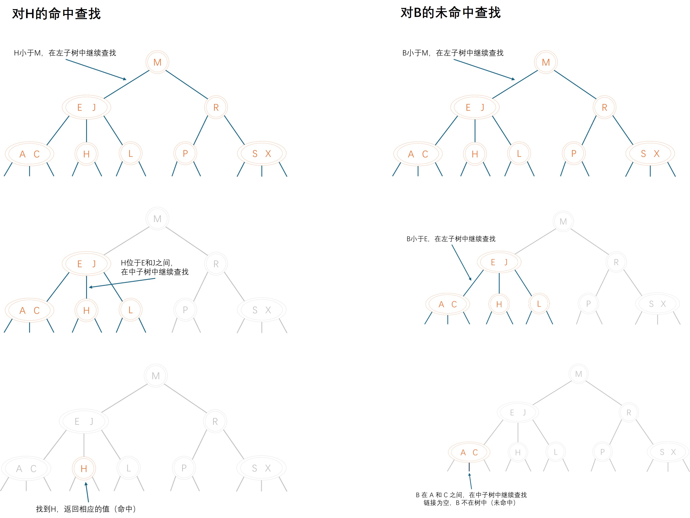

#### 6.3.1.3 2-3 树插入

##### 6.3.1.3.1 向 2-结点插入新键

要在 2-3 树中插入一个新结点，我们可以和二叉查找树一样先进行一次未命中的查找，然后把新结点挂在树的底部。但这样的话树无法保持完美平衡性。我们使用2-3树的主要原因就在于它能够在插入后继续保持平衡。如果未命中的查找结束于一个2-结点，事情就好办了：我们只要把这个2-结点替换为一个3-结点，将要插入的键保存在其中即可，如下图所示。

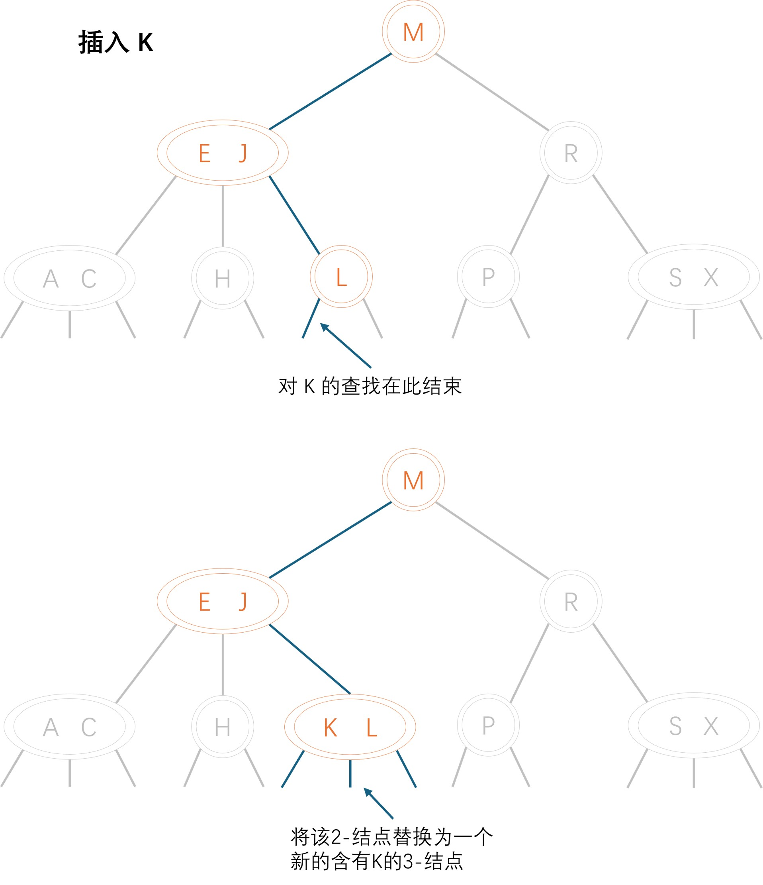

##### 6.3.1.3.1 向只含有一个3-结点插入新键

假设我们需要向一棵只含有一个3-结点的树中插入一个新键，这棵树有两个键，所以它唯一的一个结点已经不能再容纳新的结点了。为了将新键插入，我们临时将新插入的键暂存在该结点中，这时就形成了一个4-结点。在形成一个4-结点后，我们很方便地可以将4-结点转换成两个2-结点的2-3树，其中根结点是4-结点的中键，左孩子是3个键中最小的一个，右孩子是3个键中最大的一个。形成的新树，很明显是平衡的2-3树，因为其中所有的空链接到根结点的距离都相等。插入前树的高度为 $0$，插入后树的高度为 $1$。

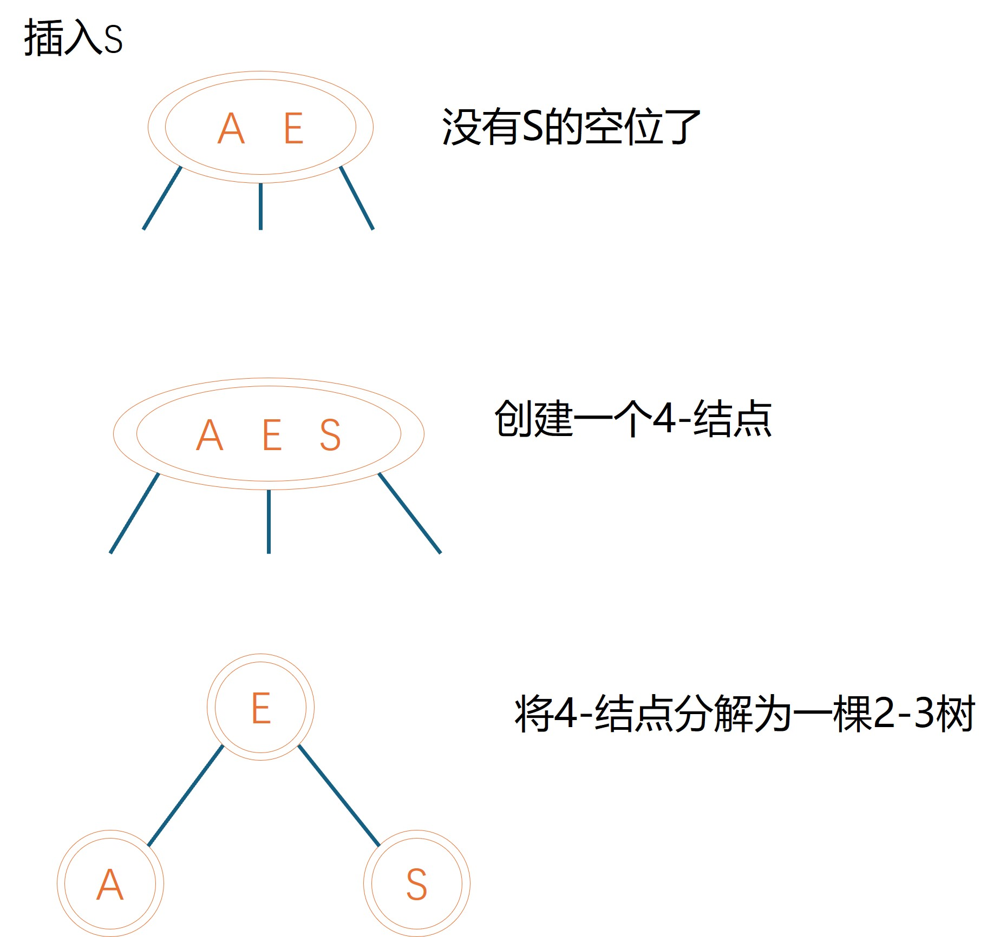

##### 6.3.1.3.2 向父结点为2-结点的3-结点插入新键

假设未命中的查找结束于一个3-结点，而它的父结点是一个2-结点。在这种情况下我们需要在维持树的完美平衡的前提下为新键腾出空间。我们先像刚才一样构造一个临时的4-结点并将其分解，但此时我们不会为中键创建一个新结点，而是将其移动至原来的父结点中。你可以将这次转换看成将指向原3-结点的一条链接替换为新父结点中的原中键左右两边的两条链接，并分别指向两个新的2-结点。根据我们的假设，父结点中是有空间的：父结点是一个2-结点（一个键两条链接），插入之后变为了一个3-结点（两个键3条链接）。另外，这次转换也并不影响（完美平衡的）2-3树的主要性质。树仍然是有序的，因为中键被移动到父结点中去了；树仍然是完美平衡的，插入后所有的空链接到根结点的距离仍然相同。其过程如下图所示。

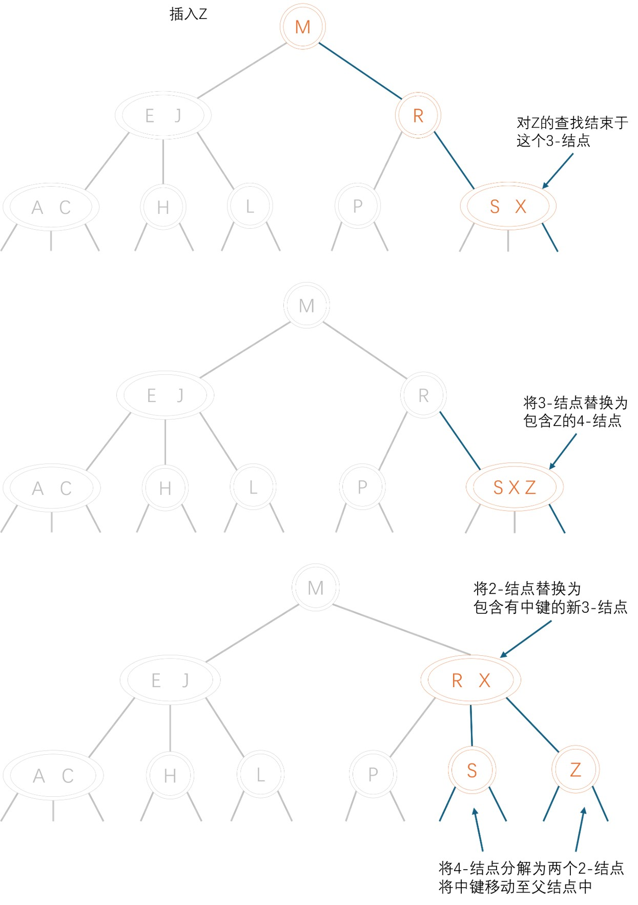

##### 6.3.1.3.3 向父结点为3-结点的3-结点中插入新键

现在假设未命中的查找结束于一个父结点为3-结点的结点。我们再次和刚才一样构造一个临时的4-结点并分解它，然后将它的中键插入它的父结点中。但父结点也是一个3-结点，因此我们再用这个中键构造一个新的临时4-结点，然后在这个结点上进行相同的变换，即分解这个父结点并将它的中键插入到它的父结点中去。推广到一般情况，我们就这样一直向上不断分解临时的4-结点并将中键插入更高层的父结点，直至遇到一个2-结点并将它替换为一个不需要继续分解的3-结点，或者是到达3-结点的根。该过程如下图所示。

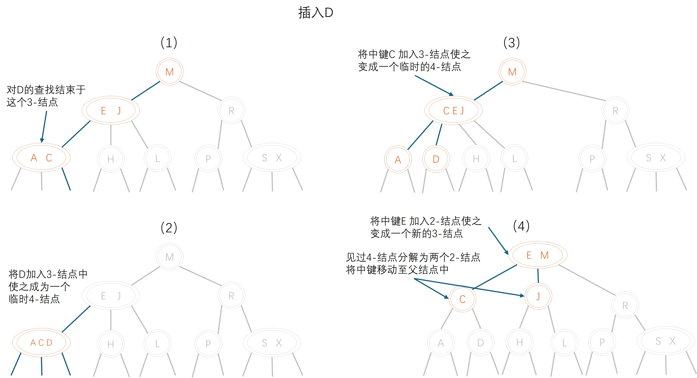

##### 6.3.1.3.4 分解根结点

如果从插入结点到根结点的路径上全都是3-结点，我们的根结点最终变成一个临时的4-结点。此时我们可以按照向一棵只有一个3-结点的树中插入新键的方法处理这个问题。我们将临时的4-结点分解为3个2-结点，使得树高加1，如下图所示。请注意，这次最后的变换仍然保持了树的完美平衡性，因为它变换的是根结点。

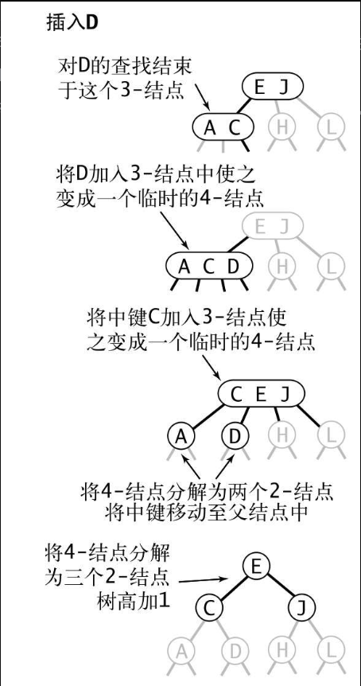

#### 6.3.1.3 2-3 树删除

待完成2-3树的删除操作

#### 6.3.1.4 2-3 树的性质

1. 2-3 树的插入和删除操作都是局部操作，这些变换不会影响树的全局有序性和平衡性：任意空链接到根结点的路径长度都是相等的。
2. 在一棵大小为 $N$ 的2-3树中，查找和插入操作访问的结点必然不超过$lgN$ 个。

#### 6.3.1.5 2-3 树的实现

待完成2-3的实现

### 6.3.2 红黑树定义

#### 6.3.2.1 替换2-3树中的3-结点

红黑二叉查找树背后的基本思想是用标准的二叉查找树（完全由2-结点构成）和一些额外的信息（替换3-结点）来表示2-3树。我们将树中的链接分为两种类型：红链接将两个2-结点连接起来构成一个3-结点，黑链接则是2-3树中的普通链接。确切地说，我们将3-结点表示为由一条左斜的红色链接（两个2-结点其中之一是另一个的左子结点）相连的两个2-结点，如下图所示。

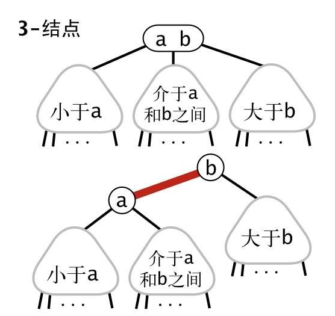

这种表示法的一个优点是，我们无需修改就可以直接使用标准二叉查找树的很多方法，比如`get()`。对于任意的2-3树，只要对结点进行转换，我们都可以立即派生出一棵对应的二叉查找树。我们将用这种方式表示2-3树的二叉查找树称为红黑二叉查找树（以下简称为红黑树）。

#### 6.3.2.2 红黑树定义

红黑树的另一种定义是含有红黑链接并满足下列条件的二叉查找树：

1. 红链接均为左链接；
2. 没有任何一个结点同时和两条红链接相连；
3. 该树是完美黑色平衡的，即任意空链接到根结点的路径上的黑链接数量相同。

满足这样定义的红黑树和相应的2-3树是一一对应的。如下图所示，如果我们将一棵红黑树中的红链接画平，那么所有的空链接到根结点的距离都将是相同的。如果我们将由红链接相连的结点合并，得到的就是一棵2-3树。相反，如果将一棵2-3树中的3-结点画作由红色左链接相连的两个2-结点，那么不会存在能够和两条红链接相连的结点，且树必然是完美黑色平衡的，因为黑链接即2-3树中的普通链接，根据定义这些链接必然是完美平衡的。无论我们选择用何种方式去定义它们，红黑树都既是二叉查找树，也是2-3树。因此，如果我们能够在保持一一对应关系的基础上实现2-3树的插入算法，那么我们就能够将两个算法的优点结合起来：二叉查找树中简洁高效的查找方法和2-3树中高效的平衡插入算法。

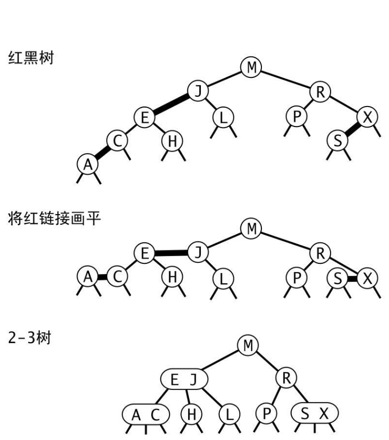

#### 6.3.2.3 红黑树结点定义

因为每个结点都只会有一条指向自己的链接（从它的父结点指向它），我们将链接的颜色保存在表示结点的`RedBlackTreeNode`数据类型的布尔变量`color`中。如果指向它的链接是红色的，那么该变量为`true`，黑色则为`false`。我们约定空链接为黑色。为了代码的清晰我们定义了两个常量`RED`和`BLACK`来设置和测试这个变量。我们使用私有方法`isRed()`来测试一个结点和它的父结点之间的链接的颜色。当我们提到一个结点的颜色时，我们指的是指向该结点的链接的颜色，反之亦然。颜色表示的代码实现如下图所示。

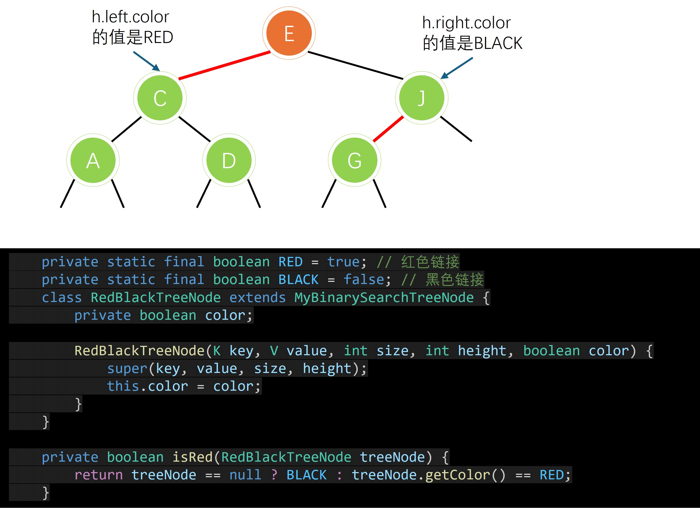

### 6.3.3 红黑树的操作

#### 6.3.3.1 旋转操作

在我们实现的某些操作中可能会出现红色右链接或者两条连续的红链接，但在操作完成前这些情况都会被小心地旋转并修复。旋转操作会改变红链接的指向。首先，假设我们有一条红色的右链接需要被转化为左链接（请见下图）。

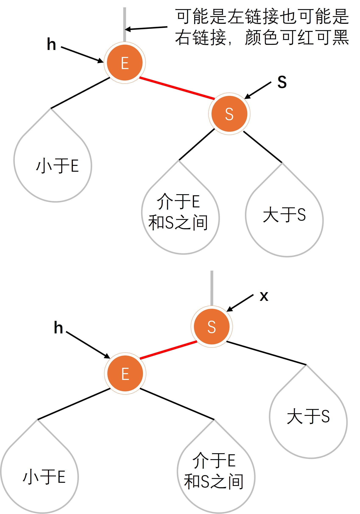

这个操作叫做左旋转，它对应的方法接受一条指向红黑树中的某个结点的链接作为参数。假设被指向的结点的右链接是红色的，这个方法会对树进行必要的调整并返回一个指向包含同一组键的子树且其左链接为红色的根结点的链接。

代码如下：

```java
    private RedBlackTreeNode rotateLeft(RedBlackTreeNode treeNode) {
        RedBlackTreeNode x = (RedBlackTreeNode) treeNode.getRightChild();
        treeNode.setRightChild(x.getLeftChild());
        x.setLeftChild(treeNode);
        // 更新颜色
        x.setColor(treeNode.getColor());
        treeNode.setColor(RED);
        // 更新size
        x.setSize(treeNode.getSize());
        updateSize(treeNode);
        // 更新高度
        x.setHeight(treeNode.getHeight());
        updateHeight(treeNode);

        return x;
    }
```

上面是左旋，对应的有右旋对称操作，对应的操作如下图所示：

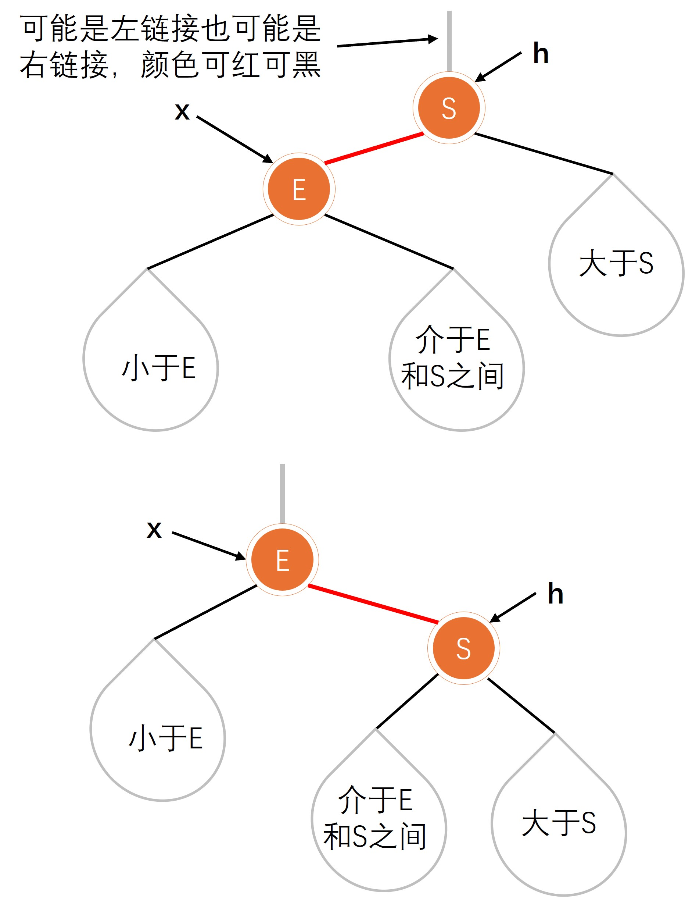

```java
    private RedBlackTreeNode rotateRight(RedBlackTreeNode treeNode) {
        RedBlackTreeNode x = (RedBlackTreeNode) treeNode.getLeftChild();
        treeNode.setLeftChild(x.getRightChild());
        x.setRightChild(treeNode);
        // 更新颜色
        x.setColor(treeNode.getColor());
        treeNode.setColor(RED);
        // 更新size
        x.setSize(treeNode.getSize());
        updateSize(treeNode);
        // 更新高度
        x.setHeight(treeNode.getHeight());
        updateHeight(treeNode);

        return x;
    }
```

#### 6.3.3.2 插入操作

为了理解红黑树整个插入的过程，我们从简单的插入开始讨论，然后慢慢变复杂，最后得出我们的代码。

##### 6.3.3.2.1 向单个2-结点插入新键

一棵只含有一个键的红黑树只含有一个2-结点。插入另一个键之后，如果新键小于老键，我们只需要新增一个红色的结点即可，新的红黑树和单个3-结点完全等价。如果新键大于老键，那么新增的红色结点将会产生一条红色的右链接。我们需要使用`root=rotateLeft(root)`来将其旋转为红色左链接并修正根结点的链接，插入操作才算完成。两种情况的结果均为一棵和单个3-结点等价的红黑树，其中含有两个键，一条红链接，树的黑链接高度为1，如下图所示。

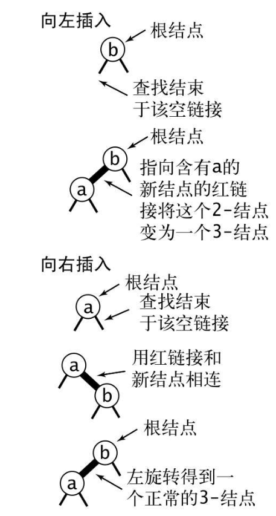

##### 6.3.3.2.2 向树底部的2-结点插入新键

我们向红黑树插入结点时，使用的方式是，在树的底部新增一个结点，但总是用红链接连接父结点。向树底部的2-结点和向单个2-结点插入新键的情况很相似。如果，指向新结点的是父结点的左链接，那么父结点直接变成了一个3-结点；如果指向父结点的右链接，那么就是一个非法的3-结点，需要一次左旋转修正它，拒听情形，如下图所示：

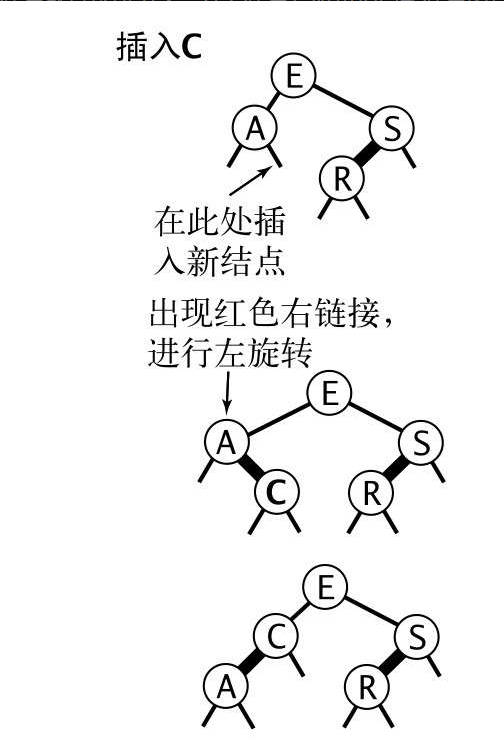

##### 6.3.3.2.3 向一棵双键树（即一个3-结点）中插入新键

向一棵双键树中插入新键，新键和3-结点中两个键大小比较，有三种情况，分别为：

1. 新键大于3-结点中的两个键，这种情况最简单，新结点被连接到3-结点的右链接。此时树是平衡的，根结点为中间大小的键，它有两条红链接分别和较小和较大的结点相连。如果我们将两条链接的颜色都由红变黑，那么我们就得到了一棵由三个结点组成、高为2的平衡树。它正好能够对应一棵2-3树，如下图（左）。其他两种情况最终也会转化为这种情况。
2. 如果新键小于原树中的两个键，它会被连接到最左边的空链接，这样就产生了两条连续的红链接，如下图（中）。此时我们只需要将上层的红链接右旋转即可得到第一种情况（中值键为根结点并和其他两个结点用红链接相连）。
3. 如果新键介于原树中的两个键之间，这又会产生两条连续的红链接，一条红色左链接接一条红色右链接，如下图（右）。此时我们只需要将下层的红链接左旋转即可得到第二种情况（两条连续的红色左链接），再右旋得到第一种情况。

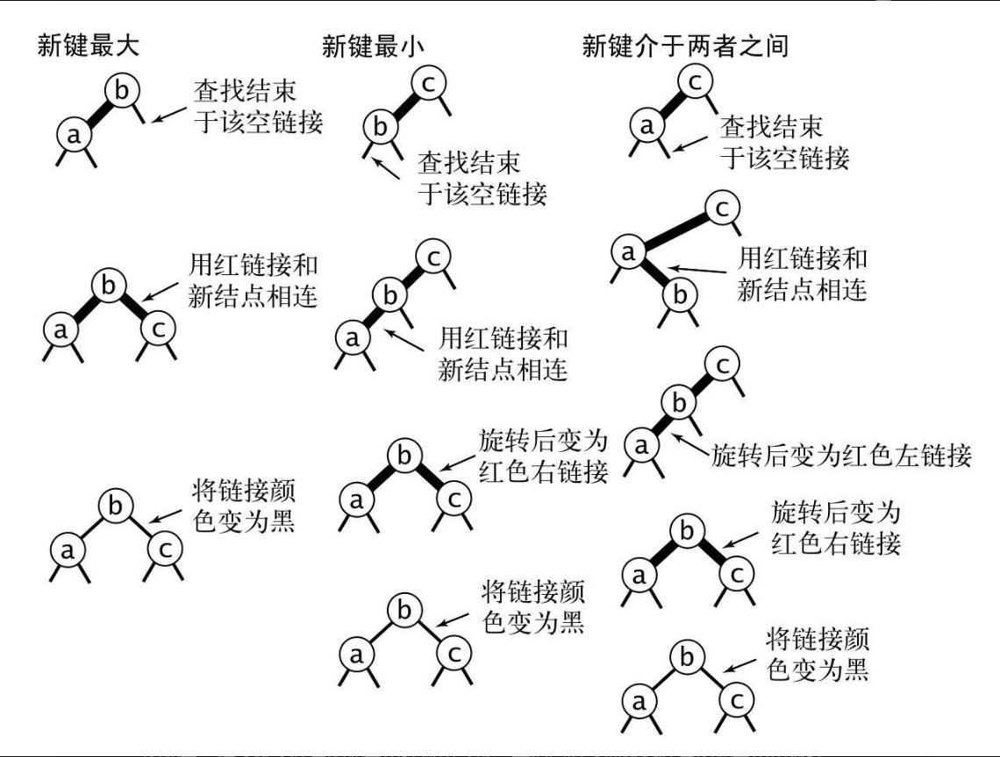

##### 6.3.3.2.4 颜色转换

向一个双键树中插入新键，三种情况，都需要经历下图所示的情况：

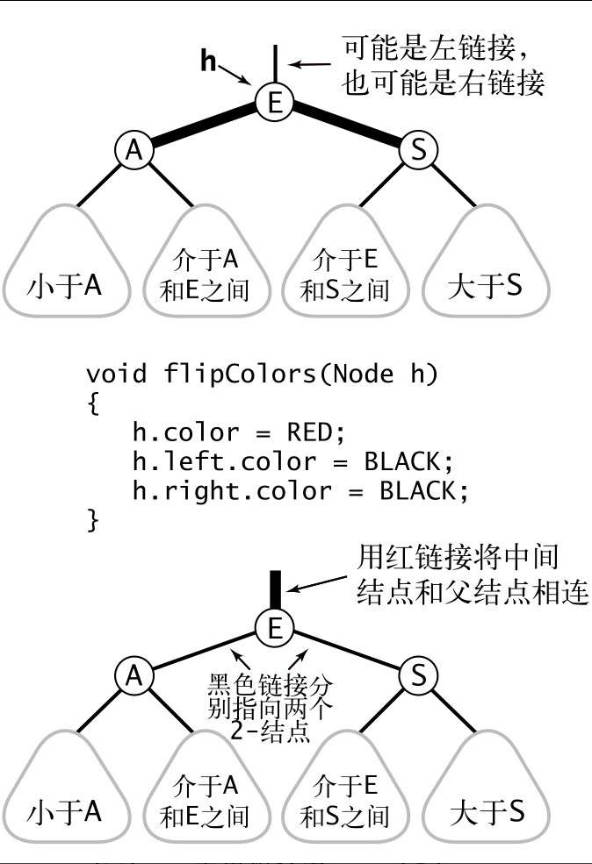

上图中，转换一个结点的两个红色子结点的颜色。除了将子结点的颜色由红变黑之外，我们同时还要将父结点的颜色由黑变红。这项操作最重要的性质在于它和旋转操作一样是局部变换，不会影响整棵树的黑色平衡性。

##### 6.3.3.2.5 根结点总是黑色

在 6.3.3.2.4 中将根结点颜色由黑转变为红色，红色的根结点是一个3-结点的一部分，但这不符合实际情况，所以，每次插入操作后，都会将根结点设置为黑色，当根结点颜色由红转黑时，说明，树的黑链接高度增加 $1$。

##### 6.3.3.2.5 向树底部的3-结点插入新键

现在我们需要讨论向树底部的3-结点插入新键，在向双键树插入结点时会遇到三种情况，这里也一样，也会遇到三种情况，以下是新键小于结点中两个键的情况：

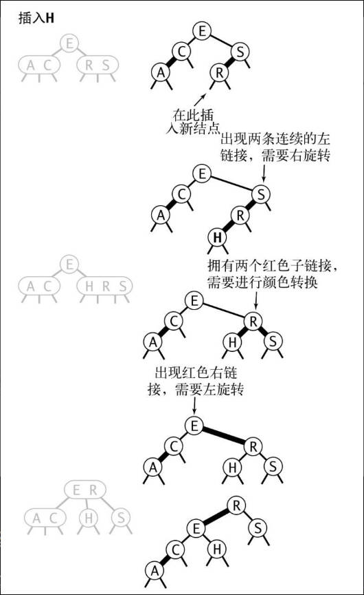

如上图所示，指向新结点的链接可能是3-结点的右链接（此时我们只需要转换颜色即可），或是左链接（此时我们需要进行右旋转然后再转换颜色），或是中链接（此时我们需要先左旋转下层链接然后右旋转上层链接，最后再转换颜色）。颜色转换会使到中结点的链接变红，相当于将它送入了父结点。这意味着在父结点中继续插入一个新键，我们也会继续用相同的办法解决这个问题。

##### 6.3.3.2.6 将红链接在树中向上传递

在 6.3.3.2.5 节中，在树底部的3-结点插入新键，需要将红链接在树中向上传递，向上传递后，可能使父结点变成一个3-结点，这时可以使用相同的方法继续向上传递，每次传递的操作都一样，现在总结如下：

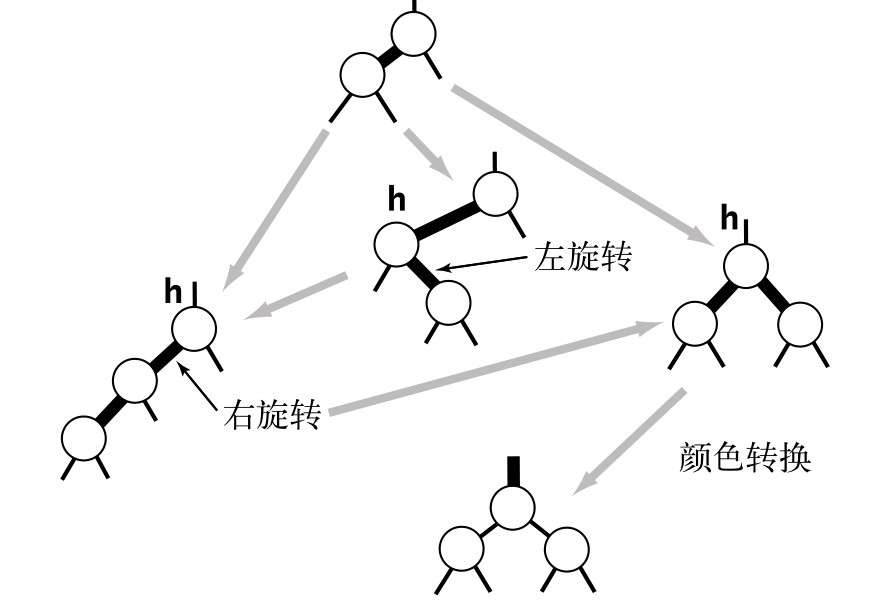

要在一个3-结点下插入新键，先创建一个临时的4-结点，将其分解并将红链接由中间键传递给它的父结点。重复这个过程，我们就能将红链接在树中向上传递，直至遇到一个2-结点或者根结点。

##### 6.3.3.2.6 红黑树插入代码实现

因为保持树的平衡性所需的操作是由下向上在每个所经过的结点中进行的，将它们植入我们已有的实现中十分简单：只需要在递归调用之后完成这些操作即可，代码如下所示：

```java
    @Override
    public void put(K key, V value) {
        super.put(key, value);
        ((RedBlackTreeNode) root).setColor(BLACK);
    }

    @Override
    TreeNode<K, V> afterNodePut(TreeNode<K, V> treeNode) {
        // 修正右倾斜链接
        RedBlackTreeNode node = (RedBlackTreeNode) treeNode;
        if (isRed((RedBlackTreeNode) node.getRightChild()) && !isRed((RedBlackTreeNode) node.getLeftChild()))
            node = rotateLeft(node);
        if (isRed((RedBlackTreeNode) node.getLeftChild())
                && isRed((RedBlackTreeNode) ((RedBlackTreeNode) node.getLeftChild()).getLeftChild()))
            node = rotateRight(node);
        if (isRed((RedBlackTreeNode) node.getLeftChild()) && isRed((RedBlackTreeNode) node.getRightChild()))
            flipColors(node);
        // 更新 size 和 height
        node = (MyRedBlackBST<K, V>.RedBlackTreeNode) super.afterNodePut(node);

        return node;
    }
```

红黑树`RedBlackBST`继承了二叉搜索树`AbstractMyBinarySearchTree`，其中递归`put`操作和二叉搜索树一样，这里直接使用`AbstractMyBinarySearchTree`的`put`方法，在`put`方法的最后，调用了`afterNodePut`方法。在`AbstractMyBinarySearchTree`中执行的是更新`treeNode`的`size`和`height`，这里增加了红黑树的修正操作，使其总是满足红黑树的定义。

#### 6.3.3.3 删除操作

