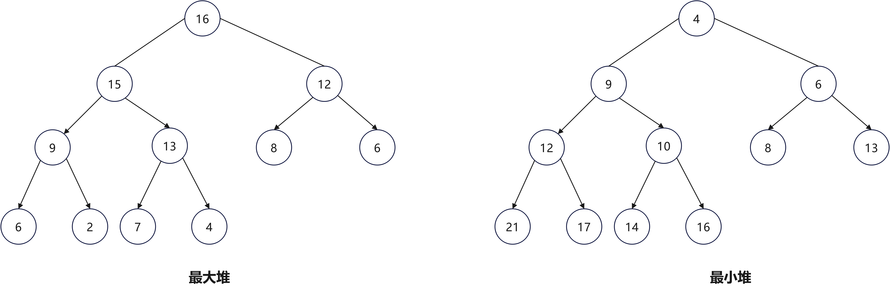
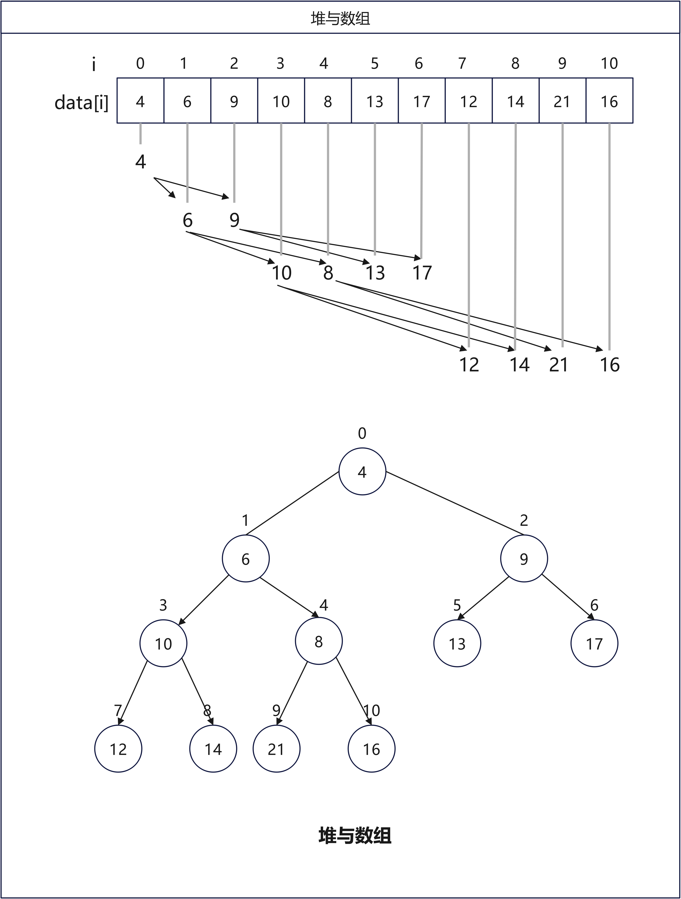
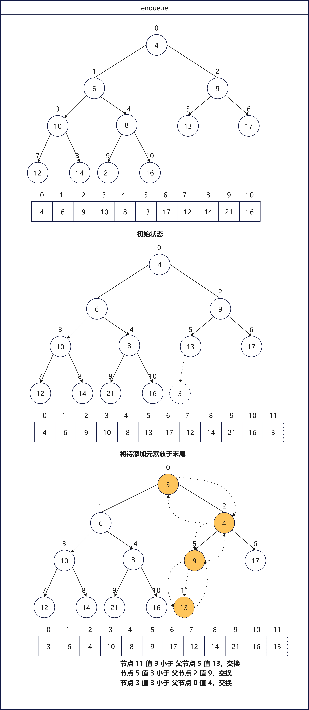
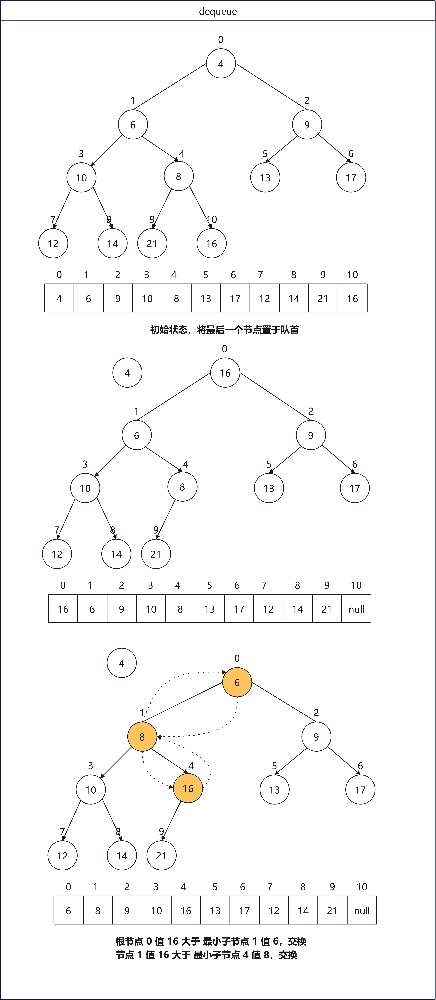

# 第6章 树

## 6.6 堆的定义和实现

### 6.6.2 堆的定义

堆（`heap`）是一种满足特定条件的**完全二叉树**，主要可分为两种类型，如下图所示：

+ 小顶堆（`min heap`）：任意节点的值 $\leq$ 其子节点的值。
+ 大顶堆（`max heap`）：任意节点的值 $\geq$ 其子节点的值。

堆作为完全二叉树的一个特例，具有以下特性：

+ 最底层节点靠左填充，其他层的节点都被填满。
+ 将二叉树的根节点称为“堆顶”，将底层最靠右的节点称为“堆底”。
+ 对于大顶堆（小顶堆），堆顶元素（根节点）的值是最大（最小）的。

### 6.6.2 堆的实现

#### 6.6.2.1 堆的存储结构

二叉树是一种逻辑结构，实际的存储结构可是是链表，也可以是数组。怎么使用数组表示一棵完全二叉树呢？

因为堆是一种完全二叉树，那么如下图所示，假设当前结点的索引为 $i$ ，那么其父结点索引为： $\frac{i-1}{2}$ ，左结点索引： $2*i+1$，右节点索引： $2*i+2$。当索引越界时，表示空结点或结点不存在。

#### 6.2.2.2 堆化（heapify）

堆化的意思是调整一个数组，使其具有堆的性质。具体的思想为，从 **最后一个非叶子节点（最后一个结点的父结点）** 开始，一直往前直到根，对每个节点，执行向下调整（`siftDown`），向下调整步骤为：

1. 将节点与两个孩子节点中较小的比较，如果不大于该孩子节点，则满足堆的性质，结束；
2. 否则与较小的孩子节点进行交换，交换后，再与较小的孩子节点比较和交换，一直到没有孩子节点，或者不大于两个孩子节点。

换句话说，是自底向上，先使每个最小子树为堆，然后每对左右子树和其父节点合并，调整为更大的堆，因为每个子树已经为堆，所以调整就是对父节点执行向下调整（`siftdown`），这样一直合并调整直到根。

#### 6.2.2.3 入队（enqueue）

元素入队的思想是先把元素放在最后一个位置，往上寻找插入的位置，但是怎么寻找到目标位置呢？

1. 新元素（`element`）不断与父节点（`parent`）比较，如果新元素（`element`）大于等于父节点（`parent`），则已满足堆的性质，退出循环，`k`就是新元素最终的位置；
2. 否则，将父节点往下移（`queue [k]=parent`），索引`k=parent`，继续向上寻找。

元素入队案例如下：

#### 6.2.2.4 出队（dequeue）

出队的含义就是删除数组的第一个元素`firstE`，即`data[0]`，整个过程可以看作是把最后一个元素（`lastE`）提到队首，再使用`siftDown`变换，把`lastE`元素往下变换，直到遇到其子结点都大于`lastE`，即可完成变换。

案例如下：

#### 6.2.2.5 删除（remove(Object)）

根据值删除优先队列中的值，其思路需要结合出队和入队的操作。

我们先根据值查找元素的位置`index`，然后调用根据索引值进行删除，步骤如下：

1. 如果是删除最后一个位置，直接删即可；
2. 否则移动最后一个元素到位置`i`并进行堆调整，调整有两种情况，如果大于孩子节点，则向下调整，如果小于父节点则向上调整。
3. 先向下调整（`siftDown(i, moved)`），如果没有调整过（`queue[i] ==moved`），可能需向上调整，调用`siftUp(i, moved)`；
