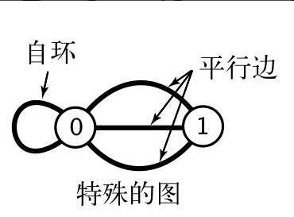
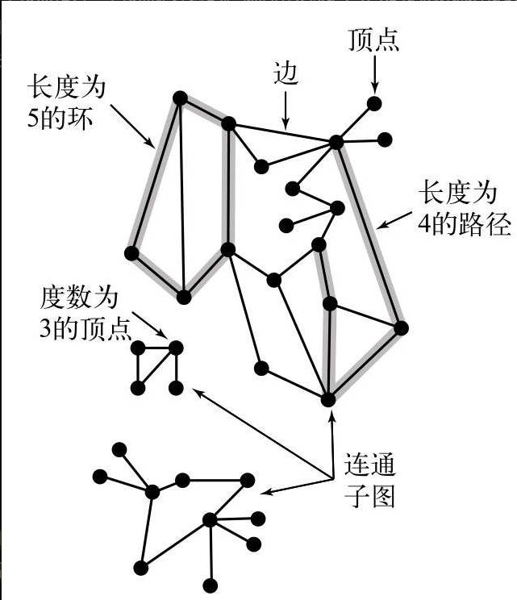
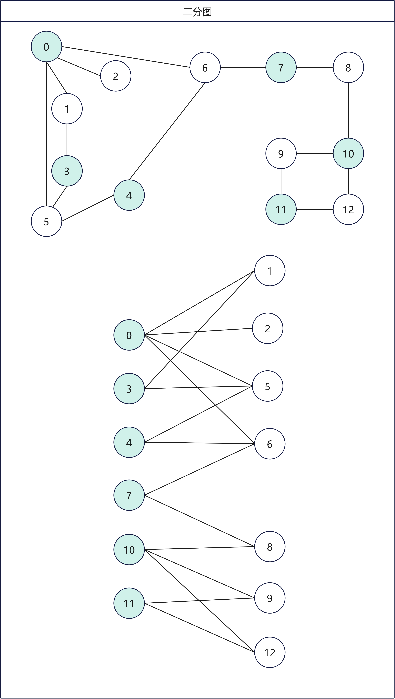
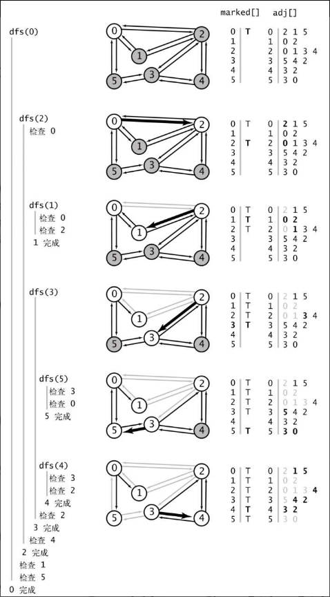
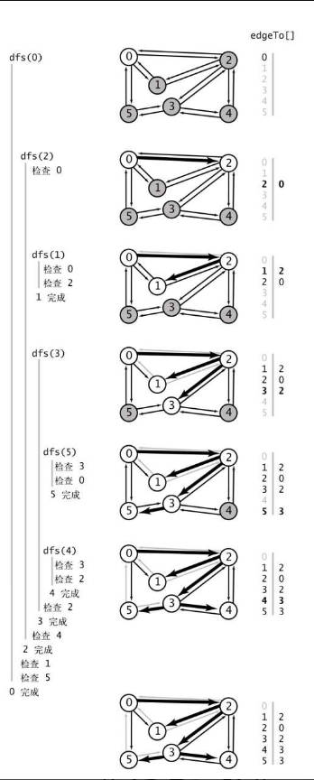
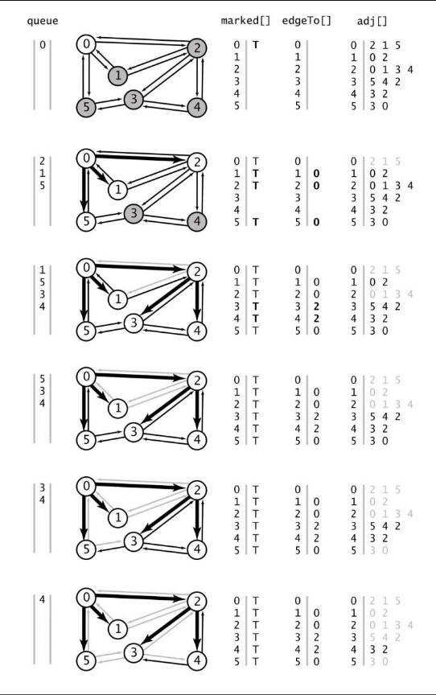

# 第7章 图

## 7.1 无向图的定义及实现

在图中，有两个重要的概念：边（edge）和顶点（vertex），图就是由这两个元素组合而成。其中，根据边是否有向以及权重是否不同，可以将图分为：无向图（简单连接）、有向图（连接有方向性）、加权图（连接带有权值）和加权有向图（连接既有方向性又带有权值）。

边仅仅是两个顶点之间的连接（简单连接），这样的图边既没有方向也没有权重，我们称它为无向图。

有两类特殊的图：自环（即一条连接一个顶点和其自身的边）和多重图（含有平行边，连接同一对顶点的两条边），如下所示：



### 7.1.1 有关图的术语

当两个顶点通过一条边相连时，我们称这两个顶点是**相邻**的，并称这条边依附于这两个顶点。某个顶点的**度数**即为依附于它的边的总数。**子图**是由一幅图的所有边的一个子集（以及它们所依附的所有顶点）组成的图。

在图中，**路径**是由边顺序连接的一系列顶点。**简单路径**是一条没有重复顶点的路径。**环**是一条至少含有一条边且起点和终点相同的路径。**简单环**是一条（除了起点和终点必须相同之外）不含有重复顶点和边的环。**路径或者环的长度**为其中所包含的边数。

当两个顶点之间存在一条连接双方的路径时，我们称一个顶点和另一个顶点是**连通**的。我们用类似`u-v-w-x`的记法来表示`u`到`x`的一条路径，用`u-v-w-x-u`表示从`u`到`v`到`w`到`x`再回到`u`的一条环。



如果从任意一个顶点都存在一条路径到达另一个任意顶点，我们称这幅图是**连通图**。一幅非连通的图由若干连通的部分组成，它们都是其极大连通子图。直观上来说，如果顶点是物理存在的对象，例如绳节或是念珠，而边也是物理存在的对象，例如绳子或是电线，那么将任意顶点提起，连通图都将是一个整体，而非连通图则会变成两个或多个部分。一般来说，要处理一张图就需要一个个地处理它的连通分量（子图）。

**无环图**是一种不包含环的图。树是一种连通无环图。

**二分图**是一种能够将所有结点分为两部分的图，其中图的每条边所连接的两个顶点都分别属于不同的部分。简单来说，就是顶点分为两部分，这两部分中，单个部分内，没有连接的边，边只能连接两个部分中的顶点。



### 7.1.2 表示无向图数据模型

#### 7.1.2.1 图的表示方法

对于图的表示方法，至少需要满足以下需求：

+ 它必须为可能在应用中碰到的各种类型的图预留出足够的空间；
+ `Graph`的实例方法的实现一定要快——它们是开发处理图的各种用例的基础。

我们可以从三种图的表示方法中进行选择：

+ 邻接矩阵。我们可以使用一个`V`乘`V`的布尔矩阵。当顶点`v`和顶点`w`之间有相连接的边时，定义`v`行`w`列的元素值为`true`，否则为`false`。这种表示方法不符合第一个条件——含有上百万个顶点的图是很常见的， $V^2$ 个布尔值所需的空间是不能满足的。
+ 边的数组。我们可以使用一个`Edge`类，它含有两个`int`实例变量。这种表示方法很简洁但不满足第二个条件——要实现`adj()`需要检查图中的所有边。
+ 邻接表数组。我们可以使用一个以顶点为索引的列表数组，其中的每个元素都是和该顶点相邻的顶点列表。这种数据结构能够同时满足典型应用所需的以上两个条件。

#### 7.1.2.2 邻接表数组的数据结构

邻接表的数据结构，将每个顶点的所有相邻顶点都保存在该顶点对应的元素所指向的一张链表中。我们使用这个数组就是为了快速访问给定顶点的邻接顶点列表。使用邻接表实现的`Graph`的实现的性能有如下特点：

+ 使用的空间和`V+E`成正比；
+ 添加一条边所需的时间为常数；
+ 遍历顶点`v`的所有相邻顶点所需的时间和`v`的度数成正比（处理每个相邻顶点所需的时间为常数）

对于这些操作，这样的特性已经是最优的了，这已经可以满足图处理应用的需要，而且支持平行边和自环。


由上图中，可以知道，同一条边会在两个结点的链表数组中都出现，比如：边`0-1`，`1`需要出现在`0`链表数组中，`0`也需要出现在`1`的链表数组中。

无向图定义的代码如下：

```java
public class MyUndirectedGraph {

    private final int V; // 顶点数目
    private int E; // 边数目
    private MyList<Integer>[] adj; // 邻接表

    /**
     * 初始化一个顶点个数为 {@code V} 边个数为 0 的空图
     *
     * @param V 顶点的个数
     * @throws IllegalArgumentException 如果顶点个数 {@code V < 0}
     */
    @SuppressWarnings("unchecked")
    public MyUndirectedGraph(int V) {
        if (V < 0)
            throw new IllegalArgumentException("Number of vertices must be non-negative");
        this.V = V;
        this.E = 0;
        adj = (MyList<Integer>[]) new MyList[V];
        for (int v = 0; v < V; v++) {
            adj[v] = new MyArrayList<Integer>();
        }
    }

    /**
     * 从指定的输入流中读取一个图
     * 首行是顶点的个数
     * 第二行是边的数量
     * 接下来的每行表示一条具体的边，由两个结点表示，节点之间以空格相隔
     *
     * @param in 输入流
     * @throws IllegalArgumentException 如果输入流 {@code in} 为 {@code null}
     * @throws IllegalArgumentException 如果边中结点编号超出范围
     * @throws IllegalArgumentException 如果边的数量或者结点的数量为负数
     * @throws IllegalArgumentException 如果输入流数据不符合数据格式规范
     */
    @SuppressWarnings("unchecked")
    public MyUndirectedGraph(Scanner in) {
        if (in == null)
            throw new IllegalArgumentException("argument is null");
        try {
            this.V = in.nextInt();
            if (V < 0)
                throw new IllegalArgumentException("number of vertices in a Graph must be non-negative");
            adj = (MyList<Integer>[]) new MyList[V];
            for (int v = 0; v < V; v++) {
                adj[v] = new MyArrayList<Integer>();
            }
            int E = in.nextInt();
            if (E < 0)
                throw new IllegalArgumentException("number of edges in a Graph must be non-negative");
            for (int i = 0; i < E; i++) {
                int v = in.nextInt();
                int w = in.nextInt();
                validateVertex(v);
                validateVertex(w);
                addEdge(v, w);
            }
        } catch (NoSuchElementException e) {
            throw new IllegalArgumentException("invalid input format in Graph constructor", e);
        }
    }

    /**
     * 深度拷贝图
     *
     * @param G 待拷贝的图
     * @throws IllegalArgumentException 如果 {@code G} 是 {@code null}
     */
    @SuppressWarnings("unchecked")
    public MyUndirectedGraph(MyUndirectedGraph G) {
        this.V = G.V();
        this.E = G.E();
        if (V < 0)
            throw new IllegalArgumentException("Number of vertices must be non-negative");

        // update adjacency lists
        adj = (MyList<Integer>[]) new MyList[V];
        for (int v = 0; v < V; v++) {
            adj[v] = new MyArrayList<Integer>();
        }

        for (int v = 0; v < G.V(); v++) {
            // reverse so that adjacency list is in same order as original
            MyStack<Integer> reverse = new MyResizingArrayStack<Integer>();
            for (int w : G.adj[v]) {
                reverse.push(w);
            }
            for (int w : reverse) {
                adj[v].add(w);
            }
        }
    }

    /**
     * 返回图顶点的数量
     *
     * @return 图顶点的数量
     */
    public int V() {
        return V;
    }

    /**
     * 返回图边的数量
     *
     * @return 图边的数量
     */
    public int E() {
        return E;
    }

    // 除非 {@code 0 <= v < V}，否则抛出 IllegalArgumentException 异常
    private void validateVertex(int v) {
        if (v < 0 || v >= V)
            throw new IllegalArgumentException("vertex " + v + " is not between 0 and " + (V - 1));
    }

    /**
     * 向图中添加无向边
     *
     * @param v 边中一个顶点
     * @param w 边中另一个顶点
     * @throws IllegalArgumentException 如果 {@code 0 <= v < V} 以及
     *                                  {@code 0 <= w < V}，否则抛出异常
     */
    public void addEdge(int v, int w) {
        validateVertex(v);
        validateVertex(w);
        E++;
        adj[v].add(w);
        adj[w].add(v);
    }

    /**
     * 返回顶点 {@code v} 所有的邻接点
     *
     * @param v 顶点
     * @return 顶点 {@code v} 的所有邻接点
     * @throws IllegalArgumentException 不满足 {@code 0 <= v < V}
     */
    public Iterable<Integer> adj(int v) {
        validateVertex(v);
        return adj[v];
    }

    /**
     * 返回顶点 {@code v} 的度
     *
     * @param v 顶点
     * @return 顶点 {@code v} 的度
     * @throws IllegalArgumentException 不满足 {@code 0 <= v < V}
     */
    public int degree(int v) {
        validateVertex(v);
        return adj[v].size();
    }

    public String toString() {
        StringBuilder s = new StringBuilder();
        s.append(V + " vertices, " + E + " edges " + File.separator);
        for (int v = 0; v < V; v++) {
            s.append(v + ": ");
            for (int w : adj[v]) {
                s.append(w + " ");
            }
            s.append(File.separator);
        }
        return s.toString();
    }
}
```

#### 7.1.2.3 图的处理算法的设计模式

我们将学习大量关于图处理的算法，所以设计的首要目标是将图的表示和实现分离开来。为此，我们会为每个任务创建一个相应的类，用例可以创建相应的对象来完成任务。类的构造函数一般会在预处理中构造各种数据结构，以有效地响应用例的请求。典型的用例程序会构造一幅图，将图传递给实现了某个算法的类（作为构造函数的参数），然后调用用例的方法来获取图的各种性质。

### 7.1.3 深度优先遍历

深度优先遍历是一种优先走到底、无路可走再回头的遍历方式。比如你在走迷宫，把迷宫当作图，迷宫中路口看作结点，通道看作边，现在要探索迷宫中所有通道，我们需要：

1. 从起点开始，选择一条没有标记过的通道，在你走过的路上铺一条绳子；
2. 标记所有你第一次路过的路口和通道；
3. 当来到一个标记过的路口时（用绳子）回退到上个路口；
4. 当回退到的路口已没有可走的通道时继续回退。
5. 绳子可以保证你总能找到一条出路，标记则能保证你不会两次经过同一条通道或者同一个路口。

以上思想如果放在图的遍历中时，可以采用递归的方法来实现，在访问一个顶点时：

1. 将它标记为已访问；
2. 递归地访问它的所有没有被标记过的邻居顶点。

这种方法称为深度优先搜索（`DFS, Depth First Search`），在深度优先搜索中，标记与起点连通的所有顶点所需的时间和顶点的度数之和成正比。

深度优先搜索递归实现代码如下：

```java
    /**
     * 深度优先搜索，递归实现
     * 
     * @param graph 图
     * @param s     开始结点
     */
    private void dfs0(MyUndirectedGraph graph, int v) {
        count++;
        marked[v] = true;
        traversalVertex.add(v);
        for (int w : graph.adj(v)) {
            if (!marked[w]) { // 如果没有遍历，访问
                dfs0(graph, w);
            }
        }
    }
```

深度优先搜索迭代实现代码如下：

```java
    /**
     * 深度优先搜索，迭代实现
     */
    @SuppressWarnings("unchecked")
    private void dfs1() {
        Iterator<Integer>[] adj = (Iterator<Integer>[]) new Iterator[graph.V()];
        for (int i = 0; i < adj.length; i++) {
            adj[i] = graph.adj(i).iterator();
        }

        MyResizingArrayStack<Integer> mStack = new MyResizingArrayStack<>();
        marked[source] = true;
        traversalVertex.add(source);
        mStack.push(source);
        while (!mStack.isEmpty()) {
            int v = mStack.peek();
            if (adj[v].hasNext()) {
                int w = adj[v].next();
                if (!marked(w)) {
                    marked[w] = true;
                    traversalVertex.add(w);
                    mStack.push(w);
                }
            } else
                mStack.pop();
        }
    }
```

深度优先搜索时的详细轨迹：



### 7.1.4 寻找路径

现在我们需要知道一个顶点到另一个顶点的一条路径，这个该怎么做呢？我们可以使用深度优先搜索实现，实现代码如下：

```java
public class MyDepthFirstPaths {
    private boolean[] marked; // marked[v]：s-v 路径是否存在
    private int[] edgeTo; // edgeTo[v]：s-v 路径中最后一条边
    private MyUndirectedGraph graph; // 图
    private int source; // 起点

    public MyDepthFirstPaths(MyUndirectedGraph graph, int source) {
        this.source = source;
        this.graph = graph;
        edgeTo = new int[graph.V()];
        marked = new boolean[graph.V()];
        validateVertex(source);
    }

    public void traversalPaths() {
        dfs(graph, source);
    }

    private void dfs(MyUndirectedGraph graph, int v) {
        marked[v] = true;
        for (int w : graph.adj(v)) {
            if (!marked[w]) {
                edgeTo[w] = v;
                dfs(graph, w);
            }
        }
    }

    public boolean hasPathTo(int v) {
        validateVertex(v);
        return marked[v];
    }

    private void validateVertex(int v) {
        int V = marked.length;
        if (v < 0 || v >= V)
            throw new IllegalArgumentException("vertex " + v + "is not between 0 and " + (V - 1));
    }

    public Iterable<Integer> pathTo(int v) {
        validateVertex(v);
        if (!hasPathTo(v))
            return null;
        MyStack<Integer> mStack = new MyResizingArrayStack<>();
        for (int x = v; x != source; x = edgeTo[x]) {
            mStack.push(x);
        }
        mStack.push(source);
        return mStack;
    }
}
```

详细搜索轨迹如下所示：



### 7.1.5 广度优先搜索

深度优先搜索得到的路径不仅取决于图的结构，还取决于图的表示和递归调用的性质。接下来，我们对以下问题比较感兴趣：

+ 单点最短路径。给定一幅图和一个起点s，回答“从s到给定目的顶点v是否存在一条路径？如果有，找出其中最短的那条（所含边数最少）；
+ 找出图的连通分量；
+ 检测环，给定的图是无环图吗；
+ 双色问题。能够用两种颜色将图的所有顶点着色，使得任意一条边的两个端点的颜色都不相同吗？这个问题也等价于：这是一幅二分图吗？

对与这些问题，深度优先搜索是无法解决的，我们需要使用广度优先搜索（BFS），广度优先搜索使用了一个队列来保存所有已经被标记过但其邻接表还未被检查过的顶点。先将起点加入队列，然后重复以下步骤直到队列为空：

1. 取队列中的下一个顶点v并标记它；
2. 将与v相邻的所有未被标记过的顶点加入队列。

### 7.1.6 寻找最短路径



1. 从队列中删除顶点`0` ，并将它的相邻顶点`2`、`1`和`5`加入队列中，标记他们并分别将他们在`egeTo[]`中的值设为`0`。
2. 从队列中删去顶点`2`并检查它的相邻顶点`0`和`1`，发现两者都已经被标记。将相邻的顶点`3`和`4`加入队列，标记他们并分别将它们在`edgeTo[]`中的值设为`2`。
3. 从队列中删除顶点`1`并检查它的相邻顶点`0`和`2`，发现它们已经被标记了。
4. 从队列中删去顶点`5`并检查相邻顶点`0`和`3`，发现它们已经被标记了。
5. 从队列中删去顶点`3`并检查相邻顶点`2`、`4`和`5`，发现它们都已经被标记了。
6. 从队列中删去顶点`4`并检查相邻顶点`2`和`3`，发现它们都已经被标记了。
