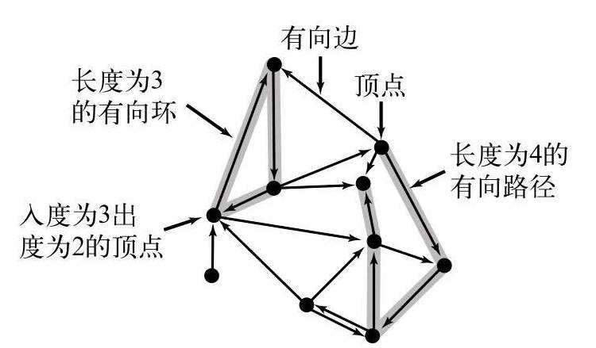

# 第7章 图

## 7.2 有向图的定义和实现

在有向图中，边是单向的：每条边所连接的两个顶点都是一个有序对，且邻接性是单向。我们定义：一幅有方向性的图（或有向图）是由一组顶点和一组有方向的边组成，每条有方向的边都连接着有序的一对顶点。有向边由第一个顶点并指向第二个顶点，比如`v->w`，就是顶点`v`指向顶点`w`的一条有向边。一幅有向图中，两个顶点的关系有 $4$ 种：没有边相连；存在从`v`到`w`的边`v->w`；存在从`w`到`v`的边`w->v`；既存在从`w`到`v`的边也存在从`v`到`w`的边`v<-->w`，即双向连接。在一幅有向图中，一个顶点的出度为由该顶点指出的边的总数；一个顶点的入度为指向该顶点的边的总数。



### 7.2.1 有向图的数据类型

以下为有向图`Digraph`的`API`定义：

|public class|**Digraph**||
|--:|:--|:--|
|file|asa|asas|

像无向图一样，我们使用邻接表来表示有向图，其中边`v->w`表示为顶点`v`所对应的邻接链表中包含一个顶点`w`，与无向图不同的是，不能再在顶点`w`的邻接链表中增加`v`顶点，这样做的话就是双向连接`v<-->w`而不是单向连接`v->w`。所以，有向图的表示方法和无向图几乎一模一样，代码如下所示：

```java

```