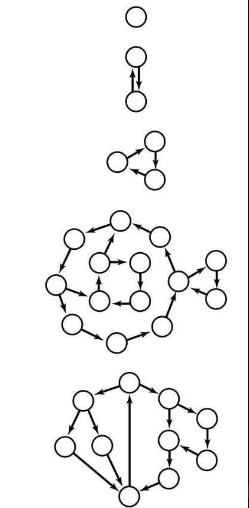

# 第7章 图

## 7.2 有向图的定义和实现

在有向图中，边是单向的：每条边所连接的两个顶点都是一个有序对，且邻接性是单向。我们定义：一幅有方向性的图（或有向图）是由一组顶点和一组有方向的边组成，每条有方向的边都连接着有序的一对顶点。有向边由第一个顶点并指向第二个顶点，比如`v->w`，就是顶点`v`指向顶点`w`的一条有向边。一幅有向图中，两个顶点的关系有 $4$ 种：没有边相连；存在从`v`到`w`的边`v->w`；存在从`w`到`v`的边`w->v`；既存在从`w`到`v`的边也存在从`v`到`w`的边`v<-->w`，即双向连接。在一幅有向图中，一个顶点的出度为由该顶点指出的边的总数；一个顶点的入度为指向该顶点的边的总数。


### 7.2.1 有向图的数据类型

以下为有向图`Digraph`的`API`定义：

|public class|**Digraph**||
|--:|:--|:--|
||MyDigraph(int V)|创建一幅含有 V 个顶点但没有边的有向图|
||MyDigraph(Scanner in)|从输入流 in 中读取一幅有向图|
|int|V()|顶点总数|
|int|E()|边的总数|
|void|addEdge(int v, int w)|向有向图添加一条边`v->w`|
|Iterable<Integer>|adj(int v)|由`v`指出的边所连接的所有顶点|
|int|inDegree(int v)|顶点`v`的入度|
|int|outDegree(int v)|顶点`v`的出度|
|MyDigraph|reverse()|该图的反向图|
|String|toString()|有向图的字符串表示|
|void|draw()|有向图图片可视化|

像无向图一样，我们使用邻接表来表示有向图，其中边`v->w`表示为顶点`v`所对应的邻接链表中包含一个顶点`w`，与无向图不同的是，不能再在顶点`w`的邻接链表中增加`v`顶点，这样做的话就是双向连接`v<-->w`而不是单向连接`v->w`。所以，有向图的表示方法和无向图几乎一模一样，代码如下所示：

```java
import java.io.IOException;
import java.util.Scanner;

import org.graphstream.graph.implementations.MultiGraph;
import org.graphstream.stream.file.FileSinkImages;
import org.graphstream.stream.file.FileSinkImages.LayoutPolicy;

public class MyDigraph {
    // MARK:Fields

    private static final String NEWLINE = System.lineSeparator();
    private final int V; // 有向图中顶点数量
    private int E;// 有向图中边的数量
    private MyList<Integer>[] adj; // 邻接表
    private int[] inDegree; // inDegree[v]：顶点 v 的入度

    // MARK:Constructor

    /**
     * 构建一个顶点个数为V的空有向图
     * 
     * @param V 顶点个数
     * @throws IllegalArgumentException V为负数
     */
    @SuppressWarnings("unchecked")
    public MyDigraph(int V) {
        if (V < 0)
            throw new IllegalArgumentException("Number of vertices must be non-negative");
        this.V = V;
        this.E = 0;
        adj = (MyList<Integer>[]) new MyList[V];
        inDegree = new int[V];
        for (int v = 0; v < V; v++) {
            adj[v] = new MyArrayList<>();
        }
    }

    /**
     * 从指定的输入流中读取一个图
     * 首行是顶点的个数
     * 第二行是边的数量
     * 接下来的每行表示一条具体的边，由两个结点表示，节点之间以空格相隔
     * 
     * @param in 输入流
     * @throws IllegalArgumentException 如果输入流 {@code in} 为 {@code null}
     * @throws IllegalArgumentException 如果边中结点编号超出范围
     * @throws IllegalArgumentException 如果边的数量或者结点的数量为负数
     * @throws IllegalArgumentException 如果输入流数据不符合数据格式规范
     */
    @SuppressWarnings("unchecked")
    public MyDigraph(Scanner in) {
        if (in == null)
            throw new IllegalArgumentException("input stream is null");
        try {
            V = in.nextInt();
            if (V < 0)
                throw new IllegalArgumentException(
                        "Number of vertices must be non-negative, " + V + " is less than zero");
            adj = (MyList<Integer>[]) new MyList[V];
            inDegree = new int[V];
            for (int v = 0; v < V; v++) {
                adj[v] = new MyArrayList<>();
            }
            int E = in.nextInt();
            if (E < 0) {
                throw new IllegalArgumentException(
                        "Number of edges must be non-negative, " + E + " is less than zero");
            }
            for (int i = 0; i < E; i++) {
                int v = in.nextInt();
                int w = in.nextInt();
                addEdge(v, w);
            }
        } catch (Exception e) {
            throw new IllegalArgumentException("invalid input format in Graph constructor", e);
        }
    }

    /**
     * 验证顶点是否合法，如果 {@code 0 <= v || v > V} 则非法
     * 
     * @param v 顶点 v
     * @throws IllegalArgumentException 如果 {@code 0 <= v || v > V}
     */
    private void validateVertex(int v) {
        if (v < 0 || v >= V)
            throw new IllegalArgumentException("vertex " + v + " is not between 0 and " + (V - 1));
    }

    // MARK:Modify Operations

    /**
     * 向有向图中添加有向边
     * 
     * @param v 有向边起点
     * @param w 有向边终点
     * @throws IllegalArgumentException 如果 {@code 0 <= v || v >= V} 以及
     *                                  {@code 0 <= w || w >= V} 抛出异常
     */
    private void addEdge(int v, int w) {
        validateVertex(v);
        validateVertex(w);

        adj[v].add(w);
        inDegree[w]++;
        E++;
    }

    // MARK:Query Operations

    /**
     * 返回图顶点的数量
     *
     * @return 图顶点的数量
     */
    public int V() {
        return V;
    }

    /**
     * 返回图边的数量
     *
     * @return 图边的数量
     */
    public int E() {
        return E;
    }

    /**
     * 返回顶点 {@code v} 所有的邻接点
     *
     * @param v 顶点
     * @return 顶点 {@code v} 的所有邻接点
     * @throws IllegalArgumentException 不满足 {@code 0 <= v < V}
     */
    public Iterable<Integer> adj(int v) {
        validateVertex(v);
        return adj[v];
    }

    /**
     * 返回顶点 {@code v} 的入度
     * 
     * @param v 顶点
     * @return 顶点 {@code v} 的入度
     * @throws IllegalArgumentException 不满足 {@code 0 <= v < V}
     */
    public int inDegree(int v) {
        validateVertex(v);
        return inDegree[v];
    }

    /**
     * 返回顶点 {@code v} 的出度
     * 
     * @param v 顶点
     * @return 顶点 {@code v} 的入度
     * @throws IllegalArgumentException 不满足 {@code 0 <= v < V}
     */
    public int outDegree(int v) {
        validateVertex(v);
        return adj[v].size();
    }

    /**
     * 返回有向图的反向图
     * 
     * @return
     */
    public MyDigraph reverse() {
        MyDigraph reverse = new MyDigraph(V);
        for (int v = 0; v < V; v++) {
            for (Integer w : adj[v]) {
                reverse.addEdge(w, v);
            }
        }
        return reverse;
    }

    // MARK:Visible

    @Override
    public String toString() {
        StringBuilder s = new StringBuilder();
        s.append(V + " vertices, " + E + " edges" + NEWLINE);
        for (int v = 0; v < V; v++) {
            s.append(String.format("%d: ", v));
            for (int w : adj[v]) {
                s.append(String.format("%d ", w));
            }
            s.append(NEWLINE);
        }
        return s.toString();
    }

    public void draw(String filePath) {
        System.setProperty("org.graphstream.ui", "swing");
        MultiGraph graph = new MultiGraph(this.getClass().getSimpleName());
        graph.setAttribute("ui.stylesheet", "url(file:src/main/resources/assets/graph.css)");
        for (int v = 0; v < V; v++) {
            // 加入顶点
            graph.addNode(String.valueOf(v)).setAttribute("ui.label", String.valueOf(v));
        }
        for (int v = 0; v < V; v++) {
            // 加入边
            for (int w : adj[v]) {
                graph.addEdge(v + "-" + w, v, w, true);
            }
        }
        try {
            FileSinkImages fileSinkImages = FileSinkImages.createDefault();
            fileSinkImages.setLayoutPolicy(LayoutPolicy.COMPUTED_FULLY_AT_NEW_IMAGE);
            fileSinkImages.setAutofit(true);
            graph.write(fileSinkImages, filePath);
        } catch (IOException e) {
            e.printStackTrace();
        }
    }
}
```

### 7.2.2 有向图的搜素

和无向图一样，有向图也有深度和广度优先搜索。有向图的深度和广度优先搜索比较简单，只需要在无向图的基础上，将无向图类替换为有向图即可。

### 7.2.2 有向图的可达性

有向图单点可达性问题，即：给定一幅有向图和一个起点`s`，回答“是否存在一条从`s`到达给定顶点`v`的有向路径？

有向图多点可达性问题，即：给定一幅有向图和顶点的集合，回答“是否存在一条从集合中的任意顶点到达给定顶点`v`的有向路径？”

最短路径问题，即：给定一幅有向图和起点`s`或者顶点的集合，回答“是否存在一条从起点`s`或者集合中的任意顶点到达给定顶点`v`的有向路径，如果存在，求出其最短路径”。

参考有向图的可达性，发现有向图和无向图在该问题上非常的相似，只需要将无向图类替换成有向图类即可。

### 7.2.3 有向图环检测

有向环检测：给定的有向图中包含有向环吗？如果有，按照路径的方向从某个顶点并返回自己来找到环上的所有顶点。

有向环的检测和无向环有所不同，无向环使用深度优先检测时，通过检查顶点`v`的已访问邻接结点`w`的最近路径另一结点`adjW`是不是与`v`相同，如果不相同，说明，深度优先搜索中，从同一起点出发，到`v`有两条不同的路径，这就说明有环存在，如下面示意图：


无向图相比有向图，环的检测更加简单。我们从起点出发，开始使用深度优先搜索顶点，在搜索的过程中，我们维护一个由`s`出发的路径栈，假设在图中已经访问了顶点`v`，现在又访问到了`w`，而`w`的下一个顶点是`v`，这样就有路径`s->...->v->...->w->v`，很明显可以得到环`v->...->w->v`，这样就说明了，有向图中环是存在的。当然上面的操作还是不行的，如下图所示，深度优先遍历了结点`2`和`6`，并且`marked`已经标记了`true`。现在遍历结点`1`的另一边，依次遍历`3`，`4`，`5`，`6`，因为`6`已经遍历了，所以形成了环路，但是实际上并没有。所以，我们还需要增加额外的限制，什么限制呢？我们可以增加一个`boolean[] onStack`数组，用来标记当前结点是否在当前的递归栈中，再次回到上面的问题，因为`2`和`6`会因为栈的递归而出栈，然后到`1`，再深度遍历`1`的另一边（`3->5->5->6`），因为`6`不在栈中，没有环。


```java
    private boolean[] marked;
    private int[] edgeTo;
    private MyStack<Integer> cycle;

    private boolean[] onStack; // onStack[v]：顶点v是否在栈中，有向图使用

    public MyCycleDetection(MyDigraph graph) {
        marked = new boolean[graph.V()];
        edgeTo = new int[graph.V()];
        onStack = new boolean[graph.V()];

        for (int v = 0; v < graph.V(); v++) {
            if (!marked[v] && cycle == null) {
                dfs(graph, v);
            }
        }
    }

    private void dfs(MyDigraph graph, int v) {
        onStack[v] = true;
        marked[v] = true;
        for (int w : graph.adj(v)) {
            if (cycle != null) // 如果已找到环，那么直接返回
                return;
            else if (!marked[w]) { // 访问到新顶点，递归访问
                edgeTo[w] = v;
                dfs(graph, w);
            } else if (onStack[w]) { // 找到环，追溯有向环
                cycle = new MyResizingArrayStack<>();
                for (int x = v; x != w; x = edgeTo[x])
                    cycle.push(x);
                cycle.push(w);
                cycle.push(v);
            }
        }
        onStack[v] = false; // 访问完 v 的邻接顶点，说明以 v 为起点，没有找到环，说明该顶点在环外，置为false
    }
```

除了使用深度优先搜索，还可以使用一种非迭代的基于队列的算法。为讲解其原理，我们先需要知道一个事实：有向图中，所有入度为零的顶点以及仅以这些入度为零的顶点指向的顶点都不可能在有向环中。什么意思呢？比如下面一幅有向图，图中因为顶点`0`入度为零，以及顶点`1`仅有顶点`0`指向，所以可以首先排除在有向环外。


但是顶点`5`是怎么排除呢？如下面的代码：

```java
for (int v = 0; v < graph.V(); v++) {
    if (inDegree[v] == 0)
        continue;
    else
        root = v;
    for (int w : graph.adj(v)) {
        if (inDegree[w] > 0) {
            edgeTo[w] = v;
        }
    }
}
```

代码中，先排除所有环外的顶点，再记录`s->v`路径中最后一条边，这样就很顺利地把跟环无关的顶点都屏蔽了，只留下和环有关的，且除了环内的顶点，其余顶点都是环中的顶点指向其余的顶点，比如顶点`5`，它的入度只能是环中的顶点单向指出，这样就保证了下面代码拿到的一定是环中的任意一个顶点。

```java
// 拿到环中任意一个顶点
marked = new boolean[graph.V()];
while (!marked[root]) {
    marked[root] = true;
    root = edgeTo[root];
}
```

上面代码中，`root`初始值有两种情况，一种是环内，即为顶点`2`或`3`或`4`，这样最后`root`值也一定是`2`或`3`或`4`，即为环中任意一个顶点；当最初`root`为顶点`5`时，那么最后也会回到环内，即为环中任意一个顶点。

基于队列非迭代检测有向环代码如下：

```java
    public MyCycleDetection(MyDigraph graph, MyQueue<Integer> queue) {
        // 顶点的入度
        int[] inDegree = new int[graph.V()];
        for (int v = 0; v < graph.V(); v++) {
            inDegree[v] = graph.inDegree(v);
        }
        // 初始化队列，存入所有入度为零的顶点，入度为零，不可能作为环的的顶点，因为环的顶点至少有一个入度和一个出度形成环状
        queue.clear();
        for (int v = 0; v < graph.V(); v++) {
            if (inDegree[v] == 0)
                queue.enqueue(v);
        }

        while (!queue.isEmpty()) { // 遍历顶点，
            int v = queue.dequeue();
            for (int w : graph.adj(v)) {
                inDegree[w]--; // 减去因为不能作为环的顶点入度，减到零，说明该顶点也不可能作为环的顶点，入队，
                if (inDegree[w] == 0)
                    queue.enqueue(w);
            }
        }
        // there is a directed cycle in subgraph of vertices with inDegree >= 1.
        edgeTo = new int[graph.V()];
        int root = -1;
        for (int v = 0; v < graph.V(); v++) {
            if (inDegree[v] == 0)
                continue;
            else
                root = v;
            for (int w : graph.adj(v)) {
                if (inDegree[w] > 0) {
                    edgeTo[w] = v;
                }
            }
        }

        if (root != -1) {
            // 环中任意一个顶点
            marked = new boolean[graph.V()];
            while (!marked[root]) {
                marked[root] = true;
                root = edgeTo[root];
            }

            // extract cycle
            cycle = new MyResizingArrayStack<>();
            int v = root;
            do {
                cycle.push(v);
                v = edgeTo[v];
            } while (v != root);
            cycle.push(root);
        }
    }
```

### 7.2.4 顶点的深度优先次序

我们使用深度优先搜索正好访问一幅连通有向图每个顶点一次，如果将深度优先搜索访问的顶点保存至一个数据结构中，遍历这个数据结构实际上就能访问图中的所有顶点，遍历的顺序取决于这个数据结构的性质以及再递归调用之前还是之后保存。在典型的应用中，我们通常对以下三种排列顺序感兴趣：

1. 前序：在递归调用之前将顶点加入队列。
2. 后序：在递归调用之后将顶点加入队列。
3. 逆后序：在递归调用之后将顶点压入栈。

三种排序代码实现如下所示，对应于`pre`，`post`和`reversePost`方法。

```java
public class MyDepthFirstOrder {
    private boolean[] marked; // marked[v]：在搜索的过程中，顶点 v 是否已经被标记
    private int[] pre; // pre[v]：顶点 v 在前序排序中编号
    private int[] post; // post[v]：顶点 v 在后续排序中编号
    private MyQueue<Integer> preOrder; // 前序顶点
    private MyQueue<Integer> postOrder; // 后序顶点
    private int preCounter; // 前序顶点计数器
    private int postCounter; // 后续顶点计数器

    public MyDepthFirstOrder(MyDigraph graph) {
        pre = new int[graph.V()];
        post = new int[graph.V()];
        preOrder = new MyLinkedListQueue<>();
        postOrder = new MyLinkedListQueue<>();
        marked = new boolean[graph.V()];
        // 深度优先搜索
        for (int v = 0; v < graph.V(); v++) {
            if (!marked[v])
                dfs(graph, v);
        }
    }

    private void dfs(MyDigraph graph, int v) {
        marked[v] = true;
        pre[v] = preCounter++;
        preOrder.enqueue(v); // 前序
        for (int w : graph.adj(v)) {
            if (!marked[w])
                dfs(graph, w);
        }
        postOrder.enqueue(v); // 后序
        post[v] = postCounter++;
    }

    /**
     * 返回顶点 v 前序序号
     * 
     * @param v 顶点
     * @return 前序序号
     * @throws IllegalArgumentException 如果{@code 0<=v<V}
     */
    public int pre(int v) {
        validateVertex(v);
        return pre[v];
    }

    /**
     * 返回顶点 v 后序序号
     * 
     * @param v 顶点
     * @return 后序序号
     * @throws IllegalArgumentException 如果{@code 0<=v<V}
     */
    public int post(int v) {
        validateVertex(v);
        return post[v];
    }

    private void validateVertex(int v) {
        int V = marked.length;
        if (v < 0 || v >= V)
            throw new IllegalArgumentException("vertex " + v + "is not between 0 and " + (V - 1));
    }

    /**
     * 深度搜索前序顶点
     * 
     * @return 深度搜索前序顶点
     */
    public Iterable<Integer> pre() {
        return preOrder;
    }

    /**
     * 深度搜索后续顶点
     * 
     * @return 深度搜索后续顶点
     */
    public Iterable<Integer> post() {
        return postOrder;
    }

    /**
     * 逆后序顶点
     * 
     * @return 返回逆后序顶点
     */
    public Iterable<Integer> reversePost() {
        MyStack<Integer> reverse = new MyLinkedListStack<>();
        for (Integer v : postOrder) {
            reverse.push(v);
        }
        return reverse;
    }
}

```

类`MyDepthFirstOrder`公有方法 `API` 定义如下：

|public class|**MyDepthFirstOrder**||
|--:|:--|:--|
||MyDepthFirstOrder(MyDigraph graph)|构造有向图深度优先前、后、逆后次序搜索|
|int|pre(int v)|顶点 v 深度优先前序排列顺序|
|int|post(int v)|顶点 v 深度优先后序排列顺序|
|Iterable<Integer>|pre()|深度优先前序次序顶点，以迭代器形式返回|
|Iterable<Integer>|post()|深度优先后序次序顶点，以迭代器形式返回|
|Iterable<Integer>|reversePost()|深度优先逆后序次序顶点，以迭代器形式返回|

三种深度优先次序详细轨迹如下：


### 7.2.5 拓扑排序

在实际生活中，可能有这样一种场景，给定了一组任务，我们需要安排执行它们的执行顺序，限制条件是优先级限制，即指明了哪些任务必须在哪些任务之前完成。那么，给定一组需要完成的任务，以及一组关于任务完成的先后次序的优先级限制。在满足限制条件的前提下应该如何安排并完成所有任务？

对于这样一个问题，我们可以使用有向图来表示，其中顶点对应任务，有向边对应优先级顺序。为了简化表达，使用整数为顶点编号的标准有向图模型来表示。在有向图中，优先级限制下的调度问题等价于于拓扑排序问题。

**拓扑排序**。给定一幅有向图，将所有的顶点排序，使得所有的有向边均从排在前面的元素指向排在后面的元素（或者说明无法做到这一点）。

比如下面安排课程的问题，其中有的课程是其它课程的先导课程，按照图中的顺序，就可以满足优先级限制条件下修完所有课程。


优先级限制下的调度问题等价于计算有向无环图（`DAG`，`Directed Acyclic Graph`）中的所有顶点的拓扑排序，而拓扑排序就是顶点深度优先搜索的逆后序。

现在对于任何一条`v->w`的有向边，在调用`dfs(v)`时，下面三种情况必有一种情况成立：

1. `dfs(w)`已经被调用过且已经返回了（`w`已经被标记）。
2. `dfs(w)`还没有被调用（w还未被标记），因此`v→w`会直接或间接调用并返回`dfs(w)`，且`dfs(w)`会在`dfs(v)`返回前返回。
3. `dfs(w)`已经被调用但还未返回。

第三种情况，在有向无环图中时不可能出现的，这是因为一旦第三种情况成立，意味着`w->v`的路径是存在的，并且因为`v->w`的存在，就构成了一个环了，与前提不符。

在第一种和第二种情况下，深度优先后序排序中，`dfs(w)`都会在`dfs(v)`之前完成，所以后序排列中`w`一直排在`v`之前，而在逆后序中，`w`排在`v`之后。

根据调度问题，设计了如下拓扑排序类`MyTopological`的`API`：

|public class|**MyTopological**||
|--:|:--|:--|
||MyTopological(MyDigraph graph, boolean isRecursive)|拓扑排序的构造函数|
|boolean|hasOrder()|graph 是否可以拓扑排序|
|Iterable<Integer>|order()|拓扑排序的所有顶点|
|int|rank(int v)|拓扑排序中，顶点 v 排名，如果无法拓扑排序，返回 -1|

### 7.2.6 有向图中的强连通性

在无向图中可达性和连通性是等价的，因为顶点`v`有路径达到顶点`w`，那么顶点`w`到顶点`v`也一定有一条路径，所以`v`和`w`是连通的。但是在有向图中，如果从顶点`v`有一条有向路径到达`w`，则顶点`w`是从顶点`v`可达的，但从`w`到达`v`的路径可能存在也可能不存在。这时，我们会考虑类似无向图中的连通性问题：

如果两个顶点`v`和`w`是互相可达的，则称它们为强连通的。也就是说，既存在一条从`v`到`w`的有向路径，也存在一条从`w`到`v`的有向路径。如果一幅有向图中的任意两个顶点都是强连通的，则称这幅有向图也是强连通的。



如果两个顶点`v`和`w`是强连通的，那么有着以下的性质：

1. **自反性**：任意顶点`v`和自己都是强连通的。
2. **对称性**：如果`v`和`w`是强连通的，那么`w`和`v`也是强连通的。
3. **传递性**：如果`v`和`w`是强连通的且`w`和`x`也是强连通的，那么`v`和`x`也是强连通的。

强连通性将所有顶点分为了一些等价类，每个等价类都是由相互均为强连通的顶点的最大子集组成的。我们将这些子集称为强连通分量。比如如下所示的图，有五个强连通分量。一个含有`V`个顶点的有向无环图，含有`V`个强连通分量。一个强连通图，只有一个强连通分量。


现在我们要解决有向图的强连通性问题：给定一幅有向图，回答“给定的两个顶点是强连通的吗？这幅有向图中含有多少个强连通分量？”等类似问题。

求有向图强连通分量有三种方法：`Kosaraju`算法、`Tarjan`算法和`Gabow`算法。

根据强连通问题，设计了如下类`MyStronglyConnectedComponent`的`API`：

|public class|**MyStronglyConnectedComponent**||
|--:|:--|:--|
||MyStronglyConnectedComponent(MyDigraph graph, AlgorithmType algorithmType)|强连通分量构造函数|
|boolean|stronglyConnected(int v, int w)|顶点 v 和 w 是强连通的嘛|
|int|count|图中的强连通分量的总数|
|int|id(int v)|顶点 v 所在强连通分量标识符（[0,count()-1] 之间）|

#### 7.2.6.1 `Kosaraju`算法

步骤：

1. 在给定的一幅有向图`G`中，计算图的反向图 $G^R$ 的逆后序排列；
2. 在`G`中进行标准的深度优先搜索，但是要按照刚才计算得到的顺序而非标准的顺序来访问所有未被标记的顶点。
3. 所有在同一个递归`dfs()`调用中被访问到的顶点都在同一个强连通分量中。

如下是在有向图中寻找强连通分量的`Kosaraju`算法案例：


根据`Kosaraju`算法，我们可以得出结论：使用深度优先搜索查找给定有向图`G`的反向图 $G^R$，根据由此得到的所有顶点的逆后序再次用深度优先搜索处理有向图`G`，其每一次递归调用所标记的顶点都在同一个强连通分量之中。

首先我们来看**每个和`s`强连通的顶点`v`都会在调用的`dfs(G,s)`中被访问到**的正确性。假设有一个和`s`强连通的顶点`v`不会在调用`dfs(G,s)`中被访问到。因为存在`s->v`的路径，而在访问`s`却不会访问`v`，说明访问`s`之前`v`已经被标记访问过了。而在访问`v`的过程中，因为存在`v->s`的路径，`s`肯定已经被标记过访问了，所有访问`v`后，`s`不应再被访问，而此时却正在访问`s`，此时与`s`和`v`是强连通冲突。所以：**每个和`s`强连通的顶点`v`都会在调用的`dfs(G,s)`中被访问到**是正确的。

其次再来看**调用的`dfs(G,s)`所到达的任意顶点v都必然是和s强连通的**正确性。设`v`为`dfs(G,s)`到达的某个顶点。那么，`G`中必然存在一条从`s`到`v`的路径，为证明`s`和`v`是强连通的。只需要证明`G`中还存在一条从`v`到`s`的路径即可。这也等价于 $G^R$ 中存在一条从`s`到`v`的路径，因此只需要证明在 $G^R$ 中存在一条从`s`到`v`的路径即可。前面已经按照逆后序进行了深度优先搜索，在 $G^R$ 进行深度优先搜索，假设存在`s->v`的路径，那么必然`dfs(G,v)`在`dfs(G,s)`之前已经结束了，这样`dfs(G,v)`的调用指挥出现以下两种情况：

1. 调用`dfs(G,v)`在`dfs(G,s)`调用之前，这样，也在`dfs(G,s)`调用之前结束；
2. 调用`dfs(G,v)`在`dfs(G,s)`调用之后，这样，也在`dfs(G,s)`结束之前结束；

因为 $G^R$ 中存在一条从`v->s`的路径，所以，如果第一种情况成立，那么在访问`dfs(G,v)`时，`dfs(G,s)`早已被访问结束，与现在在访问`dfs(G,s)`到`v`结点冲突。而第二种情况，就是因为`s->v`有路径才能成立。

#### 7.2.6.2 `Tarjan`算法

比如说下面的有向图中，顶点 $1,2,4,5,6,7,8$ 就是一个强连通分量，另外 $3$ 和 $9$ 单独构成强连通分量。现在我们要学习使用`Tarjan`算法来寻找有向图，时间复杂度为 $O(V+E)$ 。


`Tarjan`算法是由`Robert Tarjan`提出的用于寻找有向图的强连通分量的算法，主要是利用`DFS`来寻找强连通分量的。在介绍该算法之前，我们先来介绍一下搜索树。先前那个有向图的搜索树是这样的：


有向图的搜索树主要有 $4$ 种边（这张图只有 $3$ 种），其中用实线画出来的是树边（`tree edge`），每次搜索找到一个还没有访问过的结点的时候就形成了一条树边。用长虚线画出来的是反祖边（`back edge`），也被叫做回边，表示该边指向先前访问过的祖先。用短虚线画出来的是横叉边（`cross edge`），它主要是在搜索的时候遇到了一个已经访问过的结点，但是这个结点并不是当前节点的祖先时形成的。除此之外，像从结点 $1$ 到结点 $6$ 这样的边叫做前向边（`forward edge`），它是在搜索的时候遇到子树中的结点的时候形成的，表示该边指向先前访问过的孩子结点。

现在我们来看看在DFS的过程中强连通分量有什么性质。

很重要的一点是如果结点`u`是某个强连通分量在搜索树中遇到的第一个结点（这通常被称为这个强连通分量的根），那么这个强连通分量的其余结点肯定是在搜索树中以`u`为根的子树中。如果有个结点`v`在该强连通分量中但是不在以`u`为根的子树中，那么`u`到`v`的路径中肯定有一条离开子树的边。但是这样的边只可能是横叉边或者反祖边，然而这两条边都要求指向的结点已经被访问过了，这就和`u`是第一个访问的结点矛盾了。

`Tarjan`算法主要是在`DFS`的过程中维护了一些信息：`DFN`、`LOW`和一个栈。

+ 栈里的元素表示的是当前已经访问过但是没有被归类到任一强连通分量的结点。
+ $DFN[u]$ 表示结点`u`在`DFS`中第一次搜索到的次序，通常被叫做时间戳。
+ $LOW[u]$ 稍微有些复杂，它表示从`u`或者以`u`为根的子树中的结点，再通过一条反祖边或者横叉边可以到达的时间戳最小的结点`v`的时间戳，并且要求`v`有一些额外的性质：`v`还要能够到达`u`。显然通过反祖边到达的结点`v`满足`LOW`的性质，但是通过横叉边到达的却不一定。

可以证明，结点`u`是某个强连通分量的根等价于 $DFN[u]$ 和 $LOW[u]$ 相等。简单可以理解成当它们相等的时候就不可能从`u`通过子树再经过其它时间戳比它小的结点回到`u`。

当通过`u`搜索到一个新的节点`v`的时候可以有多种情况：

1. 结点`u`通过树边到达结点`v`。 $LOW[u]=min(LOW[u],LOW[v])$
2. 结点`u`通过反祖边到达结点`v`，或者通过横叉边到达结点`v`并且满足`LOW`定义中`v`的性质（`v`还能够到达`u`）， $LOW[u]=min(LOW[u],DFN[v])$

在`Tarjan`算法进行`DFS`的过程中，每离开一个结点，我们就判断一下`LOW`是否小于`DFN`，如果是，那么着个结点可以到达它先前的结点再通过那个结点回到它，肯定不是强连通分量的根。如果`DFN`和`LOW`相等，那么就不断退栈直到当前结点为止，这些结点就属于一个强连通分量。

至于如何更新`LOW`，关键就在于第二种情况，当通过反祖边或者横叉边走到一个结点的时候，只需要判断这个结点是否在栈中，如果在就用它的`LOW`值更新当前节点的`LOW`值，否则就不更新。因为如果不在栈中这个结点就已经确定在某个强连通分量中了，不可能回到`u`。

现在我们对着先前的图模拟一次。结点内的标号就是`DFN`值，结点边上的标号是表示`LOW`值，当前所在的结点用灰色表示。


首先从第一个结点开始进行搜索，最初`LOW[1]=1`。此时栈里的结点是： $1$ 。


然后到达第二个结点，同时也初始化`LOW[2]=2`。此时栈里的结点是： $1,2$ 。


类似地，到达第三个结点，同时也初始化`LOW[3]=3`。此时栈里的结点是： $1,2,3$ 。

此时结点 $3$ 没有其余边可以继续进行搜索了，我们需要离开它了，判断`DFN`和`LOW`，因为发现`DFN[3]=LOW[3]`，所以结点 $3$ 是一个强连通分量的根，出栈直到结点 $3$ 为止，得到刚好只有一个结点 $3$ 的强连通分量。此时栈里的结点是： $1,2$。


从结点 $3$ 返回后到结点 $2$ ，而后进入结点 $4$ ，从结点 $4$ 可以到达结点 $1$ ，但是结点 $1$ 已经访问过了，并且是通过反祖边，更新 $LOW[4]=min(LOW[4],DFN[1])$ 的值。此时栈里的结点是： $1,2,4$ 。


继续从结点 $4$ 还可以通过横叉边到达结点 $3$ ，但是结点 $3$ 并不在栈中（也就是结点 $3$ 并没有路径到达结点 $4$ ），不做任何改动。此时栈里的结点是： $1,2,4$ 。

接着一直搜索直到结点 $6$ 。此时栈里的结点是： $1,2,4,5,6$ 。

从结点 $6$ 出发可以通过横叉边到达结点 $4$ ，因为它已经访问过而且还在栈中，并且从结点 $4$ 可以到达结点 $6$ ，更新 $LOW[6]=min(LOW[6],DFN[4])$ 。此时栈里的结点是： $1,2,4,5,6$ 。


因为结点 $6$ 访问完成，需要回退到结点 $5$，使用结点 $6$ 的值更新 $LOW[5]=min(LOW[5],LOW[6])$。此时栈里的结点是： $1,2,4,5,6$ 。


从结点 $5$ 出发经过结点 $7$ 后到达结点 $8$ 。遇到反祖边回到结点 $5$ 更新 $LOW[8]$ 。此时栈里的结点是： $1,2,4,5,6,7,8$ 。


继续到达结点 $9$ 。此时栈里的结点是： $1,2,4,5,6,7,8,9$ 。

离开时发现 $DFN[9]=LOW[9]$ 。找到强连通分量，出栈。此时栈里的结点是： $1,2,4,5,6,7,8$ 。

回到结点 $8$ ，此时 $LOW[8]<DFN[8]$ ，不做处理继续回退。


直到回到结点 $1$ 的时候 $LOW[1]=DFN[1]$ 。此时栈里的结点是： $1,2,4,5,6,7,8$ 。一直退栈直到遇见 $1$ ，找到强连通分量 $1,2,4,5,6,7,8$。

#### 7.2.6.3 `Gabow`算法

`Gabow`算法和`Tarjan`算法的思想是一样的。每个强连通分量都有一个“根”，根是强连通分量中最先被检查的顶点。在一组强连通分量中，沿着根不断深度优先搜索，最终将会回到根，路上经过的顶点则属于这个强连通分量。

准备工作：

1. 准备一个数组`private int[] preOrder`，存放结点`v`的访问顺序，除了数组还需要变量`pre`，表示当前访问的顺序。
2. 需要两个辅助栈，第一个`MyStack<Integer> path`用来保存在一次深度优先搜索的过程中遇到的顶点，这些顶点还没有确认属于哪个强连通分量，在确认连通分量归属后，记录结果，顶点出栈。第二个`MyStack<Integer> root`用来保存一次深度优先搜索过程中遇到的根。

算法步骤：

1. 在所有顶点中，找一个没有被访问过的结点`v`，以`v`为参数执行步骤 $2$，否则完成；
2. 记录`v`的访问顺序，将`v`压入堆栈`path`和`root`中，这一步骤相当于`Tarjan`中初始化一个顶点的`low`值和`dfn`值；
3. 遍历顶点`v`的邻接顶点`w`，如果`w`没有被访问过，递归执行步骤 $2$；
4. 如果访问过，那么判断`w`是否在栈中（和确认`w`是否确定强连通分量是等价的，因为栈中的元素都是没有确认强连通分量的）,如果在栈中，那么`(v,w)`是反向边，此时，从`root`栈中`w`之后访问的所有结点出栈（`preOrder[root.peek()] > preOrder[w]`）。为什么呢？因为此时，`w`是`v`的后继顶点，我们目标是找出以`v`为根的子树顶点能达到的最早访问顶点，在这一点上，类似于`Tarjan`算法中对`low`值的更新
5. 访问完顶点`v`所有邻接顶点，如果`root`栈的栈顶元素等于`v`，那么在`path`中记录以`v`为**根**的强连通分量。

案例分析：


