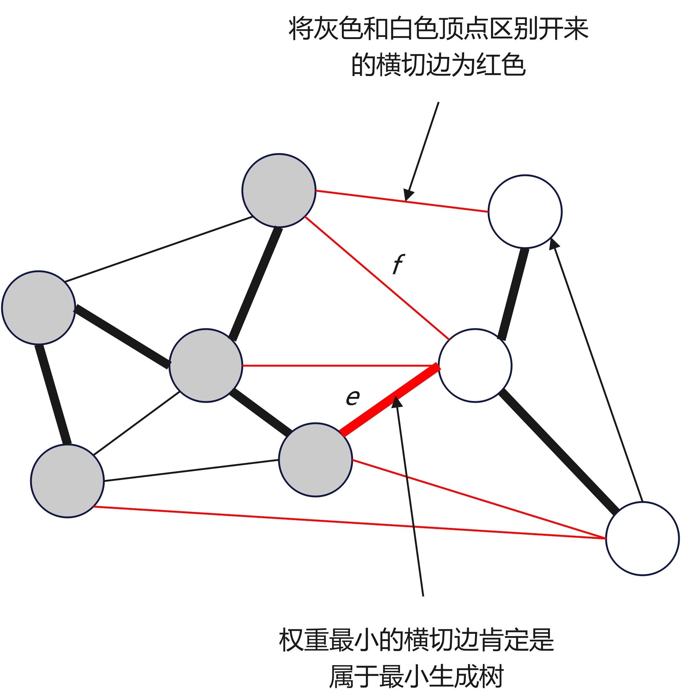
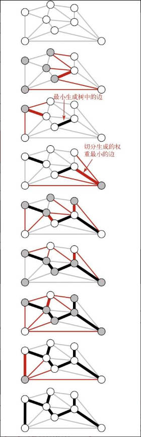
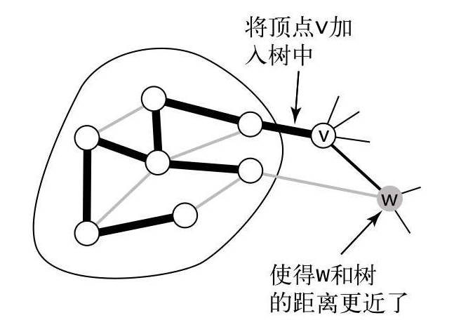

# 第7章 图

## 7.3 加权无向图定义及实现

加权图是一种为每条边关联一个权值或者成本的图模型。在实际生活中，比如一幅航空图，边是航线，全职则可以是费用或者距离，或者在一幅电路图中，边表示导线，权值则可能表示导线的长度或者信号通过线路花费的时间。在这些情境中，最令人感兴趣的就是如何使成本最小化。

**图的生成树**是它的一棵含有**所有顶点**的**无环连通子图**。一幅加权图的最小生成树（`Minimum Spanning Tree,MST`）是它的一棵权值（树中所有顶点的权值之和）最小的生成树。

### 7.3.1 加权无向图的数据类型

加权无向图应该如何表示呢？在邻接矩阵表示方法中，可以用边的权重代替布尔值作为矩阵的元素；在邻接表中，可以在列表的结点增加权重域。

我们先来定义加权边`MyEdge`的的`API`：

|public class|**MyEdge**|implements Comparable\<Edge\>|
|--:|:--|:--|
||Edge(int v, int w, double weight)|用于初始化边的构造函数|
|double|weight()|返回边的权重|
|int|either()|边两端的顶点之一|
|int|other()|边两端的另一顶点|
|int|compareTo(Edge that)|将这条边与 that 比较|
|String|toString()|边字符串表示|

在`MyEdge`的基础上，定义加权无向图`MyEdgeWeightedGraph`的`API`如下：

|public class|**MyEdgeWeightedGraph**||
|--:|:--|:--|
||MyEdgeWeightedGraph(int V)|构造一幅含有 V 个顶点的空图|
||MyEdgeWeightedGraph(Scanner in)|从输入流中读取图|
|int|V()|图的顶点数|
|int|E()|图的边数|
|int|degree()|顶点的度|
|void|addEdge(Edge e)|向图中添加一条边|
|Iterable\<Edge>|adj(int v)|和顶点 v 相关联的所有边|
|Iterable\<Edge>|edges()|获取图的所有边|
|String|toString()|边字符串表示|
|void|draw()|加权无向图可视化|

### 7.3.2 最小生成树前置

#### 7.3.2.1 树的定义及性质

树是一幅无环连通图，当且仅当一幅含有`V`个结点的图`G`满足下列 $5$ 个条件之一时，它就是一棵树：

1. `G`有`V-1`条边且不含有环；
2. `G`有`V-1`条边且是连通的；
3. `G`是连通的，但删除任意一条边都会使它不再连通；
4. `G`是无环图，但添加任意一条边都会产生一条环；
5. `G`中的任意一对顶点之间仅存在一条简单路径（一条没有重复顶点的路径）。

其中`3`和`4`是证明最小生成树性质的基础。

#### 7.3.2.2 切分定理

图的一种切分是将图的所有顶点分为两个非空且不重叠的两个集合。横切边是一条连接两个属于不同集合的顶点的边。

如下图所示，我们将图中的顶点分成了两个集合，分别用灰色和白色表示，其中红色就是横切边。

关于横切边有一条重要的定理（切分定理）需要说明：在一幅加权图中，给定任意的切分，它的横切边中的权重最小者必然属于图的最小生成树。

现在有一幅图，`T`是图的最小生成树，所以`T`中必然有一条边是两个集合的横切边，假设为`f`，`e`是权重最小的横切边，为证明切分定理，我们采用反证法来说明。假设，`T`不包含`e`，那么如果将`e`加入`T`中，那么得到的图必然含有一条经过`e`的环，且这个环因为有边`f`，`f`的权重必然大于`e`，因为`e`的权重是最小的且图中所有边的权重均不同，那么我们删掉`f`而保留`e`就可以得到一棵权重更小的生成树，这就和假设`T`矛盾。

#### 7.3.2.3 贪心算法

我们已经有切分定理，那么我们可以使用贪心算法解决最小生成树问题：使用切分定理找到最小生成树的一条边，不断重复直到找到最小生成树的所有边，这就是贪心算法。那么我们可以得到最小生成树的贪心算法：初始状态下所有边均为灰色，找到一种切分，它产生的横切边均不为黑色，将它权重最小的横切边标记为黑色，反复，直到标记了`V-1`条黑边为止。

贪心算法轨迹如下图所示：

#### 7.3.2.4 最小生成树 API

定义如下最小生成树类`MyMinimumSpanningTree`的`API`：

|public class|**MyMinimumSpanningTree**||
|--:|:--|:--|
||MyMinimumSpanningTree(MyEdgeWeightedGraph graph, AlgorithmType algorithmType)|构造函数|
|Iterable\<Edge>|edges()|最小生成树的所有边|
|double|weight()|最小生成树的权重|

### 7.3.3 Prim 算法

`Prim` 算法的每一步都会为一棵生长中的树添加一条边，一开始这棵树只有一个顶点，然后会向它添加`V-1`条边，每次总是将下一条连接树中的顶点与不在树中的顶点且权重最小的边加入树中。

根据算法的步骤，我们很容易抓住关键问题：如何有效地找到最小权重的横切边呢？

为有效地找到最小权重的横切边，我们需要用以下的方法表示树中的顶点、边和横切边。

+ <strong>顶点</strong>：使用一个由顶点索引定义的`boolean[] marked`，如果顶点`v`在树中，那么`marked[v]=true`。
+ <strong>边</strong>：选择以下两种数据结构之一：一个用来保存最小生成树中的边，或者一个由顶点索引的`Edge`对象数组`edgeTo[]`，其中`EdgeTo[v]`为连接到树中的`Edge`对象。
+ <strong>横切边</strong>：使用一个优先级队列`MyPriorityQueue<Edge>`来根据权重比较所有边。

#### 7.3.3.1 Prim 算法 -- 延时实现

在我们向树中添加了一条新边的同时，也向树种添加了一个顶点。我们要维护一个包含所有横切边的集合，就要将连接这个顶点的边以及其他所有不在树中的顶点的边加入优先队列。在添加新的顶点时，由边需要加入，那么自然会有原来是横切边变成不是横切边。这时，`Prim`算法有两种处理策略，一个是即时将失效的边从优先队列种删除，即即时实现；另一个则是将这些边先留在优先队列中，等到要删除的时候再检查边的有效性，即延时实现。

我们先来看延时实现。如下图是一幅图使用延时`Prim`算法生成最小生成树的过程。在整个过程中，顶点不断加入树中，图和优先队列的状态不断变换。

+ 将顶点 $0$，添加到最小树中，将它的邻接链表中的所有边添加到优先队列之中。
+ 将顶点 $7$ 和边`0-7`添加到最小生成树中，将顶点的邻接链表中的所有边添加到优先队列中。
+ 将顶点 $1$ 和边`1-7`添加到最小生成树中，将顶点的邻接表中的所有边添加到优先队列之中。
+ 将顶点 $2$ 和边`0-2`添加到最小生成树中，将边`2-3`和`6-2`添加到优先队列之中，边`2-7`和`1-2`失效。
+ 将顶点 $3$ 和边`2-3`添加到最小生成树中，将边`3-6`添加到优先队列中，边`1-3`失效。
+ 将顶点 $5$ 和边`5-7`添加到最小生成树中，将边`4-5`添加到优先队列中，边`1-5`失效。
+ 从优先队列中删除失效的边`1-3`、`1-5`和`2-7`。
+ 将顶点 $4$ 和边`4-5`添加到最小生成树中，将边`6-4`添加到优先队列中，边`4-7`和`0-4`失效。
+ 从优先队列中删除失效的边`1-2`、`4-7`和`0-4`。
+ 将顶点 $6$ 和边`6-2`添加到最小生成树中，和顶点 $6$ 相关的其他边均失效。

在添加完 $V$ 个顶点和 $V-1$ 条边后，最小生成树总算完成了，优先队列剩下的边都是无效的，不需要再处理它们。

`Prim`算法的延时实现计算一幅含有 $V$ 个顶点和 $E$ 条边的连通加权无向图的最小生成树所需的空间与 $E$ 成正比，所需的时间与 $Elg_E$成正比（最坏情况）。

整个算法的瓶颈在于优先队列的插入和删除中比较边的权重次数。优先队列中最多有 $E$ 条边，这是空间需求的上线，即空间复杂度为 $O(n)$。在最坏的情况下，一次插入的成本为 $lg_E$，删除最小的元素成本为 $2lg_E$，因为最多只能插入 $E$ 条边，删除 $E$ 次最小元素。

#### 7.3.3.2 Prim 算法 -- 即时实现

想要改进`Prim`算法，可以尝试从优先级队列中即时删除失效的边，其实还可以删除更多的边，因为我们感兴趣的只有一条：连接树顶点和非树顶点中权重最小的边。回顾延时实现，如下图所示，当我们将顶点`v`加入最小生成树中，对于每个非树顶点`w`产生的影响只可能使得`w`距离添加至最小生成树的距离更近了。

所以，我们不需要在最小生成树中保存所有从`w`到树顶点的边，而只需要板寸其中权重最小的那条边即可，在将`v`添加到树后，我们不再不再检查地加入所有边，而先检查是否需要更新树与顶点`w`权重最小的边，这是因为`v-w`的权重可能更小。这个任务，我们只需要遍历`v`的邻接链表即可。换句话说。我们只会在优先级队列中保存每个非树顶点`w`的一条边，这条边是让顶点`w`与树连接的最小权重边，在`w`和树顶点连接起来的过程中，其他权重较大的边迟早都会失效，所以没必要在优先级队列中保存它们而复杂优先级队列插入和删除操作。

对比延时实现，我们将延时实现中`marked[]`和`mst[]`替换为`edgeTo[]`和`distTo[]`，它们具有如下性质：

+ 如果顶点`v`不在树中但至少含有一条边和树相连，那么`edgeTo[v]`是将`v`和树连接的最短边，distTo[v]`为最短边的权重。
+ 所有这类顶点`v`都保存在一条索引优先队列中，索引`v`关联的值是`edgeTo[v]`的边的权重。

那么即时实现的`Prim`如何维护这些数据结构呢？`Prim`算法会从优先队列中取出一个顶点`v`并检查它的邻接链表中的每条边`v-w`。如果`w`已经被标识过（`distTo[w] == Double.POSITIVE_INFINITY`），那么这条边就已经失效了；如果`w`不在优先队列中或者`v-w`的权重小于目前已知的最小值`edgeTo[w]`，更新`v-w`作为`w`和树连接的最佳选择。

如下图所示，是即时`Prim`算法的详细轨迹：

