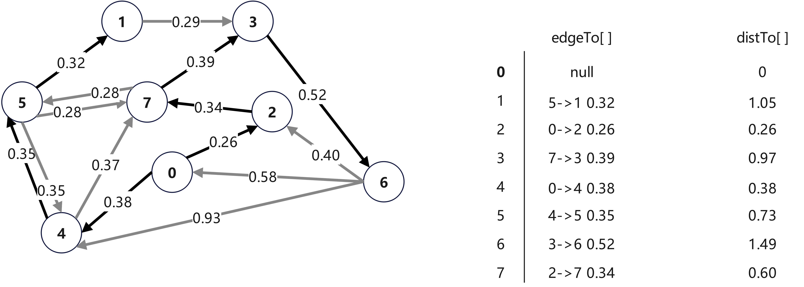
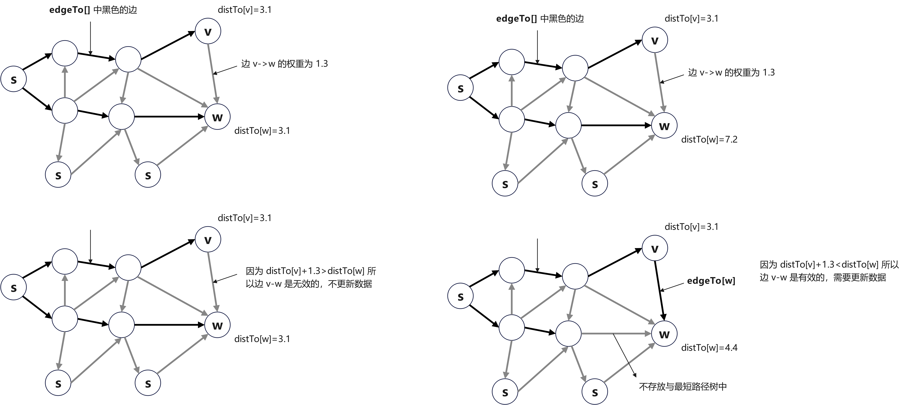

# 第7章 图

## 7.4 加权有向图定义及实现

### 7.4.1 最短路径

在日常生活的图处理中，地图导航是我们日常生活中必不可少的。关于地图导航，我们可以抽象得到对应的图模型：图的顶点对应于交叉路口，边对应公路，边的权重对应经过该路段的成本（可以是时间、距离或者油耗等），边的方向对应于公路的通行方向。这样的图模型就是加权有向图，在加权有向图模型中，地图导航的问题就可以归纳为：找到从一个顶点到达另一个顶点的成本最小的路径。

在加权有向图中，每条有向路径都有一个与之关联的路径权重，它是路径中的所有边的权重之和。在一幅加权有向图中，从顶点`s`到顶点`t`的<font color="red"><strong>最短路径</strong></font>是所有从`s`到`t`的路径中的权重最小者。现在我们就来思考在给定的加权有向图和起点`s`情况下，是否存在从`s`到目标`v`的一条有向路径，如果有，请找出最短的那条路径。

寻找到`s`到`v`最短路径是单点最短路径问题，那么不仅仅是顶点`v`，还有给定的加权有向图中`s`可以达到的所有顶点的最短路径，这些最短路径组合的结果就是一棵最短路径树。所以，最短路径树包含了顶点`s`到所有可达顶点的最短路径。给定一幅加权有向图和一个顶点`s`，以`s`为起点的一棵最短路径树是图的一幅子图，它包含`s`和从`s`可达的所有顶点。这棵有向树的根结点为`s`，树的每条路径都是有向图中的一条最短路径。

最短路径树一定是存在的，一般来说，从`s`到一个顶点有可能存在两条长度相等的路径。如果出现这种情况，可以删除其中一条路径的最后一条边，如此这般，直到从起点到每个顶点都只有一条路径相连。

### 7.4.2 加权有向图的数据结构

加权有向边比加权无向边更简单一点，因为有向边只有一个方向，定义`MyDirectedEdge`类`API`如下所示;

|public class|**MyDirectedEdge**||
|--:|:--|:--|
||MyDirectedEdge(int v, int w, double weight)|加权有向边构造函数|
|double|weight()|边的权重|
|int|from()|这条有向边指出的顶点|
|int|to()|这条有向边指向的顶点|
|String|toString()|对象的字符串表示|

代码如下所示：

```java
    public static class MyDirectedEdge {
        private final int v;
        private final int w;
        private final double weight;

        /**
         * @param v
         * @param w
         * @param weight
         */
        public MyDirectedEdge(int v, int w, double weight) {
            if (v < 0)
                throw new IllegalArgumentException("Vertex names must be non-negative integers");
            if (w < 0)
                throw new IllegalArgumentException("Vertex names must be non-negative integers");
            if (Double.isNaN(weight))
                throw new IllegalArgumentException("Weight is NaN");

            this.v = v;
            this.w = w;
            this.weight = weight;
        }

        public double weight() {
            return weight;
        }

        public int from() {
            return v;
        }

        public int to() {
            return w;
        }

        public String toString() {
            return v + "->" + w + " " + String.format("%5.2f", weight);
        }

    }
```

在`MyDirectedEdge`的基础上，定义加权有向图`MyEdgeWeightedDigraph`类的`API`如下表所示：

|public class|**MyEdgeWeightedDigraph**||
|--:|:--|:--|
||MyEdgeWeightedDigraph(int V)|构造一幅含有 V 个顶点的空图|
||MyEdgeWeightedDigraph(Scanner in)|从输入流中读取图|
||MyEdgeWeightedDigraph(MyEdgeWeightedDigraph graph)|深度拷贝|
|int|V()|图的顶点数|
|int|E()|图的边数|
|void|addEdge(MyDirectedEdge e)|向图中添加一条边|
|Iterable\<MyDirectedEdge>|adj(int v)|从顶点 v 指出的边|
|Iterable\<MyDirectedEdge>|edges()|获取图的所有边|
|int|inDegree(int v)|顶点 v 的入度|
|int|outDegree(int v)|顶点 v 的出度|
|String|toString()|对象的字符串表示|
|void|draw()|加权无向图可视化|

### 7.4.3 最短路径 API

对于最短路径`API`，设计类`MyShortestPath`，提供的方法如下定义：

|public class|**MyShortestPath**||
|--:|:--|:--|
||MyShortestPath(MyEdgeWeightedDigraph graph, int s)|构造函数|
|double|distTo(int v)|从顶点 s 到 v 的距离，如果不存在则路径无穷大|
|double|hasPathTo(int v)|是否存在从顶点 s 到 v 的路径|
|Iterable\<MyDirectedEdge>|pathTo(int v)|从顶点 s 到 v 的路径，如果不存在则为 null|

### 7.4.4 最短路径数据结构

为表示最短路径，使用`edgeTo`和`distTo`两个数组，`edge[v]`表示达到`v`的上一条边，`distTo[v]`表示从顶点`s`到顶点`v`的最短路径权重。具体案例，如下图所示：



我们约定：对于起点`s`，`edgeTo[s]`的值为`null`，`distTo[s]`的值为 $0$ ；对于起点的不可到达顶点`v`，`edgeTo[v]`的值为`null`，`distTo[v]`的值为 `Double.POSITIVE_INFINITY`。

### 7.4.5 松弛操作

#### 7.4.5.1 边的松弛

一开始我们只知道图的顶点，图的边以及它们的权重，`distTo[]`中只有起点所对应的元素值为 $0$，其余元素均被初始化为`Double.POSITIVE_INFINITY`。随着算法的进行，将起点到其它顶点的最短路径存入了`edgeTo[]`和`distTo[]`数组中。在遇到新的边时，通过更新这些信息就可以得到新的最短路径。假设现在已经有两个顶点`v`和`w`，已有`edgeTo[v]`、`edgeTo[w]`、`distTo[v]`和`distTo[w]`，下一步即将遇到新边`v->w`，这时，会出现两种情况，示意图如下所示：



代码如下：

```java
private void relax(MyDirectedEdge e){
    int v = e.from(), w = e.to();
    if(distTo[w] > distTo[v] + e.weight()){
        distTo[w] = distTo[v] + e.weight();
        edgeTo[w] = e;
    }
}
```

#### 7.4.5.2 顶点的松弛

关于边的松弛，实际上会放松从一个给定顶点指出的所有边。代码如下所示：

```java
private void relax(MyEdgeWeightedDigraph graph, int v){
    for(MyDirectedEdge e : graph.adj(v)){
        int w = e.to();
        if(distTo[w] > distTo[v] + e.weight()){
            distTo[w] = distTo[v] + e.weight();
            edgeTo[w] = e;
        }
    }
}
```

每次顶点的松弛操作都能得到到达某个顶点的更短路径，随着越来越多顶点执行松弛操作，距离实现我们找出每个顶点的最短路径目标也越来越近。

### 7.4.6 最优性条件

什么是**最优性条件**呢？令 $G$ 是一幅加权有向图，顶点 $s$ 是 $G$ 中的起点，`distTo[]`是一个由顶点索引的数组，保存的是 $G$ 中路径的长度。对于从`s`可达的所有顶点`v`，`distTo[v]`的值是从`s`到`v`的某条路径的长度，对于从`s`不可达的所有顶点`v`，该值为无穷大。当且仅当对于从`v`到`w`的任意一条边`e`，这些值都满足`distTo[w]<=distTo[v]+e.weight()`时，它们是最短路径的长度。

### 7.4.7 Dijkstra 算法

### 7.4.8 无环加权有向图中最短路径

### 7.4.9 Bellman-Ford 算法

### 7.4.10 最短路径算法总结

### 7.4.11 最短路径问题

#### 7.4.11.1 两点最短路径

#### 7.4.11.2 多起点最短路径

#### 7.4.11.3 两个顶点集合最短路径

### 7.4.12 最长路径问题

### 7.4.13 调度问题

#### 7.4.13.1 优先级条件下限制

#### 7.4.13.2 相对最后期限限制
