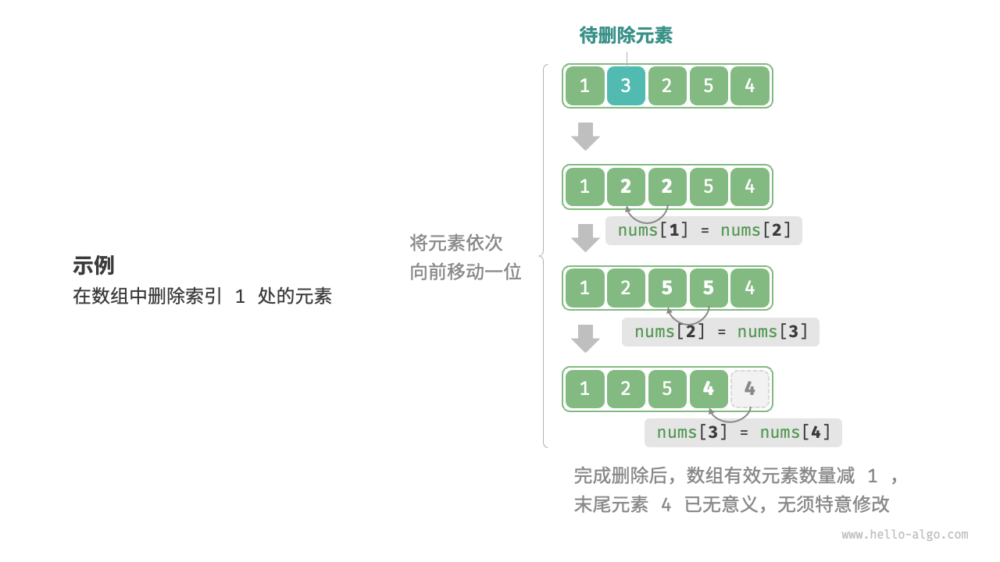

## 3.1 数组

数组（`array`）是一种线性数据结构，其将**相同类型的元素存储在连续的内存空间**中，也就是说，数组表示固定长度的同种数据类型的多条记录，这些数据在内存中连续存放。比如，一个自然数可以用一个整数类型数据表示， $100$ 个连续的自然数可以用一个长度为 $100$ 的整数数组表示。一个字符可以用一个`char`类型数据表示，一段文字可以用一个`char`数组表示。我们将元素在数组中的位置称为该元素的索引（`index`）。


`Java`中，数组是对象类型。数组的长度虽然可以动态确定，但定了之后就不可以变。数组有一个`length`属性，但只能读，不能改。

### 3.1.1 数组常用操作

#### 3.1.1.1 数组定义、赋值和初始化

```java
int[] arrayDeclare; // 声明数组
int[] arrayA = {1,2,3}; // 数组赋值
int[] arrayB = new int[]{1,2,3}; // 数组赋值
int[] arrayC = new int[3]; // 给定长度，如果没有赋值，则为数组元素类型的默认值，int 型为 0，所以数组为：{0, 0, 0}
arrayC[0]=1; arrayC[1]=2; arrayC[2]=3; // {1, 2, 3}
```

#### 3.1.1.2 访问元素

数组元素被存储在连续的内存空间中，这意味着计算数组元素的内存地址非常容易。给定数组内存地址（首元素内存地址）和某个元素的索引，我们可以使用下图所示的公式计算得到该元素的内存地址，从而直接访问该元素。


数组首个元素的索引为 $0$ ，这似乎有些反直觉，因为从 $1$ 开始计数会更自然。但从地址计算公式的角度看，索引本质上是内存地址的偏移量。首个元素的地址偏移量是 $0$ ，因此它的索引为 $0$ 是合理的。

在数组中访问元素非常高效，我们可以在 $O(1)$ 时间内随机访问数组中的任意一个元素。

```java
    /**
     * 随机获取一个元素
     * 
     * @return
     */
    public E randomAccess() {
        if (isEmpty()) {
            throw new RuntimeException("MyArray is empty");
        }
        int randomIndex = ThreadLocalRandom.current().nextInt(size);
        return elementData(randomIndex);

    }

    @SuppressWarnings("unchecked")
    E elementData(int index) {
        return (E) elementData[index];
    }
```

#### 3.1.1.3 添加元素

数组元素在内存中是“紧挨着的”，它们之间没有空间再存放任何数据。如下图所示，如果想在数组中间插入一个元素，则需要将该元素之后的所有元素都向后移动一位，之后再把元素赋值给该索引。


值得注意的是，由于数组的长度是固定的，因此插入一个元素需要判断数组`size`是否越界。

```java
    public void add(E element, int index) {
        rangeCheckForAdd(index);
        if (isFull()) {
            throw new RuntimeException("array is full, forbid adding");
        }
        System.arraycopy(elementData, index, elementData, index + 1,
                size - index);
        elementData[index] = element;
        size++;
    }
    private void rangeCheckForAdd(int index) {
        if (index > size || index < 0)
            throw new IndexOutOfBoundsException(outOfBoundsMsg(index));
    }

    public boolean isFull() {
        return size + 1 == elementData.length;
    }
```

#### 3.1.1.4 删除元素

同理，如下图所示，若想删除索引 $index$ 处的元素，则需要把索引 $index$ 之后的元素都向前移动一位。



请注意，删除元素完成后，原先末尾的元素变得“无意义”了，所以我们无须特意去修改它，只需修改`size`值即可。

```java
    public E remove(int index) {
        rangeCheck(index);

        E oldValue = elementData(index);

        int numMoved = --size - index;
        if (numMoved > 0)
            System.arraycopy(elementData, index + 1, elementData, index,
                    numMoved);
        return oldValue;
    }

    public boolean remove(Object o) {
        if (o == null) {
            for (int index = 0; index < size; index++)
                if (elementData[index] == null) {
                    remove(index);
                    return true;
                }
        } else {
            for (int index = 0; index < size; index++)
                if (o.equals(elementData[index])) {
                    remove(index);
                    return true;
                }
        }
        return false;
    }
```

总的来看，数组的插入与删除操作有以下缺点。

1. 时间复杂度高：数组的插入和删除的平均时间复杂度均为 $O(n)$ ，其中 $n$ 为数组长度。
2. 内存浪费：我们可以初始化一个比较长的数组，只用前面一部分，这样在插入数据时，丢失的末尾元素都是“无意义”的，但这样做会造成部分内存空间浪费。

#### 3.1.1.5 遍历迭代数组

在大多数编程语言中，我们既可以通过索引遍历数组，也可以通过迭代器遍历获取数组中的每个元素：

```java
    public Iterator<E> iterator() {
        return new Itr();
    }

    private class Itr implements Iterator<E> {
        int cursor; // index of next element to return
        int lastRet = -1; // index of last element returned; -1 if no such
        int expectedModCount = modCount;

        Itr() {
        }

        public boolean hasNext() {
            return cursor != size;
        }

        @SuppressWarnings("unchecked")
        public E next() {
            checkForComodification();
            int i = cursor;
            if (i >= size)
                throw new NoSuchElementException();
            Object[] elementData = MyArray.this.elementData;
            if (i >= elementData.length)
                throw new ConcurrentModificationException();
            cursor = i + 1;
            return (E) elementData[lastRet = i];
        }

        public void remove() {
            if (lastRet < 0)
                throw new IllegalStateException();
            checkForComodification();

            try {
                MyArray.this.remove(lastRet);
                cursor = lastRet;
                lastRet = -1;
                expectedModCount = modCount;
            } catch (IndexOutOfBoundsException ex) {
                throw new ConcurrentModificationException();
            }
        }

        @Override
        @SuppressWarnings("unchecked")
        public void forEachRemaining(Consumer<? super E> consumer) {
            Objects.requireNonNull(consumer);
            final int size = MyArray.this.size;
            int i = cursor;
            if (i >= size) {
                return;
            }
            final Object[] elementData = MyArray.this.elementData;
            if (i >= elementData.length) {
                throw new ConcurrentModificationException();
            }
            while (i != size && modCount == expectedModCount) {
                consumer.accept((E) elementData[i++]);
            }
            // update once at end of iteration to reduce heap write traffic
            cursor = i;
            lastRet = i - 1;
            checkForComodification();
        }

        final void checkForComodification() {
            if (modCount != expectedModCount)
                throw new ConcurrentModificationException();
        }
    }
```

遍历中，自定义了一个迭代器：`Itr`，达到遍历的目的。

#### 3.1.1.6 查找元素

在数组中查找指定元素需要遍历数组，每轮判断元素值是否匹配，若匹配则输出对应索引。因为数组是线性数据结构，所以上述查找操作被称为“线性查找”，时间复杂度为 $n$。

```java
    public int indexOf(Object o) {
        if (o == null) {
            for (int i = 0; i < size; i++)
                if (elementData[i] == null)
                    return i;
        } else {
            for (int i = 0; i < size; i++)
                if (o.equals(elementData[i]))
                    return i;
        }
        return -1;
    }

    public int lastIndexOf(Object o) {
        if (o == null) {
            for (int i = size - 1; i >= 0; i--)
                if (elementData[i] == null)
                    return i;
        } else {
            for (int i = size - 1; i >= 0; i--)
                if (o.equals(elementData[i]))
                    return i;
        }
        return -1;
    }

    public boolean contains(Object o) {
        return indexOf(o) >= 0;
    }
```

### 3.1.2 数组的优点与局限性

数组存储在连续的内存空间内，且元素类型相同。这种做法包含丰富的先验信息，系统可以利用这些信息来优化数据结构的操作效率。

+ **空间效率高**：数组为数据分配了连续的内存块，无须额外的结构开销。
+ **支持随机访问**：数组允许在 $O(1)$ 时间内访问任何元素。
+ **缓存局部性**：当访问数组元素时，计算机不仅会加载它，还会缓存其周围的其他数据，从而借助高速缓存来提升后续操作的执行速度。

连续空间存储是一把双刃剑，其存在以下局限性。

+ **插入与删除效率低**：当数组中元素较多时，插入与删除操作需要移动大量的元素。
+ **长度不可变**：数组在初始化后长度就固定了，不可改变。
+ **空间浪费**：如果数组分配的大小超过实际所需，那么多余的空间就被浪费了。

### 3.1.3 数组典型应用

数组是一种基础且常见的数据结构，既频繁应用在各类算法之中，也可用于实现各种复杂数据结构。

+ **随机访问**：如果我们想随机抽取一些样本，那么可以用数组存储，并生成一个随机序列，根据索引实现随机抽样。
+ **排序和搜索**：数组是排序和搜索算法最常用的数据结构。快速排序、归并排序、二分查找等都主要在数组上进行。
+ **查找表**：当需要快速查找一个元素或其对应关系时，可以使用数组作为查找表。假如我们想实现字符到 ASCII 码的映射，则可以将字符的 ASCII 码值作为索引，对应的元素存放在数组中的对应位置。
+** 机器学习**：神经网络中大量使用了向量、矩阵、张量之间的线性代数运算，这些数据都是以数组的形式构建的。数组是神经网络编程中最常使用的数据结构。
+ **数据结构实现**：数组可以用于实现栈、队列、哈希表、堆、图等数据结构。例如，图的邻接矩阵表示实际上是一个二维数组。