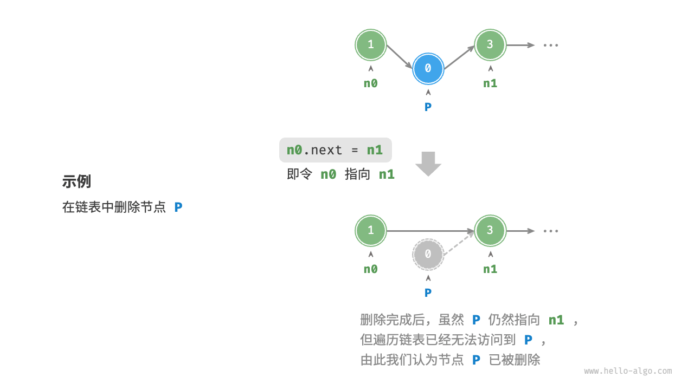
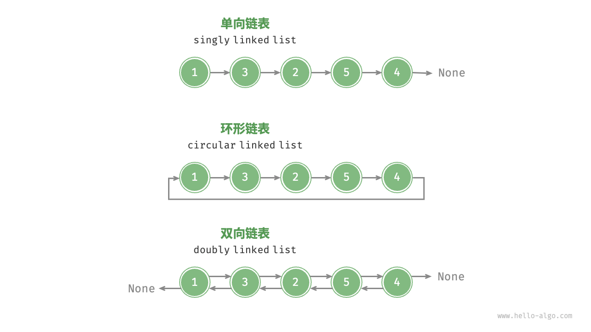

## 3.2 3.2 链表实现列表

内存空间是所有程序的公共资源，在一个复杂的系统运行环境下，空闲的内存空间可能散落在内存各处。我们知道，存储数组的内存空间必须是连续的，而当数组非常大时，内存可能无法提供如此大的连续空间。此时链表的灵活性优势就体现出来了。

链表（`linked list`）是一种线性数据结构，其中的每个元素都是一个节点对象，各个节点通过“引用”相连接。引用记录了下一个节点的内存地址，通过它可以从当前节点访问到下一个节点。

链表的设计使得各个节点可以分散存储在内存各处，它们的内存地址无须连续。


观察上图，链表的组成单位是节点（`node`）对象。每个节点都包含两项数据：节点的“值”和指向下一节点的“引用”。

+ 链表的首个节点被称为“头节点”，最后一个节点被称为“尾节点”。
+ 尾节点指向的是“空”，在`Java`中分别被记为`null`。

如以下代码所示，链表节点`ListNode`除了包含值，还需额外保存一个引用（指针）。因此在相同数据量下，**链表比数组占用更多的内存空间**。

```java
/* 链表节点类 */
class ListNode {
    int val;        // 节点值
    ListNode next;  // 指向下一节点的引用
    ListNode(int x) { val = x; }  // 构造函数
}
```

### 3.2.1 链表常用操作

#### 3.2.1.1 初始化链表

建立链表分为两步，第一步是初始化各个节点对象，第二步是构建节点之间的引用关系。初始化完成后，我们就可以从链表的头节点出发，通过引用指向`next`依次访问所有节点。

```java
/* 初始化链表 1 -> 3 -> 2 -> 5 -> 4 */
// 初始化各个节点
ListNode n0 = new ListNode(1);
ListNode n1 = new ListNode(3);
ListNode n2 = new ListNode(2);
ListNode n3 = new ListNode(5);
ListNode n4 = new ListNode(4);
// 构建节点之间的引用
n0.next = n1;
n1.next = n2;
n2.next = n3;
n3.next = n4;
```

数组整体是一个变量，比如数组`nums`包含元素`nums[0]`和`nums[1]`等，而链表是由多个独立的节点对象组成的。我们通常将头节点当作链表的代称，比如以上代码中的链表可记作链表 `n0`。实际应用中，常使用变量`head`存储头节点。

#### 3.2.1.2 插入节点

在链表中插入节点非常容易。如下图所示，假设我们想在相邻的两个节点`n0`和`n1`之间插入一个新节点`P`，则只需改变两个节点引用（指针）即可，时间复杂度为 O(1) 。

相比之下，在数组中插入元素的时间复杂度为`O(n)`，在大量数据下的效率较低。


```java
/* 在链表的节点 n0 之后插入节点 P */
void insert(ListNode n0, ListNode P) {
    ListNode n1 = n0.next;
    P.next = n1;
    n0.next = P;
}
```

#### 3.2.1.3 删除节点

如下图所示，在链表中删除节点也非常方便，只需改变一个节点的引用（指针）即可。请注意，尽管在删除操作完成后节点`P`仍然指向`n1`，但实际上遍历此链表已经无法访问到`P`，这意味着`P`已经不再属于该链表了。



```java
/* 删除链表的节点 n0 之后的首个节点 */
void remove(ListNode n0) {
    if (n0.next == null)
        return;
    // n0 -> P -> n1
    ListNode P = n0.next;
    ListNode n1 = P.next;
    n0.next = n1;
}
```

#### 3.2.1.4 访问节点

在链表中访问节点的效率较低。我们可以在 $O(1)$ 时间下访问数组中的任意元素。链表则不然，程序需要从头节点出发，逐个向后遍历，直至找到目标节点。也就是说，访问链表的第 $i$ 个节点需要循环 $i-1$ 轮，时间复杂度为 $O(n)$ 。

```java
/* 访问链表中索引为 index 的节点 */
ListNode access(ListNode head, int index) {
    for (int i = 0; i < index; i++) {
        if (head == null)
            return null;
        head = head.next;
    }
    return head;
}
```

#### 3.2.1.4 查找节点

遍历链表，查找其中值为`target`的节点，输出该节点在链表中的索引。此过程也属于线性查找。代码如下所示：

```java
/* 在链表中查找值为 target 的首个节点 */
int find(ListNode head, int target) {
    int index = 0;
    while (head != null) {
        if (head.val == target)
            return index;
        head = head.next;
        index++;
    }
    return -1;
}
```

### 3.2.2 数组 VS. 链表

<table>
<thead>
<tr>
<th></th>
<th>数组</th>
<th>链表</th>
</tr>
</thead>
<tbody>
<tr>
<td>存储方式</td>
<td>连续内存空间</td>
<td>分散内存空间</td>
</tr>
<tr>
<td>容量扩展</td>
<td>长度不可变</td>
<td>可灵活扩展</td>
</tr>
<tr>
<td>内存效率</td>
<td>元素占用内存少、但可能浪费空间</td>
<td>元素占用内存多</td>
</tr>
<tr>
<td>访问元素</td>
<td><span ><mjx-container  jax="CHTML" style="font-size: 122.9%; position: relative;"><mjx-math class="MJX-TEX" aria-hidden="true"><mjx-mi class="mjx-i"><mjx-c class="mjx-c1D442 TEX-I"></mjx-c></mjx-mi><mjx-mo class="mjx-n"><mjx-c class="mjx-c28"></mjx-c></mjx-mo><mjx-mn class="mjx-n"><mjx-c class="mjx-c31"></mjx-c></mjx-mn><mjx-mo class="mjx-n"><mjx-c class="mjx-c29"></mjx-c></mjx-mo></mjx-math><mjx-assistive-mml unselectable="on" display="inline"><mjx-container  jax="CHTML" style="font-size: 122.9%; position: relative;"><mjx-math class="MJX-TEX" aria-hidden="true"><mjx-mi class="mjx-i"><mjx-c class="mjx-c1D442 TEX-I"></mjx-c></mjx-mi><mjx-mo class="mjx-n"><mjx-c class="mjx-c28"></mjx-c></mjx-mo><mjx-mn class="mjx-n"><mjx-c class="mjx-c31"></mjx-c></mjx-mn><mjx-mo class="mjx-n"><mjx-c class="mjx-c29"></mjx-c></mjx-mo></mjx-math><mjx-assistive-mml unselectable="on" display="inline"><math xmlns="http://www.w3.org/1998/Math/MathML"><mi>O</mi><mo stretchy="false">(</mo><mn>1</mn><mo stretchy="false">)</mo></math></mjx-assistive-mml></mjx-container></mjx-assistive-mml></mjx-container></span></td>
<td><span ><mjx-container  jax="CHTML" style="font-size: 122.9%; position: relative;"><mjx-math class="MJX-TEX" aria-hidden="true"><mjx-mi class="mjx-i"><mjx-c class="mjx-c1D442 TEX-I"></mjx-c></mjx-mi><mjx-mo class="mjx-n"><mjx-c class="mjx-c28"></mjx-c></mjx-mo><mjx-mi class="mjx-i"><mjx-c class="mjx-c1D45B TEX-I"></mjx-c></mjx-mi><mjx-mo class="mjx-n"><mjx-c class="mjx-c29"></mjx-c></mjx-mo></mjx-math><mjx-assistive-mml unselectable="on" display="inline"><mjx-container  jax="CHTML" style="font-size: 122.9%; position: relative;"><mjx-math class="MJX-TEX" aria-hidden="true"><mjx-mi class="mjx-i"><mjx-c class="mjx-c1D442 TEX-I"></mjx-c></mjx-mi><mjx-mo class="mjx-n"><mjx-c class="mjx-c28"></mjx-c></mjx-mo><mjx-mi class="mjx-i"><mjx-c class="mjx-c1D45B TEX-I"></mjx-c></mjx-mi><mjx-mo class="mjx-n"><mjx-c class="mjx-c29"></mjx-c></mjx-mo></mjx-math><mjx-assistive-mml unselectable="on" display="inline"><math xmlns="http://www.w3.org/1998/Math/MathML"><mi>O</mi><mo stretchy="false">(</mo><mi>n</mi><mo stretchy="false">)</mo></math></mjx-assistive-mml></mjx-container></mjx-assistive-mml></mjx-container></span></td>
</tr>
<tr>
<td>添加元素</td>
<td><span ><mjx-container  jax="CHTML" style="font-size: 122.9%; position: relative;"><mjx-math class="MJX-TEX" aria-hidden="true"><mjx-mi class="mjx-i"><mjx-c class="mjx-c1D442 TEX-I"></mjx-c></mjx-mi><mjx-mo class="mjx-n"><mjx-c class="mjx-c28"></mjx-c></mjx-mo><mjx-mi class="mjx-i"><mjx-c class="mjx-c1D45B TEX-I"></mjx-c></mjx-mi><mjx-mo class="mjx-n"><mjx-c class="mjx-c29"></mjx-c></mjx-mo></mjx-math><mjx-assistive-mml unselectable="on" display="inline"><mjx-container  jax="CHTML" style="font-size: 122.9%; position: relative;"><mjx-math class="MJX-TEX" aria-hidden="true"><mjx-mi class="mjx-i"><mjx-c class="mjx-c1D442 TEX-I"></mjx-c></mjx-mi><mjx-mo class="mjx-n"><mjx-c class="mjx-c28"></mjx-c></mjx-mo><mjx-mi class="mjx-i"><mjx-c class="mjx-c1D45B TEX-I"></mjx-c></mjx-mi><mjx-mo class="mjx-n"><mjx-c class="mjx-c29"></mjx-c></mjx-mo></mjx-math><mjx-assistive-mml unselectable="on" display="inline"><math xmlns="http://www.w3.org/1998/Math/MathML"><mi>O</mi><mo stretchy="false">(</mo><mi>n</mi><mo stretchy="false">)</mo></math></mjx-assistive-mml></mjx-container></mjx-assistive-mml></mjx-container></span></td>
<td><span ><mjx-container  jax="CHTML" style="font-size: 122.9%; position: relative;"><mjx-math class="MJX-TEX" aria-hidden="true"><mjx-mi class="mjx-i"><mjx-c class="mjx-c1D442 TEX-I"></mjx-c></mjx-mi><mjx-mo class="mjx-n"><mjx-c class="mjx-c28"></mjx-c></mjx-mo><mjx-mn class="mjx-n"><mjx-c class="mjx-c31"></mjx-c></mjx-mn><mjx-mo class="mjx-n"><mjx-c class="mjx-c29"></mjx-c></mjx-mo></mjx-math><mjx-assistive-mml unselectable="on" display="inline"><mjx-container  jax="CHTML" style="font-size: 122.9%; position: relative;"><mjx-math class="MJX-TEX" aria-hidden="true"><mjx-mi class="mjx-i"><mjx-c class="mjx-c1D442 TEX-I"></mjx-c></mjx-mi><mjx-mo class="mjx-n"><mjx-c class="mjx-c28"></mjx-c></mjx-mo><mjx-mn class="mjx-n"><mjx-c class="mjx-c31"></mjx-c></mjx-mn><mjx-mo class="mjx-n"><mjx-c class="mjx-c29"></mjx-c></mjx-mo></mjx-math><mjx-assistive-mml unselectable="on" display="inline"><math xmlns="http://www.w3.org/1998/Math/MathML"><mi>O</mi><mo stretchy="false">(</mo><mn>1</mn><mo stretchy="false">)</mo></math></mjx-assistive-mml></mjx-container></mjx-assistive-mml></mjx-container></span></td>
</tr>
<tr>
<td>删除元素</td>
<td><span ><mjx-container  jax="CHTML" style="font-size: 122.9%; position: relative;"><mjx-math class="MJX-TEX" aria-hidden="true"><mjx-mi class="mjx-i"><mjx-c class="mjx-c1D442 TEX-I"></mjx-c></mjx-mi><mjx-mo class="mjx-n"><mjx-c class="mjx-c28"></mjx-c></mjx-mo><mjx-mi class="mjx-i"><mjx-c class="mjx-c1D45B TEX-I"></mjx-c></mjx-mi><mjx-mo class="mjx-n"><mjx-c class="mjx-c29"></mjx-c></mjx-mo></mjx-math><mjx-assistive-mml unselectable="on" display="inline"><mjx-container  jax="CHTML" style="font-size: 122.9%; position: relative;"><mjx-math class="MJX-TEX" aria-hidden="true"><mjx-mi class="mjx-i"><mjx-c class="mjx-c1D442 TEX-I"></mjx-c></mjx-mi><mjx-mo class="mjx-n"><mjx-c class="mjx-c28"></mjx-c></mjx-mo><mjx-mi class="mjx-i"><mjx-c class="mjx-c1D45B TEX-I"></mjx-c></mjx-mi><mjx-mo class="mjx-n"><mjx-c class="mjx-c29"></mjx-c></mjx-mo></mjx-math><mjx-assistive-mml unselectable="on" display="inline"><math xmlns="http://www.w3.org/1998/Math/MathML"><mi>O</mi><mo stretchy="false">(</mo><mi>n</mi><mo stretchy="false">)</mo></math></mjx-assistive-mml></mjx-container></mjx-assistive-mml></mjx-container></span></td>
<td><span ><mjx-container  jax="CHTML" style="font-size: 122.9%; position: relative;"><mjx-math class="MJX-TEX" aria-hidden="true"><mjx-mi class="mjx-i"><mjx-c class="mjx-c1D442 TEX-I"></mjx-c></mjx-mi><mjx-mo class="mjx-n"><mjx-c class="mjx-c28"></mjx-c></mjx-mo><mjx-mn class="mjx-n"><mjx-c class="mjx-c31"></mjx-c></mjx-mn><mjx-mo class="mjx-n"><mjx-c class="mjx-c29"></mjx-c></mjx-mo></mjx-math><mjx-assistive-mml unselectable="on" display="inline"><mjx-container  jax="CHTML" style="font-size: 122.9%; position: relative;"><mjx-math class="MJX-TEX" aria-hidden="true"><mjx-mi class="mjx-i"><mjx-c class="mjx-c1D442 TEX-I"></mjx-c></mjx-mi><mjx-mo class="mjx-n"><mjx-c class="mjx-c28"></mjx-c></mjx-mo><mjx-mn class="mjx-n"><mjx-c class="mjx-c31"></mjx-c></mjx-mn><mjx-mo class="mjx-n"><mjx-c class="mjx-c29"></mjx-c></mjx-mo></mjx-math><mjx-assistive-mml unselectable="on" display="inline"><math xmlns="http://www.w3.org/1998/Math/MathML"><mi>O</mi><mo stretchy="false">(</mo><mn>1</mn><mo stretchy="false">)</mo></math></mjx-assistive-mml></mjx-container></mjx-assistive-mml></mjx-container></span></td>
</tr>
</tbody>
</table>

### 3.2.3 常见链表类型

如下图所示，常见的链表类型包括三种。

+ **单向链表**：即前面介绍的普通链表。单向链表的节点包含值和指向下一节点的引用两项数据。我们将首个节点称为头节点，将最后一个节点称为尾节点，尾节点指向空`null`。
+ **环形链表**：如果我们令单向链表的尾节点指向头节点（首尾相接），则得到一个环形链表。在环形链表中，任意节点都可以视作头节点。
+ **双向链表**：与单向链表相比，双向链表记录了两个方向的引用。双向链表的节点定义同时包含指向后继节点（下一个节点）和前驱节点（上一个节点）的引用（指针）。相较于单向链表，双向链表更具灵活性，可以朝两个方向遍历链表，但相应地也需要占用更多的内存空间。



### 3.2.4 链表典型应用

单向链表通常用于实现栈、队列、哈希表和图等数据结构。

* **栈与队列**：当插入和删除操作都在链表的一端进行时，它表现出先进后出的特性，对应栈；当插入操作在链表的一端进行，删除操作在链表的另一端进行，它表现出先进先出的特性，对应队列。
+ **哈希表**：链式地址是解决哈希冲突的主流方案之一，在该方案中，所有冲突的元素都会被放到一个链表中。
+ **图**：邻接表是表示图的一种常用方式，其中图的每个顶点都与一个链表相关联，链表中的每个元素都代表与该顶点相连的其他顶点。

双向链表常用于需要快速查找前一个和后一个元素的场景。

+ **高级数据结构**：比如在红黑树、`B`树中，我们需要访问节点的父节点，这可以通过在节点中保存一个指向父节点的引用来实现，类似于双向链表。
+ 浏览器历史：在网页浏览器中，当用户点击前进或后退按钮时，浏览器需要知道用户访问过的前一个和后一个网页。双向链表的特性使得这种操作变得简单。
+ **LRU算法**：在缓存淘汰（`LRU`）算法中，我们需要快速找到最近最少使用的数据，以及支持快速添加和删除节点。这时候使用双向链表就非常合适。

环形链表常用于需要周期性操作的场景，比如操作系统的资源调度。

* **时间片轮转调度算法**：在操作系统中，时间片轮转调度算法是一种常见的 `CPU` 调度算法，它需要对一组进程进行循环。每个进程被赋予一个时间片，当时间片用完时，`CPU` 将切换到下一个进程。这种循环操作可以通过环形链表来实现。
* **数据缓冲区**：在某些数据缓冲区的实现中，也可能会使用环形链表。比如在音频、视频播放器中，数据流可能会被分成多个缓冲块并放入一个环形链表，以便实现无缝播放。

### 3.2.5 实现列表

使用单向链表实现一个列表。

#### 3.2.5.1 内部组成

```java
    // 列表大小
    transient int size = 0;

    /**
     * 头节点引用
     */
    transient Node<E> head;

    /**
     * 尾节点引用
     */
    transient Node<E> tail;

    // 单向链表节点定义
    private static class Node<E> {
        E item;
        Node<E> next;

        Node(E element, Node<E> next) {
            this.item = element;
            this.next = next;
        }
    }

    /**
     * 列表被修改次数，主要用于迭代时列表是否发生修改
     */
    protected transient int modCount = 0;
```

#### 3.2.5.2 构造器

```java
    // MARK:Constructors

    /**
     * 构造空列表
     */
    public MyLinkedList() {
    }

    /**
     * 从列表中构造一个链表列表
     *
     * @param c 构造链表列表源列表
     * @throws NullPointerException 如果列表为空
     */
    public MyLinkedList(MyList<? extends E> c) {
        this();
        addAll(c);
    }
```

#### 3.2.5.3 按索引访问操作

```java
    // MARK:Positional Access Operations
    @Override
    public E get(int index) {
        checkPositionIndex(index);
        return node(index).item;
    }

    private Node<E> node(int index) {
        Node<E> x = head;
        for (int i = 0; i < index; i++) {
            x = x.next;
        }
        return x;
    }

    @Override
    public E set(int index, E element) {
        checkElementIndex(index);
        Node<E> x = node(index);
        E oldValue = x.item;
        x.item = element;
        return oldValue;
    }

    private void checkElementIndex(int index) {
        if (!isElementIndex(index)) {
            throw new IndexOutOfBoundsException(outOfBoundsMsg(index));
        }
    }

    private boolean isElementIndex(int index) {
        return index >= 0 && index < size;
    }

    @Override
    public void add(int index, E element) {
        checkPositionIndex(index);

        if (index == size) {
            linkTail(element);
        } else {
            linkBefore(element, index);
        }

    }

    private void linkBefore(E element, int index) {
        Node<E> newNode = new Node<>(element, null);
        if (index == 0) { // 没有前置
            final Node<E> h = head; // 保存头节点
            newNode.next = h;// 接上链表
            head = newNode;
        } else { // 有前置
            Node<E> preX = node(index - 1);
            Node<E> x = preX.next;
            preX.next = newNode;
            newNode.next = x;
        }
        size++;
        modCount++;
    }

    @Override
    public int indexOf(Object o) {
        int index = 0;
        if (o == null) {
            for (Node<E> x = head; x != null; x = x.next) {
                if (x.item == null)
                    return index;
                index++;
            }
        } else {
            for (Node<E> x = head; x != null; x = x.next) {
                if (o.equals(x.item))
                    return index;
                index++;
            }
        }
        return -1;
    }

    @Override
    public int lastIndexOf(Object o) {
        final Object[] l = toArray();
        if (o == null) {
            for (int i = size - 1; i >= 0; i--) {
                if (l[i] == null) {
                    return i;
                }
            }
        } else {
            for (int i = size - 1; i >= 0; i--) {
                if (o.equals(l[i])) {
                    return i;
                }
            }
        }
        return -1;
    }

    @Override
    public E remove(int index) {
        checkElementIndex(index);
        return unlink(index);
    }

    private E unlink(int index) {
        final Node<E> x = node(index);
        final E element = x.item;
        if (head == tail && index == 0 && size == 1) { // 仅有一个节点
            head = tail = null;
        } else if (index == 0) { // 多个节点，删除头节点
            head = head.next;
        } else if (index == size - 1) { // 多个节点，删除尾节点
            tail = node(index - 1);
            tail.next = null;
        } else { // 多个节点非首节点非尾节点
            Node<E> preX = node(index - 1);
            preX.next = x.next;
        }
        size--;
        modCount++;
        return element;
    }

    private String outOfBoundsMsg(int index) {
        return "Index: " + index + ", Size: " + size;
    }

```

#### 3.1.1.4 修改操作

```java
    // MARK:Modification Operations

    @Override
    public boolean add(E e) {
        linkTail(e);
        return true;

    }

    private void linkTail(E e) {
        final Node<E> t = tail; // 保存尾节点位置
        final Node<E> newNode = new Node<>(e, null); // 新建节点
        tail = newNode; // 尾节点更新位置
        if (t == null) { // 如果链表没有元素
            head = newNode; // 初始化头节点
        } else
            t.next = newNode; // 新节点与链表连接
        size++;
        modCount++;
    }

    @Override
    public boolean remove(Object o) {
        int i = 0;
        if (o == null) {
            for (Node<E> x = head; x != null; x = x.next) {
                if (x.item == null) {
                    unlink(i);
                    return true;
                }
                i++;
            }
        } else {
            for (Node<E> x = head; x != null; x = x.next) {
                if (o.equals(x.item)) {
                    unlink(i);
                    return true;
                }
                i++;
            }
        }
        return false;
    }

    // MARK:Query Operations

    @Override
    public int size() {
        return size;
    }

    @Override
    public boolean isEmpty() {
        return size == 0;
    }

    @Override
    public boolean contains(Object o) {
        return indexOf(o) >= 0;
    }

    @Override
    public Iterator<E> iterator() {
        return new Itr();
    }

    private class Itr implements Iterator<E> {
        Node<E> current = head; // 当前节点
        int expectedModCount = modCount;

        @Override
        public boolean hasNext() {
            return current != null;
        }

        @Override
        public E next() {
            checkForComodification();

            E e = current.item;
            current = current.next;
            return e;
        }

        private void checkForComodification() {
            if (modCount != expectedModCount)
                throw new ConcurrentModificationException();
        }
    }

    @Override
    public Object[] toArray() {
        Object[] result = new Object[size];
        int index = 0;
        for (Node<E> x = head; x != null; x = x.next) {
            result[index++] = x.item;
        }
        return result;
    }

    @SuppressWarnings("unchecked")
    @Override
    public <T> T[] toArray(T[] a) {
        if (a.length < size) {
            a = (T[]) java.lang.reflect.Array.newInstance(a.getClass().getComponentType(), size);
        }
        int index = 0;
        Object[] result = a;
        for (Node<E> x = head; x != null; x = x.next) {
            result[index++] = x.item;
        }
        if (a.length > size) {
            a[size] = null;
        }
        return a;
    }
```

#### 3.1.1.5 批量修改操作

```java
    // MARK:Bulk Modification Operations
    
    @Override
    public boolean addAll(MyList<? extends E> l) {
        checkPositionIndex(size);

        Object[] a = l.toArray();
        int numNew = a.length;
        if (numNew == 0) {
            return false;
        }
        Node<E> pred = tail; // 前驱和后继节点

        for (Object o : a) {
            @SuppressWarnings("unchecked")
            E e = (E) o;
            Node<E> newNode = new Node<>(e, null);
            if (pred == null) { // 如果前驱为 null，即头节点 head 为 null
                head = newNode;
            } else {
                pred.next = newNode; // 将 newNode 接入链表中
            }
            pred = newNode;
        }
        tail = pred; // 指定尾节点
        size += numNew;
        modCount++;
        return true;
    }

    private void checkPositionIndex(int index) {
        if (!isPositionIndex(index))
            throw new IndexOutOfBoundsException(outOfBoundsMsg(index));
    }

    private boolean isPositionIndex(int index) {
        return index >= 0 && index <= size;
    }

    @Override
    public void clear() {
        throw new UnsupportedOperationException("Unimplemented method 'checkPositionIndex'");

    }

    @Override
    public boolean containsAll(MyList<?> c) {
        for (Object e : c)
            if (!contains(e))
                return false;
        return true;
    }

    @Override
    public boolean removeAll(MyList<?> c) {
        Objects.requireNonNull(c);
        boolean modified = false;
        int i = 0;
        for (Node<E> x = head; x != null; x = x.next) {
            if (c.contains(x.item)) {
                remove(i--); // 减一个，索引少一个
                modified = true;
            }
            i++;
        }
        return modified;
    }
```

#### 3.1.1.6 比较和哈希

```java
    // MARK:Comparison and hashing

    @Override
    public boolean equals(Object obj) {
        if (this == obj)
            return true;
        if (obj == null)
            return false;
        if (getClass() != obj.getClass())
            return false;
        @SuppressWarnings("rawtypes")
        MyLinkedList other = (MyLinkedList) obj;
        if (size != other.size())
            return false;
        if (!Arrays.deepEquals(toArray(), other.toArray()))
            return false;
        return true;
    }

    @Override
    public int hashCode() {
        final int prime = 31;
        int result = 1;
        result = prime * result + Arrays.deepHashCode(toArray());
        result = prime * result + size;
        return result;
    }

    @Override
    public String toString() {
        return "MyLinkedList [" + Arrays.toString(toArray()) + ", size=" + size + "]";
    }
```