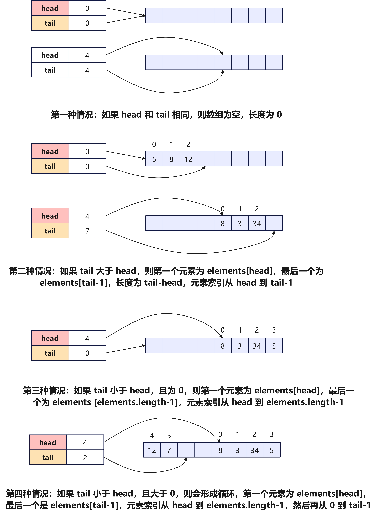

# 第4章 队列和栈

## 4.3 队列的实现

为了实现队列，我们需要一种数据结构，可以在一端添加元素，并在另一端删除元素，链表和数组都符合要求。

### 4.3.1 环形数组实现

为实现队列，这里使用了环形数组（`Ring Buffer`），先介绍一下什么是环形数组。

#### 4.3.1.1 环形数组

对于一般数组，比如`arr`，第一个元素为`arr[0]`，最后一个为`arr[arr.length-1]`。但对于`ArrayDeque`中的数组，它是一个逻辑上的循环数组，所谓循环是指元素到数组尾之后可以接着从数组头开始，数组的长度、第一个和最后一个元素都与`head`和`tail`这两个变量有关，根据`head`和`tail`值之间的大小关系，可以具体分为四种情况：

1. 如果`head`和`tail`相同，则数组为空，长度为$0$。
2. 如果`tail`大于`head`，则第一个元素为`elements[head]`，最后一个为`elements[tail-1]`，长度为`tail-head`，元素索引从`head`到`tail-1`。
3. 如果`tail`小于`head`，且为`0`，则第一个元素为`elements[head]`，最后一个为`elements [elements.length-1]`，元素索引从`head`到`elements.length-1`。
4. 如果`tail`小于`head`，且大于`0`，则会形成循环，第一个元素为`elements[head]`，最后一个是`elements[tail-1]`，元素索引从`head`到`elements.length-1`，然后再从`0`到`tail-1`。

上面情况，根据图示查看温习一遍。



#### 4.3.1.2 动态环形数组实现

使用动态环形数组，代码如下：

```java
import java.util.Iterator;
import java.util.NoSuchElementException;

public class MyResizingArrayQueue<E> implements MyQueue<E> {
    // MARK:Fields

    /**
     * 队列默认初始容量
     */
    private static final int DEFAULT_CAPACITY = 8;

    /**
     * 共享空队列实例
     */
    private static final Object[] EMPTY_ELEMENTDATA = {};

    /**
     * 队列存储数据的数组
     */
    private Object[] elementData;

    /**
     * 队列中元素数量
     */
    private int size;

    /**
     * 队列中队首索引位置
     */
    private int head;

    /**
     * 队列中队尾索引位置
     */
    private int tail;

    // MARK:Constructors

    /**
     * 构造一个空队列
     */
    public MyResizingArrayQueue() {
        elementData = new Object[DEFAULT_CAPACITY]; // 加一，因为 tail 需要占用一个空的位置
        head = tail = size = 0;
    }

    /**
     * 构造一个初始容量为 initialCapacity 的队列
     * 
     * @param initialCapacity
     */
    public MyResizingArrayQueue(int initialCapacity) {
        if (initialCapacity > 0) {
            elementData = new Object[initialCapacity];
            head = tail = size = 0;
        } else if (initialCapacity == 0) {
            elementData = EMPTY_ELEMENTDATA;
        } else {
            throw new IllegalArgumentException("Illegal Capacity: " +
                    initialCapacity);
        }
    }

    // MARK:Queue Operations

    @Override
    public void clear() {
        head = tail = size = 0;
    }

    @SuppressWarnings("unchecked")
    @Override
    public E dequeue() {
        checkIsEmpty();
        E e = (E) elementData[head];
        head = (head + 1) & (elementData.length - 1);
        size--;
        return e;
    }

    @Override
    public void enqueue(E element) {
        elementData[tail] = element;
        size++;
        if ((tail = (tail + 1) % elementData.length) == head)
            doubleCapacity();
    }

    private void doubleCapacity() {
        assert head == tail;
        int p = head;
        int n = elementData.length;
        int r = n - p; // number of elements to the right of p
        int newCapacity = n << 1;
        if (newCapacity < 0) // 如果操作 int 型最大数值
            throw new IllegalStateException("Sorry, deque too big");
        Object[] a = new Object[newCapacity];
        System.arraycopy(elementData, p, a, 0, r);
        System.arraycopy(elementData, 0, a, r, p);
        elementData = a;
        head = 0;
        tail = n;
    }

    private void checkIsEmpty() {
        if (isEmpty()) {
            throw new NoSuchElementException("Queue Underflow");
        }
    }

    @Override
    public boolean isEmpty() {
        return size == 0 && head == tail;
    }

    @SuppressWarnings("unchecked")
    @Override
    public E peek() {
        checkIsEmpty();
        return (E) elementData[head];
    }

    @Override
    public int size() {
        return size;
    }

    @Override
    public Iterator<E> iterator() {
        return new CircularArrayIterator(head, tail);
    }

    private class CircularArrayIterator implements Iterator<E> {
        private int head;
        private int tail;

        /**
         * @param head
         * @param tail
         */
        public CircularArrayIterator(int head, int tail) {
            this.head = head;
            this.tail = tail;
        }

        @Override
        public boolean hasNext() {
            return head != tail;
        }

        @Override
        public E next() {
            @SuppressWarnings("unchecked")
            E e = (E) elementData[head];
            head = (head + 1) % elementData.length;
            return e;
        }

    }
}
```

### 4.3.2 链表实现

```java
import java.util.Iterator;
import java.util.NoSuchElementException;

public class MyLinkedListQueue<E> implements MyQueue<E> {
    // MARK:Fields

    /**
     * 队列中元素数量
     */
    private int size;

    /**
     * 队列中队首节点
     */
    private Node<E> head;

    /**
     * 队列中队尾索引位置
     */
    private Node<E> tail;

    // 单向链表节点定义
    private static class Node<E> {
        E item;
        Node<E> next;

        Node(E element, Node<E> next) {
            this.item = element;
            this.next = next;
        }
    }

    // MARK:Constructors

    /**
     * 构造一个空队列
     */
    public MyLinkedListQueue() {
        head = null;
        size=0;
    }

    // MARK:Queue Operations

    @Override
    public void clear() {
        head = null;
        size=0;
    }

    @Override
    public E dequeue() {
        checkIsEmpty();
        E e = head.item;
        head=head.next;
        size--;
        return e;
    }

    @Override
    public void enqueue(E element) {
        Node<E> newNode = new Node<>(element, null);
        if (head == null) {// 如果没有元素
            head = tail = newNode;
        } else {
            tail.next = newNode; // 连接上链表
            tail = newNode;
        }
        size++;
    }

    private void checkIsEmpty() {
        if (isEmpty()) {
            throw new NoSuchElementException("Queue Underflow");
        }
    }

    @Override
    public boolean isEmpty() {
        return head == null && size==0;
    }

    @Override
    public E peek() {
        checkIsEmpty();
        return head.item;
    }

    @Override
    public int size() {
        return size;
    }

    @Override
    public Iterator<E> iterator() {
        return new LinkedIterator(head);
    }

    private class LinkedIterator implements Iterator<E> {
        private Node<E> current;

        /**
         * @param current
         */
        public LinkedIterator(Node<E> current) {
            this.current = current;
        }

        @Override
        public boolean hasNext() {
            return current != null;
        }

        @Override
        public E next() {
            E e = current.item;
            current = current.next;
            return e;
        }
    }
}
```
