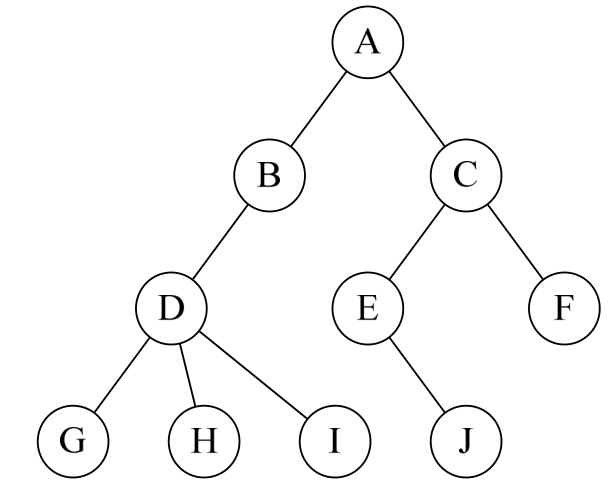
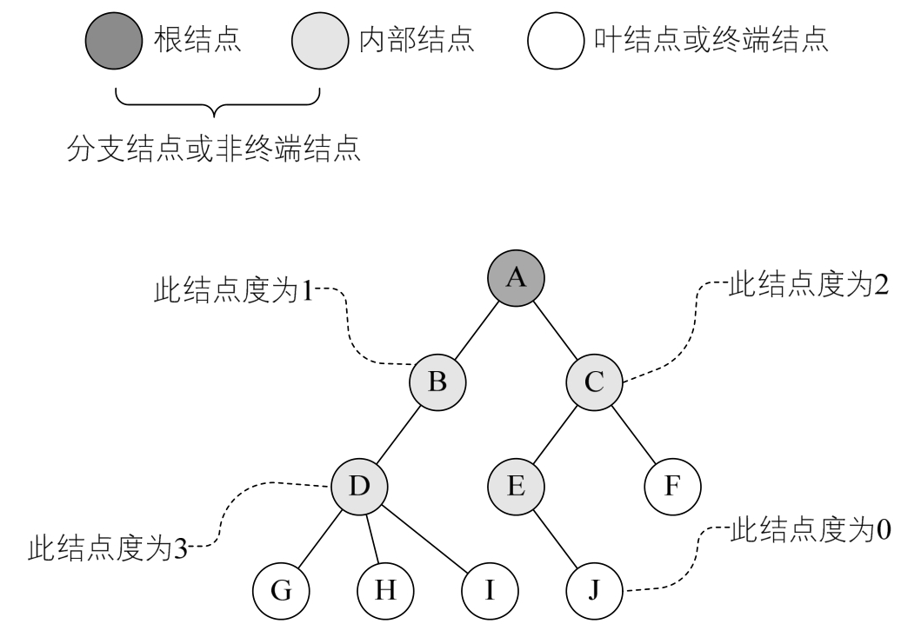
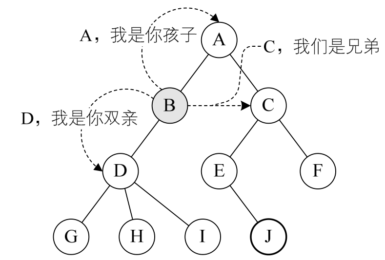
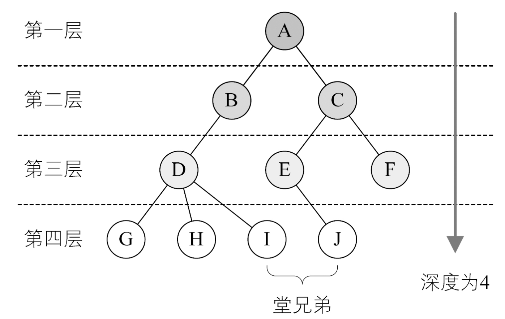

## 6.1 树、二叉树和二叉搜索树的定义

### 6.1.1 树的概念

列表、数组、哈希表等都是一对一的线性结构，可现实中，还有很多一对多的情况需要处理，有一种“树”的数据结构就是这样一种一对多的数据结构。

树（`Tree`）是 $n$ （ $n≥0$ ）个结点的有限集。$n=0$ 时称为空树。在任意一棵非空树中：
1. 有且仅有一个特定的称为根（`Root`）的结点；
2. 当 $n＞1$ 时，其余结点可分为 $m$（ $m＞0$ ）个互不相交的有限集$T1,T2,T3 ... T_m$ ，其中每一个集合本身又是一棵树，并且称为根的子树（`SubTree`），如下图所示。



对于树的定义还需要强调两点：
1. $n>0$ 时根结点是唯一的，不可能存在多个根结点，不能和现实中的树概念混在一起，现实中的树有很多根须，那是真实的树，数据结构中的树是只能有一个根结点。
2. $m>0$ 时，子树的个数没有限制，但它们一定是互不相交的。

#### 6.1.1.1 结点分类

树的结点包含一个数据元素及若干指向其子树的分支。结点拥有的子树数称为结点的度（`Degree`）。度为 $0$ 的结点称为叶结点（`Leaf`）或终端结点；度不为 $0$ 的结点称为非终端结点或分支结点。除根结点之外，分支结点也称为内部结点。树的度是树内各结点的度的最大值。如下图所示，因为这棵树结点的度的最大值是结点`D`的度，为 $3$ ，所以树的度也为 $3$ 。



#### 6.1.1.2 结点间的关系

结点的子树的根称为该结点的孩子（`Child`），相应地，该结点称为孩子的双亲（`Parent`）。同一个双亲的孩子之间互称兄弟（`Sibling`）。结点的祖先是从根到该结点所经分支上的所有结点。所以对于`H`来说，`D`、`B`、`A`都是它的祖先。反之，以某结点为根的子树中的任一结点都称为该结点的子孙。`B`的子孙有`D`、`G`、`H`、`I`，如下图所示。



#### 6.1.1.3 树的其它相关概念

结点的层次（`Level`）从根开始定义起，根为第一层，根的孩子为第二层。若某结点在第 $l$ 层，则其子树的根就在第 $l+1$ 层。其双亲在同一层的结点互为堂兄弟。显然如下图中的`D`、`E`、`F`是堂兄弟，而G、H、I、J也是。树中结点的最大层次称为树的深度（`Depth`）或高度，当前树的深度为 $4$。



树的常用概念总结如下：
+ 根节点（`root node`）：位于树顶层的节点，没有父节点。
+ 叶节点（`leaf node`）：没有子节点的节点，其两个指针均指向 `None` 。
+ 边（`edge`）：连接两个节点的线段，即节点引用（指针）。
+ 节点所在的层（`level`）：从顶至底递增，根节点所在层为 $1$ 。
+ 节点的度（`degree`）：节点的子节点的数量。
+ 树的高度（`height`）：从根节点到最远叶节点所经过的边的数量。
+ 节点的深度（`depth`）：从根节点到该节点所经过的边的数量。
+ 节点的高度（`height`）：从距离该节点最远的叶节点到该节点所经过的边的数量。

### 6.1.2 二叉树

二叉树（`binary tree`）是一种非线性数据结构，代表“祖先”与“后代”之间的派生关系，体现了“一分为二”的分治逻辑。与链表类似，二叉树的基本单元是节点，每个节点包含值、左子节点引用和右子节点引用。

每个节点都有两个引用（指针），分别指向左子节点（`left-child node`）和右子节点（`right-child node`），该节点被称为这两个子节点的父节点（`parent node`）。当给定一个二叉树的节点时，我们将该节点的左子节点及其以下节点形成的树称为该节点的左子树（`left subtree`），同理可得右子树（`right subtree`）。

二叉树的特点有：

1. 每个结点最多有两棵子树，所以二叉树中不存在度大于 $2$ 的结点。注意不是只有两棵子树，而是最多有。没有子树或者有一棵子树都是可以的。
2. 左子树和右子树是有顺序的，次序不能任意颠倒。就像人是双手、双脚，但显然左手、左脚和右手、右脚是不一样的，右手戴左手套、右脚穿左鞋都会极其别扭和难受。
3. 即使树中某结点只有一棵子树，也要区分它是左子树还是右子树。

### 6.1.3 二叉树分类

#### 6.1.3.1 完美二叉树

完美二叉树（`perfect binary tree`）所有层的节点都被完全填满。在完美二叉树中，叶节点的度为 $0$ ，其余所有节点的度都为 $2$ ；若树的高度为 $h$ ，则节点总数为 $2^{h+1}-1$ ，呈现标准的指数级关系，反映了自然界中常见的细胞分裂现象。

#### 6.1.3.2 完全二叉树

完全二叉树（`complete binary tree`）只有最底层的节点未被填满，且最底层节点尽量靠左填充。

#### 6.1.3.3 完满二叉树

完满二叉树（`full binary tree`）除了叶节点之外，其余所有节点都有两个子节点。

#### 6.1.3.4 平衡二叉树

平衡二叉树（`balanced binary tree`）中任意节点的左子树和右子树的高度之差的绝对值不超过 1 。

### 6.1.3 二叉搜索树

二叉搜索树（`binary search tree`）满足以下条件。
+ 对于根节点，左子树中所有节点的值 < 根节点的值 < 右子树中所有节点的值。
+ 任意节点的左、右子树也是二叉搜索树，即同样满足条件 $1$。

#### 6.1.3.1 二叉搜索树接口定义

```java
public interface MyBinarySearchTree<K, V> {
    // MARK:Tree Node Interface
    /**
     * 二叉搜索树中结点接口定义
     */
    interface TreeNode<K, V> {
        /**
         * 获取树结点键值（不可变）
         * 
         * @return 树结点键值
         */
        K getKey();

        /**
         * 获取树结点值
         * 
         * @return 树结点值
         */
        V getValue();

        /**
         * 修改树结点值
         * 
         * @param value 修改值
         * @return 修改以前的值
         * @throws IllegalArgumentException 如果键 {@code value} 为 {@code null}
         */
        V setValue(V value);

        /**
         * 获取当前结点左孩子引用
         * 
         * @return 当前结点左孩子引用
         */
        TreeNode<K, V> getLeftChild();

        /**
         * 修改当前结点左孩子
         * 
         * @param treeNode 待修改树结点
         */
        TreeNode<K, V> setLeftChild(TreeNode<K, V> treeNode);

        /**
         * 获取当前结点右孩子引用
         * 
         * @return 当前结点右孩子引用
         */
        TreeNode<K, V> getRightChild();

        /**
         * 修改当前结点右孩子引用
         * 
         * @param treeNode 待修改树结点
         * @return 当前结点已被修改右孩子引用
         */
        TreeNode<K, V> setRightChild(TreeNode<K, V> treeNode);
    }

    // MARK:Query Operations

    /**
     * 树存储数据量
     * 
     * @return 树的大小
     */
    int size();

    /**
     * 是否为空树
     * 
     * @return 是否为空树
     */
    boolean isEmpty();

    /**
     * 如果树中包含指定键的结点则返回 <tt>true</tt>
     * 
     * @param key 待检查键值
     * @return 如果哈希表包含指定键的映射，返回 <tt>true</tt>
     * @throws IllegalArgumentException 如果键 {@code key} 为 {@code null}
     */
    boolean containsKey(K key);

    /**
     * 如果结点存在，那么返回结点值，否则返回 {@code null}
     * 
     * @param key 待返回值对应键
     * @return 如果结点存在，那么返回结点值，否则返回 {@code null}
     * @throws IllegalArgumentException 如果键 {@code key} 为 {@code null}
     */
    V get(K key);

    /**
     * 返回 BST 中最小键
     * 
     * @return 最小键
     */
    K min();

    /**
     * 返回 BST 最大键
     * 
     * @return 最大键
     */
    K max();

    /**
     * 返回小于或者等于指定键的最大键
     * 
     * @param key 指定的键
     * @return BST 中小于或等于键值的最大键
     * @throws NoSuchElementException   如果 BST 中没有符合条件的键值
     * @throws IllegalArgumentException 如果键 {@code key} 为 {@code null}
     */
    K floor(K key);

    /**
     * 返回大于或等于指定键的最小键
     * 
     * @param key 指定键
     * @return BST 中大于或者等于指定键的最小键
     * @throws NoSuchElementException   如果 BST 中没有符合条件的键值
     * @throws IllegalArgumentException 如果键 {@code key} 为 {@code null}
     */
    K ceiling(K key);

    /**
     * 返回排名为 <em>rank</em>+1 的键
     * 
     * @param rank 等级
     * @return 排名为 <em>rank</em>+1 的键
     * @throws IllegalArgumentException 如果 {@code rank} 值不在 0 和 <em>n</em>–1 之间
     */
    K select(int rank);

    /**
     * 返回小于指定键的个数
     * 
     * @param key 指定键
     * @return 小于指定键的个数
     * @throws IllegalArgumentException if {@code key} is {@code null}
     */
    int rank(K key);

    /**
     * 返回树的高度
     * 
     * @return 树的高度
     */
    int height();

    // MARK:Modification Operations
    /**
     * 插入指定的键值对到书、树中。如果树中已存在对应键，那么使用新值代替旧值，如果没有则添加到树中，如果值为 {@code null} 那么删除键值对
     * 
     * @param key   键
     * @param value 值
     * @return 如果是新值替换旧值，那么返回旧值，否则返回 {@code null}
     * @throws IllegalArgumentException 如果键 {@code key} 为 {@code null}
     */
    V put(K key, V value);

    /**
     * 从二叉树中删除最小键以及关联的值
     * 
     * @return 删除的结点
     */
    TreeNode<K, V> deleteMin();

    /**
     * 从二叉树中删除最大键以及关联的值
     * 
     * @return 删除的结点
     */
    TreeNode<K, V> deleteMax();

    /**
     * 删除指定键对应的树结点，并返回对应的值。如果 {@code key} 不存在，返回 {@code null}
     * 
     * @param key 指定键
     * @return 返回对应的键，如果 {@code key} 不存在，返回 {@code null}
     * @throws IllegalArgumentException 如果 {@code key} 为 {@code null}
     */
    V delete(K key);

    // MARK:View
    /**
     * 按升序返回 BST 中所有键键
     * 
     * @return BST 中所有键
     */
    Iterable<K> keys();

    /**
     * 按升序返回给定范围所有键
     * 
     * @param lo 范围左边界
     * @param hi 范围右边界
     * @return 按升序在 {@code lo} 和 {@code hi} 范围之间所有键
     * @throws IllegalArgumentException 如果 {@code lo} 或者 {@code hi} 为{@code null}
     */
    Iterable<K> keys(K lo, K hi);

    /**
     * BST 前序遍历
     * 
     * @return 按照前序遍历得到所有的键
     */
    Iterable<K> preOrder();

    /**
     * BST 中序遍历
     * 
     * @return 按照中华序遍历得到所有的键
     */
    Iterable<K> middleOrder();

    /**
     * BST 后序遍历
     * 
     * @return 按照后序遍历得到所有的键
     */
    Iterable<K> postOrder();

    /**
     * BST 层遍历
     * 
     * @return 按照层序遍历得到所有的键
     */
    Iterable<K> levelOrder();

    // MARK:Comparison and hashing

    /**
     * 二叉搜索树 {@code equals} 方法
     *
     * @param o 待比较的另一个 BST 对象
     * @return 如果两个 BST 相等返回 <tt>true</tt>
     */
    boolean equals(Object o);

    /**
     * BST {@code hashCOde} 方法
     *
     * @return BST 的哈希值
     */
    int hashCode();
}

```


