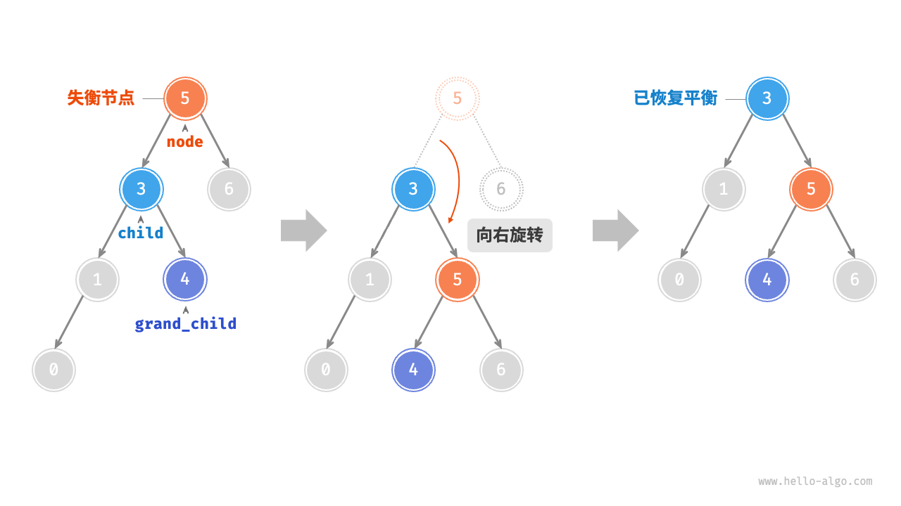

# 第6章 树

## 6.2 平衡二叉树搜索树的定义和实现

AVL（**A**delson-**V**elsky and **L**andis）树是一种自平衡二叉查找树，本身是一棵二叉搜索树，但是任何结点的两个子树的高度差最大为 $1$，所以也被称为 **高度平衡树**。增加和删除可能需要通过一次或多次树旋转来重新平衡这个树。

AVL树本质上还是一棵二叉搜索树，它的特点是：

1. 本身首先是一棵二叉搜索树。
2. 带有平衡条件：每个结点的左右子树的高度之差的绝对值（平衡因子）最多为 $1$ 。

也就是说，**AVL** 树，本质上是带了平衡功能的二叉查找树（二叉排序树，二叉搜索树）。

与普通二叉搜索树不同的是，树每次的插入和删除操作，都需要额外的操作去保持树的重新平衡，使得各种操作时间复杂度保持在 $O(log_n)$ 级别。

### 6.2.1 AVL 树术语

1. 节点高度：由于`AVL`树的相关操作需要获取节点高度，因此我们需要为节点类添加`height`变量。“节点高度”是指从该节点到它的最远叶节点的距离，即所经过的“边”的数量。需要特别注意的是，叶节点的高度为 $0$，而空节点的高度为 $-1$。
2. 节点的平衡因子（`balance factor`）：定义为节点左子树的高度减去右子树的高度，同时规定空节点的平衡因子为 $0$。设平衡因子为 $f$，则一棵 `AVL` 树的任意节点的平衡因子皆满足 $-1 \leq f \leq 1$。

### 6.2.2 AVL 树旋转

`AVL`树的特点在于“旋转”操作，它能够在不影响二叉搜索树的中序遍历序列的前提下，使失衡节点重新恢复平衡。换句话说，旋转操作既能保持“二叉搜索树”的性质，也能使树重新变为“平衡二叉树”。

我们将平衡因子绝对值 $abs(f)>1$ 的节点称为“失衡节点”。根据节点失衡情况的不同，旋转操作分为四种：右旋、左旋、先右旋后左旋、先左旋后右旋。

#### 6.2.2.1 右旋

如下图所示，从底至顶看，二叉树中首个失衡节点是“节点 $3$ ”。我们关注以该失衡节点为根节点的子树，将该节点记为`node`，其左子节点记为`child`，执行“右旋”操作。完成右旋后，子树恢复平衡，并且仍然保持二叉搜索树的性质。


如果`node`除了有左子结点`child`后，还有右子结点`grand_child`，需要在右旋中，增加一步：将`grand_child`作为`node`的左子结点。



观察右旋，我们很容易知道，只需要修改结点指针的指向即可，代码如下：

```java
    /**
     * 右旋操作
     * 
     * @param treeNode 失衡结点
     * @return 旋转后子树的根结点
     */
    AVLTreeNode rightRotate(AVLTreeNode treeNode) {
        AVLTreeNode child = (AVLTreeNode) treeNode.getLeftChild();
        AVLTreeNode grandChild = (AVLTreeNode) child.getRightChild();
        child.setRightChild(treeNode);
        treeNode.setLeftChild(grandChild);
        // 更新结点高度
        updateHeight(treeNode);
        updateHeight(child);

        return child;
    }
```

#### 6.2.2.2 左旋

相应地，如果考虑上述失衡二叉树的“镜像”，则需要执行下图所示的“左旋”操作。


同理，如下图所示，当节点`child`有左子节点（记为`grand_child`）时，需要在左旋中添加一步：将`grand_child`作为`node`的右子节点。

```java
    /**
     * 左旋操作
     * 
     * @param treeNode 失衡结点
     * @return 旋转后子树的根结点
     */
    AVLTreeNode leftRotate(AVLTreeNode treeNode) {
        AVLTreeNode child = (AVLTreeNode) treeNode.getRightChild();
        AVLTreeNode grandChild = (AVLTreeNode) child.getLeftChild();
        child.setLeftChild(treeNode);
        treeNode.setRightChild(grandChild);
        // 更新结点高度
        updateHeight(treeNode);
        updateHeight(child);

        return child;
    }
```

#### 6.2.2.3 先左旋后右旋

对于下图所示的失衡结点 $3$ ，仅使用左旋和右旋都无法使子树恢复平衡条件，此时需要我们将`child`先**左旋**，然后再对`node`执行**右旋**，即可达成平衡。


```java
    /**
     * 先左旋后右旋操作
     * 
     * @param treeNode 失衡结点
     * @return 旋转后子树根结点
     */
    private TreeNode<K, V> leftRightRotate(TreeNode<K, V> treeNode) {
        treeNode.setLeftChild(leftRotate(treeNode.getLeftChild()));
        return rightRotate(treeNode);
    }
```

#### 6.2.2.4 先右旋后左旋

如下图所示，作为**先左旋后右旋**的镜像情况，需要先对`child`执行**右旋**，再对`node`执行**左旋**。


```java
    /**
     * 先右旋后左旋
     * 
     * @param treeNode 失衡结点
     * @return 旋转后子树根结点
     */
    private TreeNode<K, V> rightLeftRotate(TreeNode<K, V> treeNode) {
        treeNode.setRightChild(rightRotate((TreeNode<K, V>) treeNode.getRightChild()));
        return leftRotate(treeNode);
    }
```

#### 6.2.2.5 旋转的选择

下图展示了在二叉搜索树中添加和删除结点时，可能发生的失衡情况，分别需要采取：右旋、先左旋后右旋、先右旋后左旋、左旋的操作。


那么，如何判定二叉搜索树已经失衡以及属于哪种失衡情况呢？如下表所示，我们可以通过判断失衡节点的平衡因子以及较高一侧子节点的平衡因子的正负号，来确定失衡节点属于四种情况中的哪种情况。

|失衡结点（node）的平衡因子|子结点（child）的平衡因子|应采取的旋转方法|
|:-:|:-:|:-:|
| $>1$（左偏树）| $\geq 0$ |右旋|
| $>1$（左偏树）| $< 0$ |先左旋后右旋|
| $<-1$（右偏树）| $\leq 0$ |左旋|
| $<-1$（右偏树）| $> 0$ |先右旋后左旋|

为了方便旋转操作，我们将四种情况封装进`rotate`函数，代码如下：

```java
    private TreeNode<K, V> rotate(TreeNode<K, V> treeNode) {
        int bf = balanceFactor(treeNode); // 获取 treeNode 结点平衡因子
        if (bf > 1) { // 左偏树
            if (balanceFactor(treeNode.getLeftChild()) >= 0)
                return rightRotate(treeNode);
            else
                return leftRightRotate(treeNode);
        }
        if (bf < -1) {// 右偏树
            if (balanceFactor(treeNode.getRightChild()) <= 0)
                return leftRotate(treeNode);
            else
                return rightLeftRotate(treeNode);

        }
        return treeNode;// 平衡树，无需旋转操作，直接返回
    }
```
